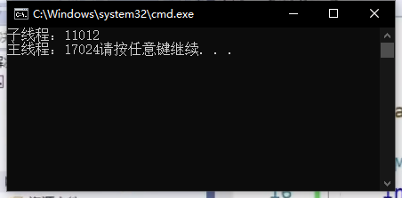
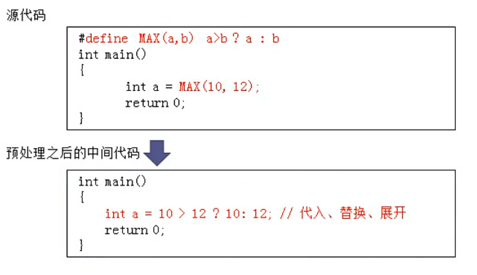
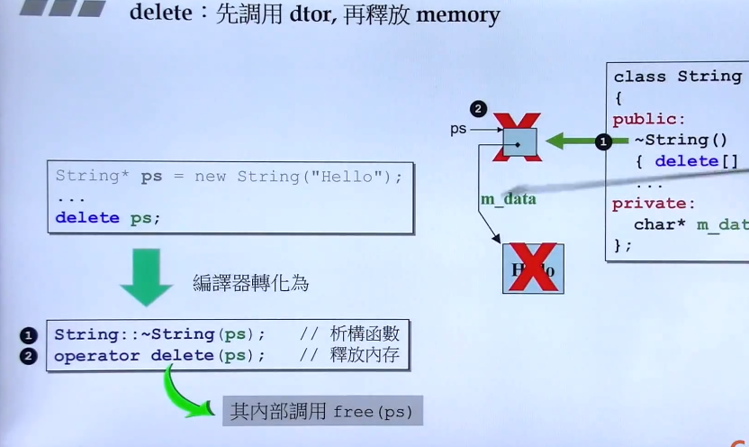
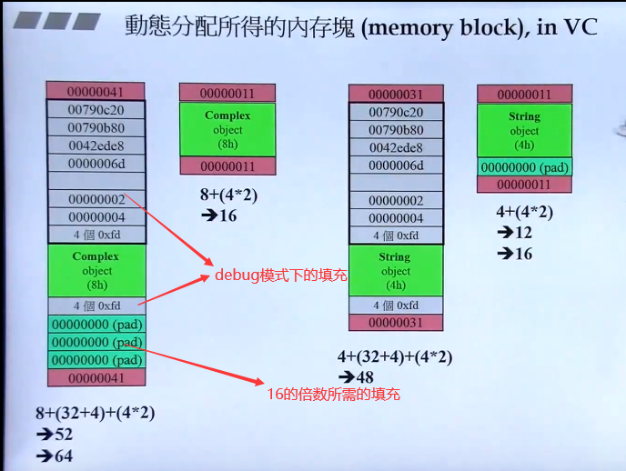
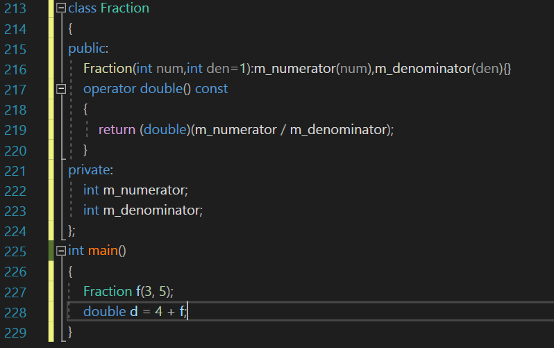
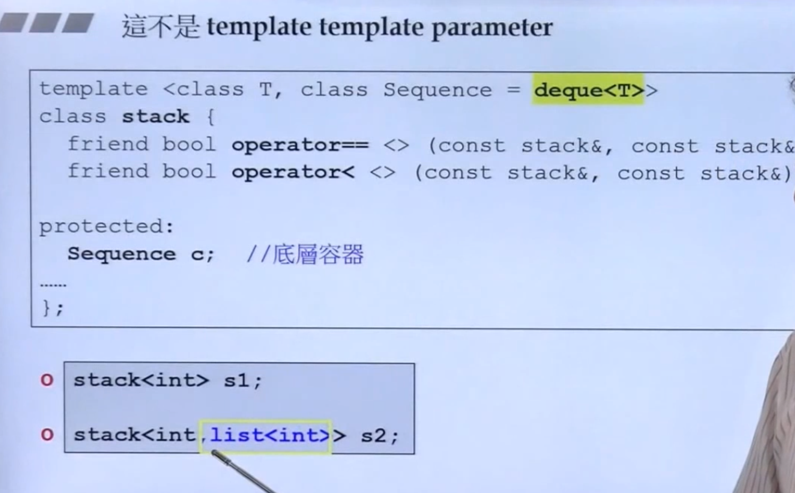
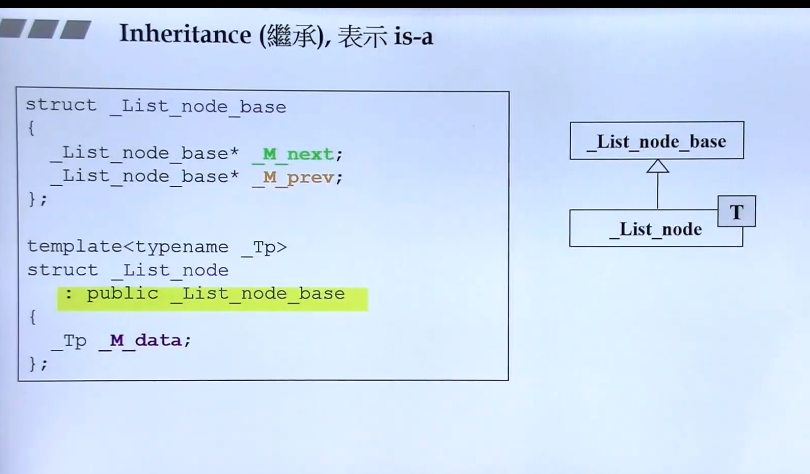
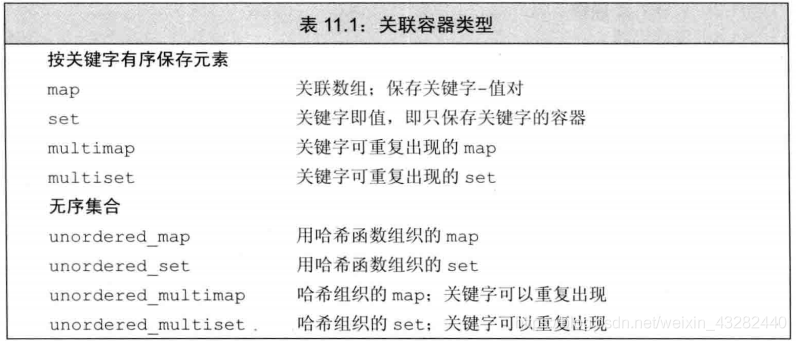

## C++多线程

### 并发

两个或者多个独立活动同时进行

并发假象：单核处理器


### 进程

每一个进程都有一个主线程，并且只有一个主线程

**计算机程序关于某一个数据集合上的一次运行活动(exe运行的状态)**  

**VS编译器中ctr+F5运行程序本质其实就是主线程调用main函数的代码**


### 线程

线程就是一个代码的运行通道


自己可以创建多个线程


### 并发的实现

#### 多进程实现并发

主要是进程间通信

一个电脑上，管道，文件，消息队列，内存共享。

多台电脑，SOCKET网络通信实现

#### 单个进程多个线程实现并发

一个主线程，多个子线程


### C++中线程的多种创建方式

包含头文件： #include<thread>

创建线程：thread类去创建一个线程对象

​	创建线程不作处理，就会调用abort终止程序

处理线程：

​	join()函数：汇合线程，阻塞主线程（让主线程等待子线程执行完后，才继续主线程）

​	detach()函数：分离，打破依赖关系，把子线程驻留后台（让子线程独立出来 在后台自由运行)

​	注意点：一个线程只能被处理一次，如果join就不能detach，如果你detach就不能join

​	joinable判断当前现成是否可以被detach或者join


### 其他的几种线程创建方式

#### 普通函数的创建

```
#include<iostream>
#include<thread>
#include<Windows.h>
using namespace std;
void print()
{
	cout << "eat!!!" << endl;
}
int main()
{
	thread test(print);
	//test.join();
	test.detach();
	if (test.joinable())
		test.join();
	else
		cout << "当前线程已经被处理！" << endl;

	Sleep(5000);
	cout << "walking!!!" << endl;
	return 0;
}
```


#### 通过类的对象创建线程


仿函数：类的对象模仿函数的行为 本质就是重载括号运算符

```
int main()
{/*
	//仿函数的调用
	MM mm;
	mm.operator()();//1.调用函数的方式实现仿函数调用
	
	mm();//2.重载，也会调用重载函数

	MM()();//3.创建无名对象直接调用仿函数
	*/
	MM mm;
	thread test(mm);
	test.join();

	thread test2((MM()));
	test2.join();
	cout << "主线程" << endl;
}
```


#### Lambda表达式的方式创建线程

```
int (*pFunc)(int,int)=NULL;
pFunc=[](int a,int b)mutable throw()->int{return a>b?a:b;};

cout << [](int a, int b) {return a > b ? a : b; }(4,9) << endl;

thread test([] {cout << "子线程启动" << endl; });
test.join();
cout<<"主线程"<<endl;
```


#### 带参的方式创建线程

```
void printData(int num)
{
	num++;
	cout << "子线程"<<num << endl;
}
void printValue(int& value)
{
	value++;
	cout << "子线程" << value << endl;
}
int main()
{
	int num = 0;
	int value = 0;
	thread test(printData, num);
	test.join();
	thread test2(printValue, ref(value));
	test2.join();

	cout << "主线程结束" << endl;
}
```


#### 带智能指针的方式创建线程

```
int main()
{
	unique_ptr<int> ptr(new int(100));
	cout << "访问数据：" << *ptr.get() << endl;
	thread test(print, move(ptr));  //移动语义
	test.join();
	cout << "主线程id：" << this_thread::get_id() << endl;
	cout << "访问数据：" << ptr.get() << endl;
}
```

 


#### 通过类的成员函数创建线程


```
class MM
{
public:
	void print(int& num)
	{
		num = 100;
		cout << "子线程：" << this_thread::get_id() << endl;
	}
};

int main()
{
	MM mm;
	int num = 100;
	//用类的成员函数成为线性处理函数的时候，一定要先告诉别人是那个对象的成员函数

	thread test(&MM::print, mm, ref(num));
	test.join();
	cout << "主线程：" << this_thread::get_id();
}
```




### 资源竞争问题 


## 预处理指令

以#开头的行，用于指示编译器做一些预处理工作

### #include

把一些包含一些类和函数的声明的头文件的内容给复制过来


### 为什么源文件要#include对应声明的头文件？


### **#pragma once**

防止一个头文件在声明中被包含两次


```
Common.h

#include “Log.h”
```


```
Main.cpp
#include “Log.h”
#include “Common.h”

如果Log.h中没有#pragma once，那么Log.h中的声明 比如结构体struct Player{}，意味着有两个相同名字的结构体，会出现重新定义的错误
```


### #ifndef


### #define

1、定义一个数值

```
#define PI 3.14
```


2、定义一个算式

#define MAX(a,b) a>b?a:b



 **易错点**


1、


改正：#define MUL(1+2)


2、


改正：#define MAX(a,b) ((a)>(b)?(a):(b))


### 例子

　Debug：调试版本，包含调试信息，所以容量比Release大很多，并且不进行任何优化（优化会使调试复杂化，因为源代码和生成的指令间关系会更复杂），便于程序员调试。**Debug模式下生成两个文件，除了.exe或.dll文件外，还有一个.pdb文件，该文件记录了代码中断点等调试信息** 

　　Release：发布版本，不对源代码进行调试，编译时对应用程序的速度进行优化，使得程序在代码大小和运行速度上都是最优的。（调试信息可在单独的PDB文件中生成）。**Release模式下生成一个文件.exe或.dll文件**


#### debug和release

如果包含一些工作日志，想在程序员debug的情况下看到，但Release的时候又不想被用户知道，可以通过宏保留在debug中的日志


```
#include<iostream>
using namespace std;
#ifdef _DEBUG
#define LOG(x) std::cout<<x<<std::endl
#else
#define LOG(x)
#endif
int main()
{
	int x{ 1 };
	LOG(x);
}
```


#### 折叠本段宏


```
#if 0

#if	_DEBUG==1
#define LOG(x) std::cout<<x<<std::endl
#elif defined(NDEBUG)
#define LOG(x)
#endif

#endif
```


#### 宏的换行

```
#define MAIN int main()	\
{\
std::cin.get();\
}

MAIN
```


## 准库类型

### string

#### 定义和初始化

**初始化不是赋值，是创建变量时赋予其一个初始值，而赋值的含义是<font color=red>把对象的当前值擦除用一个新值代替</font>**

```
string  str1 = "first";    //拷贝初始化，编译器允许把这句话改写为string str(“first”)，但是string类必须有public的拷贝(移动)构造函数

string  str2(10,'a');     //直接初始化

string  str3(str2);      //直接初始化

string  str4 = string(10,'b');  //拷贝初始化

string  str5 = str4;        //拷贝初始化

string  str6 ("strr");       //直接初始化
```

#### 自己写一个String


### vector

`vector<int> v1(10);`<font color=green>//v1有10个元素，每个的值都是0</font>

`vector<int> v2{10};`<font color=green>//v2有1个元素，该元素的值是10</font>

如果用圆括号，可以说提供的值是用来构造vector对象的。

##  数组

### 定义和初始化

`int arr[a];`  <font color=green>//a必须是常量表达式 constexpr</font>

#### 显式初始化数组元素

`int a2[]={0,1,2};` <font color=green> //维度是3的数组</font>

#### 不允许拷贝和赋值

`int a[]={0,1,2};`

`int a2[]=a;` <font color=green> //不允许使用一个数组初始化另一个数组</font>

`a2=a;`  <font color=green>//不能把一个数组直接赋值给另一个数组</font>

 

### 理解复杂的数组声明

`int *p[10];`

<font color=red>*和[]的优先级相同，按照从右往左的顺序</font>

<font color=red>首先p是一个数组，里面有10个元素</font>

<font color=red>把p[10]看成一个整体换算为A,int *A</font>

<font color=red>数组p中的每一个元素是指向一个int类型变量的指针</font>


`int (*q)[10];`

<font color=red>首先q是一个指针 </font>

<font color=red>把*q看成整体B，int B[10]</font>

<font color=red>q是一个指向int类型数组的指针</font>

 

### 数组和指针

`int ia[]={0,2,4,6,8}`

`int *p=ia;`

`int i=ia[2];`

`i=*(p+2)  <=>  i=ia[2]` 

 

`int ia[3][4];`

`auto p=ia;`  <font color=green>//p是一个类型为int[4] *类型的指针</font>

`auto q=&ia[1];`  <font color=green>//p是一个类型为int[4] *类型的指针</font>

## 函数

### 返回数组指针

函数不能返回数组，但可以返回数组的指针或引用

#### 使用类型别名

`typedef int arrT[10];`

`using arrT=int[10];`

`arrT *func(int i);`  <font color=green>//func返回一个指向含有10个整数的数组指针</font>

 

#### 普通型式

`int (*func(int i))[10]`

`func(int i);` <font color=green>//调用需要func函数;</font>

`(*func(int));`  <font color=green> //对函数调用结果可以解引用;</font>

`(*func(int))[10];` <font color=green>//解引用得到大小为10的数组;</font>

`int (*func(int))[10];` <font color=green>//数组中的元素是int类型;</font>

`int(*p)[10];`<font color=green>//把p换成func(int i);</font>

 

#### 尾至返回类型

`auto func(int i)->int(*)[10]`

 

#### 使用decltype

`int odd={1,2,3,4,5}；`

`decltype(odd) *arrPter(int i);`  <font color=green>//返回一个指针，该指针指向含有五个整数的数组</font>


### 函数返回值为引用


这种情况，下改变的就是stu1的值，old返回的是一个引用


首先stu2调用构造函数

stu1调用拷贝构造函数拷贝stu2

old(stu1)调用拷贝构造函数传给形参

return stu调用拷贝构造函数创建临时对象

**？？？old(old(stu1))直接把一个匿名对象传给形参**

return stu调用拷贝构造函数创建临时对象

## 指针

### 常量指针（必须初始化)

`int cont *p=&a;`<font color=green>//离p最近,首先p是个指针,const修饰，p的常量指针，p本身代表一段内存地址，也就是p指针本身为常量，指向的对象不能改变</font>

 n

### 指向常量的指针

`const int *p=&a;`<font color=green>//p是一个指针,const int为一个整体，也就是说不能通过指针p来改变其所指对象的值，</font><font color=red>但允许指向的对象是一个变量</font>

### new和malloc

#### **new**

**先分配memory，再调用构造函数**


```
#include<iostream>
class Entity
{
private:
	std::string m_Name;
public:
	Entity() :m_Name("Unknow") {}
	Entity(const std::string& name) :m_Name(name) {}

	const std::string& GetName()const { return m_Name; }

};
int main()
{
	Entity* e = new Entity();
	Entity* e = (Entity*)malloc(sizeof(Entity));
	//这两段代码之间的区别是，new调用了类Entity的构造函数，
	//malloc仅仅是分配内存，然后给我们一个指向内存的指针
}
```


#### delete

**先调用析构函数，再释放memory;**




动态内存管理：new delete

有时忘记释放内存，产生内存泄露，有时在还有指针引用内存的情况下就释放了，这种情况下会产生引用非法内存的指针。




### 结构体所占内存大小

1.先确定实际对齐单位，其由以下三个因素决定

  1> CPU周期

  WIN  vs  qt  默认8字节对齐

  Linux 32位 默认4字节对齐，64位默认8字节对齐

  2> 结构体最大成员(基本数据类型变量)

  3> 预编译指令#pragma pack(n)手动设置   n--只能填1 2 4 8 16

  上面三者取最小的,就是实际对齐单位(这里的“实际对齐单位”是我为了方便区分随便取的概念)

2.除结构体的第一个成员外，其他所有的成员的地址相对于结构体地址(即它首个成员的地址)的偏移量必须为**实际对齐单位**或自身大小的整数倍(取两者中小的那个)

3.结构体的整体大小必须为**实际对齐单位**的整数倍。

```
struct A
{
	long double a; 8
	char b[9]; 9
	float c; 4
	char d;1
}A1;
```

```
sizeof(A1)=32
里面成员最大占得内存是long double 占8个字节(char[9]可以看成8个char)
对于a sizeof=8
对于b 9个char sizeof=8+9=17
对于c float=4  17不是4的整数倍，所以要补齐17+3(空)=20 sizeof=20+4=24
对于d char=1  24+1=25
最后是8的整数倍 32
```


<font color=red>智能指针</font>:负责自动释放所指向的对象。 **头文件memory中**

shared_ptr：允许多个指针指向一个对象；

unique_ptr：独占所指向的对象

```
#include<iostream>
class Entity
{
private:
	std::string m_Name;
public:
	Entity() :m_Name("Unknow") {}
	Entity(const std::string& name) :m_Name(name) {}

	const std::string& GetName()const { return m_Name; }

};

class ScopedPtr
{
public:
	ScopedPtr(Entity* ptr) :m_Ptr(ptr) {};
	~ScopedPtr() { delete m_Ptr; };

private:
	Entity* m_Ptr;

};

int main()
{
	{
        ScopedPtr e1 = new Entity();
        ScopedPtr e2(new Entity());
	}
}
//ScopedPtr类的对象e1的成员有一个指针，在堆中开辟的，而e1对象是在栈中开辟的，因此在作用域外会通过析构函数自动释放，但e1的成员指针是在堆中开辟的，因此要在析构函数中手动的去delete这个成员指针。
```


### 动态内存和智能指针

#### unique_ptr

作用于指针，超出作用域时会被销毁，然后调用delete，unique_ptr不能被复制

```
#include<iostream>
#include<memory>
class Entity
{
public:
	Entity()
	{
		std::cout << "Created Entity!" << std::endl;
	};

	~Entity()
	{
		std::cout << "Destoryed Entity!" << std::endl;
	}
};

int main()
{
	{
		std::unique_ptr<Entity> entity1(new Entity());
		std::unique_ptr<Entity> entity2 = std::make_unique<Entity>();
	}
}
//前面的一段代码的实现类似，在栈上分配对象，当栈分配对象死亡时，调用析构函数delete在你的指针上，并释放内存
//entity1和entity2就是一个栈上的对象，对象的内容是一个内存地址，即指针，对象死亡时候调用析构的delete释放内存地址指向的内容
```


#### shared_ptr

```
shared_ptr<string> p2=make_shared<int>(42); //指向一个值为42的int的shared_ptr
```


##### shared_ptr的拷贝和赋值

```
#include<iostream>
#include<memory>
class Entity
{
public:
	int old;
	Entity(int old)
	{
		this->old = old;
		std::cout << "Created Entity!" << std::endl;
	};

	~Entity()
	{
		std::cout << "Destoryed Entity!" << std::endl;
	}
};

int main()
{
	{
		std::shared_ptr<Entity> sharedEntity2;
		{
			std::shared_ptr<Entity> sharedEntity1 = std::make_shared<Entity>(3);
			std::weak_ptr<Entity> weakEntity = sharedEntity1;//和sharedEntity2一样，但这里不会增加引用计数
			sharedEntity2 = sharedEntity1;
		}//此时sharedEntity1销毁，但指向Entity的堆上内存还在
	}//此时Entity对象被释放

	std::cin.get();
}
//
```

每一个shared_ptr有一个关联计数器，通常称其为引用计数，每拷贝一个shared_ptr，计数器都会递增，销毁或者赋新值计数器就会递减，当计数器变为0，它就会自动释放自己所管理的对象。


##### 直接管理内存

在自由空间分配的内存是无名的，因此new无法为期分配的对象命名，**而是返回一个指向改对象的指针**

```
int *pi=new int;
```


##### shared_ptr和new结合使用


不初始化一个智能指针，它就会被初始化为一个空指针


## 引用

`int i=1,&ir=i;`<font color=green>//ir是i的一个别名，可以用i的地方几乎都可以用ir替换;</font>

 

### 常量引用

`const int &ir=i;`<font color=green>//不能通过引用ir来改变其绑定对象i的值，<font color=red>但允许i是一个变量；</font></font>

顶层const->变量自身   底层const->变量所指向的值


### 右值引用


## Some

### 类型别名

#### typedef

`typedef double wage;`<font color=green>//wage是double的别名；</font>

`typedef wage *p;`<font color=green>//p是double*的同义词；</font>

`const p ptr=0;`<font color=green>//ptr是指向double的常量指针；</font>

#### using

`typedef bool Func(const string&, const string&);`等价说法 `using Func = bool(const string&, const string&);`

 

`bool (const string&, const string&)`是函数的类型，Func为此类型的别名

 

`typedef *bool* （*Func）(const string&, *const* string&);`函数指针

### 类型自动推导

#### **auto**

auto不能引用字面值  auto &h=42（×）  const int ci=1； auto &g=ci（√）  auto k=&ci（√）

 

#### deltype 

deltype 返回的变量类型包括顶层const和引用（引用在所有地方都指的是对象的同义词，只有在decltype处除外）

`const int ci=0,&cj=ci;`

`decltype(ci) x=0;` <font color=green>//x的类型是const int</font>

`decltype(cj) y=x;`<font color=green>//y的类型是const int&</font>


decltype括号内是变量的运算，返回结果变量的经过运算后的类型

`int i=42,*p=&i,&r=i;`

`decltype(r+0) b;`<font color=green>//r+0=43，b的类型是43即int 类型；</font>

`decltype（*p）c；`<font color=green>//*p做运算是指针p解引用的操作，</font><font color=red>解引用指针可以得到所指的对象，而且可以给这个对象赋值，因此c的类型是int&，</font><font color=green>此条语句错误，引用必须初始化</font>

**decltype((变量))的结果永远是引用**

### 常量表达式constexpr

值不会改变并且在编译过程就能得到计算结果的表达式；

`const int sz=get_size();`<font color=green>//不是常量表达式，因为程序未运行之前，函数的返回结果未知</font>

`constexpr int mf=20;`<font color=green>//20是常量表达式</font>

`constexpr int sz=size();`<font color=green>//当szize是一个constexpr函数时，此语句正确</font>


### namespace


目的：避免命名冲突

当要用到某个名称空间时，只需要写上：：，然后就能进入到这个名称空间

**namespace一定不要出现在头文件内**


```
namespace apple{
	namespace functions{
		void print()
		{}
	}
}
int main()
{
	namespace a=apple::functions;
	apple::functions::print();//a::print();
}
```

**尽量在一个小的限制域内用using namespace，如：if，函数内部**


### 转换函数



**把对象转换为其他类型**


**把其他类型隐式转换为对象**


**隐式转换只能转换一次**


#### explicit


### C++运算符及其重载


上图等价于

```
Vector2 result1=position+speed*powerup;

Vector2 result1=position.operate+(speed.operate*(powerup));
//这里的operate+类似于方法名


```

#### 在全局范围内重载运算符

运算符重载函数不仅可以作为类的成员函数，还可以作为全局函数。在全局范围内重载`+`，实现复数的加法运算：


运算符重载函数不是 complex 类的成员函数，但是却用到了 complex 类的 private 成员变量，所以必须在 complex 类中将该函数声明为友元函数。

当执行`c3 = c1 + c2;`语句时，编译器检测到`+`号两边都是 complex 对象，就会转换为类似下面的函数调用：

```
c3 = operator+(c1, c2);
```


### static

#### 在类和结构体外部的静态


我们不能有两个同名的全局变量，编译后链接器在链接的时候可以看到所有 全局变量


其他所有的翻译单元(其他的.cpp文件)  不能看到静态的s_variable变量 


#### 在类和结构体中的静态


x,y指向了同一块内存，它们实际上并不属于类，需要在类外去定义(分配内存)

**单例设计模式**


### 模版


**如果不调用模版函数，那么这个函数等于不存在，只有当我们调用这个函数时，这个函数才会被实际创建**


#### 模版特化


#### 模版的偏特化

##### 个数上的偏


##### 范围上的偏


对于指针类型的T要用下面的类型


##### 模版模版参数

普通型式


模版模版


这个不是template template parameter



第二个class Sequence接受任何类型 不一定是模版类


### lambda函数

格式:
$$
[capture list](parameter list)->return type {function body}
$$
<font color=red>capture list(捕获列表)是一个lambda函数所在函数中定义的局部变量的列表</font>

```
void ForEach(const std::vector<int>& values, void(*func)(int))
{
	for (int value : values)
	{
		func(value);
	}
}

int main()
{
	std::vector<int> values = { 1,5,4,2,3 };
	ForEach(values, [](int value) 
	{
		std::cout << "Value: " << value << std::endl; 
	}
	);
}

```

```
void Print(void(print(std::string)), std::string name)
{
	print(name);
}

Print([](std::string name) {std::cout << name << std::endl; }, "wangyaxin");


[](int a,int b)mutable throw()->int{return a>b?a:b;};
```


lambda捕获列表：

| 捕获列表               | 解释                                                         |
| ---------------------- | ------------------------------------------------------------ |
| `[]`                   | 空捕获列表。`lambda`不能使用所在函数中的变量。一个`lambda`只有在捕获变量后才能使用它们。 |
| `[names]`              | `names`是一个逗号分隔的名字列表，这些名字都是在`lambda`所在函数的局部变量，捕获列表中的变量都被拷贝，名字前如果使用了`&`，则采用引用捕获方式。 |
| `[&]`                  | 隐式捕获列表，采用引用捕获方式。`lambda`体中所使用的来自所在函数的实体都采用引用方式使用。 |
| `[=]`                  | 隐式捕获列表，采用值捕获方式。                               |
| `[&, identifier_list]` | `identifier_list`是一个逗号分隔的列表，包含0个或多个来自所在函数的变量。这些变量采用值捕获方式，而任何隐式捕获的变量都采用引用方式捕获。`identifier_list`中的名字前面不能使用`&` |
| `[=, identifier_list]` | `identifier_list`中的变量采用引用方式捕获，而任何隐式捕获的变量都采用值方式捕获。`identifier_list`中的名字不能包括`this`，且前面必须使用`&` |

### 字面值常量类

constexpr函数的参数和返回值必须是字面值类型，除了算数类型、引用和指针外，某些类也是字面值类型。

**<font color=red>数据成员都是字面值类型的聚合类是字面值常量类。</font>**

**聚合类:**

`struct Data`

`{int ival;`

`string s;}；`

| **成员public**       |
| -------------------- |
| **没有定义构造函数** |
| **没有类内初始值**   |
| **没有基类和虚函数** |

**<font color=red>如果不是聚合类，但符合：</font>**

| **数据成员字面值**                                           |
| ------------------------------------------------------------ |
| **类中至少一个constexpr构造函数(声明为=default或者删除函数，或者constexpr 类名（参数):初始化列表{//空函数体}** |
| **如果一个数据成员有初始值，初始值必须是常量表达式；或者成员属于某种类型，初始值必须使用成员自己的constexpr函数** |
| **类必须使用析构函数的默认定义**                             |


## 类

### 构造函数

如果不想让类来创建实例对象

方法一

```
class Log
{
public:
	Log()=delete;
	static void Write()
	{

	}
private:
};
```


方法二

```
class Log
{
public:
	static void Write()
	{

	}
private:
	Log()
	{

	}
};
```


#### 构造函数初始化列表

`class Circle`

`{`

​	`double radius;`

​	`Circle():radius{1}`

​	`{`

​	`}`

`};`

为什么需要构造函数列表初始化？

<font color=red>（内嵌对象必须在被嵌对象的构造函数体执行前就构造完成 ）</font>

<font color=blue>如果成员是const、引用，或者属于某种未提供默认构造函数的类类型，我们必须通过构造函数初始化列表为这些成员提供初始值。</font>


对象类型数据域必须在构造函数体之前初始化

 `class Time{...};`


`class Action`

`{`

`public:`

​	`Action(int hour, int minute, int second) : time{ hour, minute, second }`

​	`{	time{ 1,2,3 };` <font color=green>// ×，time对象已经初始化，不能通过这种方式再次初始化</font>

​		`time = { 1,2,3 };`<font color=green>//√，给time对象重新赋值，隐式的形式;</font>

​        `time = Time{ 1,2,3 };`<font color=green>//把一个匿名对象拷贝给time对象;</font>

<font color=green>//内嵌对象成员没有被显式初始化</font>

<font color=green>//Time类的time对象为内嵌对象，Time类只有有参构造函数，Time time并没有初始化对象time，因此必须在构造函数函数体{}之前初始化对象</font>

​	`}`

`private:`

​	`Time time;`

`};`

 

##### 成员初始化的次序

<font color=blue>就地初始->构造函数初始化列表->构造函数体中成员赋值</font>

**<font color=red>若一个成员同时有就地初始化和构造函数列表初始化，则就地初始化语句会被忽略不执行</font>**

 

```

1、定义对象e

2、e先看构造函数有没有列表初始化，

3、初始化没有列表初始化的成员，跳过已经初始化成员的初始化

4、在构造函数进行列表初始化

5、在构造函数内对成员进行赋值
```

`int x = 0;`

`struct S`

`{`

​	`int n = ++x;`

​	`S(){}`

​	`S(int arg):n{arg}{}`

`};` 

`int main()`

`{`

​	`cout << x << '\n';`<font color=green>//输出0，x为全局变量0</font>

​	`S s1;`

​	`cout << x << '\n';`<font color=green>//输出1，</font>

​	`S s2{ 7 };`

​	`cout << x << '\n';`<font color=green>//输出1，</font>

<font color=green>//构建s2对象先进入有参构造，看见构造函数列表初始化，不在执行就地初始化</font>

`}`

------


#### 委托构造

（一个构造函数可以调用另外的构造函数）

------

`class A`

{**//A->A(int)->A(int,int)**

`public:`

​	`A() :`**A(0)**

​	`{}`

​	`A(int i) :`**A(i, 0)**

​	`{}`

​	`A(int i, int j)`

​	`{`

​		`num1 = i;`

​		`num2 = j;`

​		`average = (num1 + num2) / 2;`

​	`}`

`private:`

​	`int num1;`

​	`int num2;`

​	`int average;`

`};`

------

<font color=red>类里面的静态成员变量在类外使用：必须需要赋初值</font>

------

`class Square`

`{`

`public:`

​	`Square()`

​	`{`

​		`getNumberOfObject++;`

​	`}`

​	`static int getNumberOfObject;`

​	`int Get()`

​	`{`

​		`return getNumberOfObject;`

​	`}`

`};`

 

`using namespace std;`

**`int Square::getNumberOfObject = 10;`**

`int main()`

`{`

​	`Square s1;`

​	`cout << s1.Get() << endl;`

​	`Square s2;`

​	cout << Square::getNumberOfObject << endl;<font color=green>//通过类名访问静态数据成员的方式</font>

`}`

------


### 析构函数

如果创建的是静态存储类对象，则其析构函数将在程序结束时被自动调用

 

如果对象是new创建的，则它将在栈内存或自由存储区中，当使用delete来释放内存时，其析构函数将自动被调用。

### 拷贝构造函数

`Circle(Circle&);`

`Circle(const Circle&);`

`Circle(const Circle&,int=1);`<font color=green>//第一个为同类型的引用，后面都带有默认值</font>

 

调用拷贝构造函数

`Circle c1(5.0);`**<font color=green>//直接初始化</font>**

`Circle c2(c1);`

`Circle c3 = c1;`

`Circle c3 = { c1 };`<font color=green>//c++11</font>

`Circle c5{ c1 };`<font color=green>//c++11</font>

只有当定义对象的时候Circle c3 = { c1 };是拷贝构造，其余都是对象的赋值操作

```
std::string s{ 'a','b','c' };//列表初始化	

std::string s2{ "Hello" };//直接初始化
Circle c1(5.0);//直接初始化

std::string s3 = "world";//拷贝初始化
Circle c6=Circle{ 6.0 };//拷贝初始化
```

#### 深拷贝和浅拷贝

浅拷贝：只拷贝指针成员的地址

深拷贝：拷贝指针成员指向的内容

 

 

birthday是一个指针，用new在堆区开辟内存得到Date对象，birthday存的内容是地址


浅拷贝情况下：如果通过e3改Date，将改动e1的Date

 


### 类的静态成员

**类的静态成员存在于任何对象之外，对象中不包含任何与静态数据成员有关的数据。**

<font color=blue>静态成员函数不能声明成const的，而且我们也不能在static函数体内使用this指针。</font>

#### 定义静态成员

既可以在类的内部也可以在类的外部定义静态成员函数。当在类的外部定义静态成员时，不能重复static关键字，该关键字只能出现在类内部的声明语句中。

因为静态数据成员不属于类的任何一个对象，所以它们并不是在创建类的对象时被定义的。**它们不是由类的构造函数初始化的。**

**一般来说，我们不能再类的内部初始化静态成员。必须在类的外部定义和初始化每个静态成员**

#### 静态成员的类内初始化

通常情况下，类的静态成员不应该在类内初始化，然而可以为静态函数提供const整数类型的类内初始值，<font color=blue>不过要求静态成员必须是字面值常量类型的constexpr</font>

`{class Account`

`private:`

​	`static constexpr int period=30;}`

类外定义:

`constexpr int Account::period;`

不完全类型：

class Screen;

对于类型Screen来说，在它**声明之后定义之前是一个不完全类型**

**静态成员和指针成员可以是不完全类型，数据成员必须是完全类型**

**静态成员和普通成员的另外一个区别是可以使用静态成员作为默认实参**


#### 使用类的静态成员

**<font color=red> 类名::静态成员名</font>**

如果通过某个类的对象访问静态成员:

**<font color=red>对象名.静态成员名</font>**

## 类和类的关系

### 复合关系


一个类里面有其他的类，创建此类的对象的时候，先调用其他类的构造函数

析构的时候，先执行自己的析构函数，再执行其他类的析构函数

### 委托关系


**类里面有其他类的指针**，此类的功能都通过指针指向的类来实现

指针可以指向不同的实现类，右边的变动便不影响左边，<font color=red>编译防火墙的手法</font>

### **继承**关系



#### 无法继承类

class Super final

{<font color=green>//Super不能被继承</font>

};

#### 基类和父类构造函数的关系

C++11：派生类不能继承析构函数

继承基类的构造函数：**usingA::A 继承所有基类构造函数**（不能指定）


#### 基类的无参构造函数

```
class A

{

public:
	A()
	{cout<<"A()"<<endl;}

	A(int i) {}

	A(double d, int i){}

};

class B:A
{

public:
	using A::A;//继承所有构造函数
	int d=0;
	
	B(int i):d(i)//等价于B b(1):A(),d(i){}
	{}

};


int main()

{
	B b(1);

}
```

 

<font color=red>所有情况默认下，声明定义子类会先调用父类的默认构造函数</font>

------

`class A {};`

`class B : public A {`

`public:`

`using A::A;`

`}`

`int main() {`

`B b{};` <font color=green>//断点调试</font>

`System(“pause”);`

`return 0;`

------

**B类中虽然没显示声明默认构造函数，但编译器不会自动生成默认构造函数。**

**因为在B类中使用using A::A，继承了A类中的默认构造函数，所以B的默认构造函数不会由编译器自动生成**

}

#### 同名函数隐藏

父类A:void func()

子类B:void func(int i)

b.func(3)可以调用,b.func()不存在，可以通过声明**using A::func**,这样B中存在两个func的函数

重定义函数


#### 继承访问属性

(public/protected/private)

------

`#include<iostream>`

`using namespace std;`

`class Father `

`{`

**public:**

​	`Father() = default;`

​	`void Father_show1() `

​    `{`

​		`cout << "调用Father类的public方法：Father_show1" << endl;`

​	`}`

**protected:**

​	`void Father_show2() `

​	`		{`

​		`cout << "调用Father类的protected方法：Father_show2" << endl;`

​	`}`

**private:**

​	`void Father_show3()`

​	` {`

​		`cout << "调用Father类的private方法：Father_show3" << endl;`

​	`}`

`};`


`class Son1 :`**public Father**

`{`

`public:`

​	`Son1() = default;`

​	`void Son_fun1() `

​	`	{`

​		`cout << "调用Son类的public方法：Son_fun1" << endl;`

​		`Father_show1();`

​		`Father_show2();`

​		~~`Father_show3(); `~~<font color=green>//错误：无法调用Father类的private方法</font>

​	`}`

`};`


`class Son2 :`**protected Father**

`{`

`public:`

​	`Son2() = default;`

​	`void Son_fun1() {`

​		`cout << "调用Son类的public方法：Son_fun1" << endl;`

​		`Father_show1();`

​		`Father_show2();`

​		`//Father_show3(); //错误：无法调用Father类的private方法` 

​	`}`

`};`


`class Son3 :private Father {`

`public:`

​	`Son3() = default;`

​	`void Son_fun1() {`

​		`cout << "调用Son类的public方法：Son_fun1" << endl;`

​		`Father_show1();`

​		`Father_show2();`

​		`//Father_show3(); //错误：无法调用Father类的private方法` 

​	`}`

`};`

------

**总结：子类可以继承除析构函数之外的所有成员（不可访问父类的私有成员），但继承分为公有继承、保护继承和私有继承。**

**<font color=blue>访问属性只能逐渐窄化，比如公有继承过来的父类成员访问属性不变，保护继承过来的父类成员中的公有属性变成protect属性，私有继承过来的父类成员全变为私有属性，孙类什么都继承不到。</font>**

**<font color=red>在父类中的私有成员继承到子类都是不可访问的。</font>**


### 委托+继承


数据是Subject，窗口的父类是Observer


文件管理系统：

Primitive：文件

Composite：文件夹

文件夹里面既可以放文件也可以放文件夹


**文件夹内放一个容器，容器里面存放指针，指向文件和文件夹的父类类型Component**


## 多态

### 虚函数

------

`class A`

`{`

`public:`

​	`virtual std::string toString()`

​	`{`

​		`return "A";`

​	`}`

`};`


`class B:public A`

`{`

`public:`

​	 `std::string toString()override`

​	`{`

​		`return "B";`

​	`}`

`};`


`class C:public B`

`{`

`public:`

​	`std::string toString()override`

​	`{`

​		`return "C";`

​	`}`

`};`

`void print(A* a)`

`{`

​	`cout << a->toString() << endl;`

`}`

### 使用override和final

####  override显式声明覆写

 

**C++11引入override标识符，指定一个虚函数覆写另一个虚函数。**

 

------

`class A {`

`public:`

 `virtual void foo() {}`

 `void bar() {}`

`};`

 

`class B : public A `

`{`

`public:`

 ~~`void foo() const override `~~

`{` <font color=green>// 错误： B::foo 不覆写 A::foo</font>`}`   <font color=green>  // （签名不匹配）</font>

 `void foo() override;`  <font color=green>// OK ： B::foo 覆写 A::foo</font>

 ~~`void bar() override {}`~~ <font color=green>// 错误： A::bar 非虚</font>

`};`

 

~~`void B::foo() override`~~ 

{<font color=green>// 错误： override只能放到类内使用</font>}

 

------

**override的价值在于：避免程序员在覆写时错命名或无虚函数导致隐藏bug**

 

#### final 显式声明禁止覆写

 

**C++11引入final特殊标识符，指定派生类不能覆写虚函数**

 

------

`struct Base {`

  `virtual void foo();`

`};`

 

`struct A : Base` 

{ 

  `void foo() final;`<font color=green> // A::foo 被覆写且是最终覆写</font>

  ~~`void bar() final;`~~<font color=green> // 错误：非虚函数不能被覆写或是 final</font>

`};`


`struct B final : A`<font color=green> // struct B 为 final，不能被继承</font>

`{`

  ~~`void foo() override;`~~<font color=green> // 错误： foo 不能被覆写，因为它在 A 中是 final</font>

};

------


### 抽象函数和抽象类 

 

#### 抽象类

 

Sometimes a base class is so abstract that it cannot have any specific instances. Such a class is referred to as an abstract class (类太抽象以至于无法实例化就叫做抽象类)


 

#### 抽象函数/纯虚函数

 

 成员函数应出现在哪个继承层次？

 

问题：Shape类层次中，getArea()函数放在哪个层次

选择1：放哪儿都行：Shape中或子类中定义getArea()

选择2：强制要求Shape子类必须实现getArea()

 

 抽象函数(abstract functions)要求子类实现它

 

**virtual double getArea() = 0;** // 在Shape类中

 

**Circle子类必须实现getArea()纯虚函数才能实例化**

 

 

Abstract class: the class which contains abstract functions (包含抽象函数的类被称为抽象类)

 

**抽象类不能实例化（创建对象）**

 

 


 

## STL容器顺序容器

### 顺序容器概述

| Vector       | 可变数组大小，可以快速随机访问                         |
| ------------ | ------------------------------------------------------ |
| deque        | 双端队列，在头尾插入元素很快                           |
| list         | 双向链表，在任何位置插入都很快                         |
| forward_list | 单向链表，在任何位置插入都很快                         |
| array        | 固定大小数组，不能添加和删除元素，可以赋值             |
| string       | 与vector相似，专门用于报错字符，在尾部插入删除速度很快 |


### 容器操作

#### 类型别名

| iterator        | 迭代器类型 	std::forward_list<int> ::iterator a;          |
| --------------- | ------------------------------------------------------------ |
| const_iterator  | 可以读取元素不能修改元素的迭代器类型 	std::list<int>::const_iterator b; |
| size_type       | 无符号证书类型，足够保存此容器类型最大可能容器大小 	auto d = list1.size(); |
| difference_type | 带符号整数类型，足够保存两个迭代器之间的距离	std::list<int>::difference_type b = 2; |
| value_type      | 元素类型                                                     |
| reference       | 元素的左值类型，等价于value_type&                            |
| const_reference | 元素的左值类型，等价于const value_type&                      |


#### 构造函数

| C c           | 默认构造函数，构造空容器，array不支持（大小是array类型的一部分） |
| ------------- | ------------------------------------------------------------ |
| C c1(c2)      | 构造c2的拷贝c1                                               |
| C c(b,e)      | 将迭代器b和e指定范围内元素拷贝到c，array不支持               |
| C c{a,b,c...} | 列表初始化c                                                  |


#### 赋值与swap

| c1=c2      | 赋值操作                                      |
| ---------- | --------------------------------------------- |
| c1={a,b,c} | 将c1中的元素替换为列表中的元素，不适用于array |
| a.sawp(b)  | 交换a和b中的元素                              |
| swap(a,b)  | 与上面等价                                    |


#### 大小

| c.size()     | c中元素的数目，不支持单向链表 |
| ------------ | ----------------------------- |
| c.max_size() | c可保存的最大元素数目         |
| c.empty()    | 看c中是否存储元素             |


#### 添加/删除元素(不适用array)

注意：在不同容易中，这些操作接口都不同

| c.insert(args)   | 将arg中的元素拷贝进c        |
| ---------------- | --------------------------- |
| c.emplace(inits) | 使用inits构造c中的一个元素  |
| c.erase(args)    | 删除arg指定的元素           |
| c.clear()        | 删除c中的所有元素，返回void |


	std::vector<int> vector1 = { 1,2,3,4 };
	std::vector<int> vector2 = { 5,6,7,8,9 };
	
	v1.emplace(v1.begin(), 4);

#### 迭代器

c.begin();

c.end();

支持++和--操作(单向链表不支持)


#### 容器定义和初始化

只有顺序容器(不包括array)的构造函数才能接受大小参数

C c(n);

C c(n,t)//n个t元素


标准库array有固定大小

array<int,42>//数组类型包括元素类型和大小

**array不支持普通的容器构造函数**


array<int,10> digits={0,1,2,3,4,5,6,7,8,9}

array<int,10> copy=digits

**array可以拷贝**


#### 关系运算符

每个容器都支持相等运算符(=和！=)；

除了无序关联容器外的所有容器都支持关系运算符(>、>=、<、<=) 关系运算符左右两边的运算对象必须是相同类型的容器


比较两个容器实际上是进行元素的逐对比较

如果容器一样，则两个容器相等

如果容器大小不相同，但较小容器中的每个元素都<font color=red>等于</font>较大容器中的元素，则较小容器小于较大容器

**如果两个容器都是另一个容器的前缀子序列，则比较结果取决于第一个不相等的元素的比较结果**


#### vector对象是如何增长的

	class Student
	{
	public:
		int old;
		Student(int old):old(old)
		{
			std::cout << "调用了构造函数old: " << old << std::endl;
		}
		Student(const Student&)
		{
			std::cout << "调用了拷贝构造函数old: " << old<<std::endl;
		}
	};
	std::vector<Student> students;
	students.push_back(Student(1));
	students.push_back(Student(2));
	students.push_back(Student(3));


### 关联容器

#### 关联容器类别



#### 关联容器的主要内容

##### 定义关联容器


##### 有序容器的关键字类型要求

**对于有序容器——map、multimap、set 以及 multiset，关键字类型必须定义元素比较的方法。默认情况下，标准库使用关键字类型的<运算符来比较两个关键字。**


##### pair类型

在头文件utility中

一个 pair 保存两个数据成员。类似容器，pair 是一个用来生成特定类型的模板。
pair 的数据成员是 public 的。两个成员分别命名为**first** 和 **second**。
map 的元素是 pair。


#### 关联容器操作


##### 关联容器迭代器

当解引用一个关联容器迭代器时，会得到一个类型为容器的 value_type 的值的引用。
一个 map 的 value_type 是一个 pair，我们可以改变 pair 的值，但不能改变关键字成员的值。
set 的迭代器是 const 的。
【遍历关联容器】：map 和 set 类型都支持 begin 和 end 操作。
【关联容器和算法】：通常不对关联容器使用泛型算法。关联容器可用与只读取元素的算法。


##### 添加元素


##### 删除元素

关联容器定义了三个版本的 erase：

一个版本是通过传递给 erase 一个迭代器来删除一个元素。
第二个版本是通过传递给 erase 一个迭代器对来删除一个元素范围。
第三个版本是接受一个 key_type 参数。删除所有匹配给定关键字的元素（如果存在），返回实际删除的元素的数量。对于不允许重复关键字的容器，返回值总是0或1。0表明想删除的元素不在容器中。对允许重复关键字的容器，删除元素数量可能大于1。


##### map的下标操作

map 和unordered_map 容器提供了下标运算符和一个对应的 at 函数。set 类型不支持小标。
map 下标运算符接受一个索引（即一个关键字），获取与此关键字相关的值。如果关键字不在 map 中，会为它创建一个元素并插入到map 中，关联值将进行初始化。
由于下标运算符可能插入一个新元素，我们只可以对非**const** 的 map 使用下标操作。
对 map 进行下标操作，会获得一个**mapped_type** 对象；但解引用一个map 迭代器时，会得到一个**value_type**（pair） 对象。


