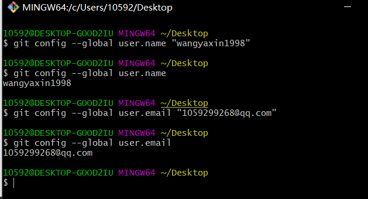
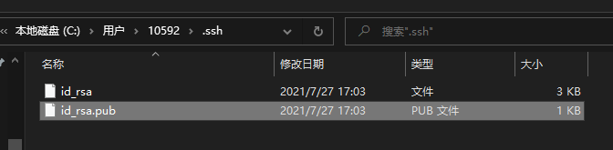

# Git的使用

## 1.本地仓库

### 1.1组成

工作流程：

### 1.2本地仓库操作

a.创建空目录

 

b.进入目录

c.Git仓库的初始化

**指令：git init**

后续操作，重复使用git add和git commit即可。

**如果更改文件内容，git add 文件名，git commit -m "修复了...的bug"**

### 1.3时光穿梭机--版本回退

**git log:**

**git log --pretty=online:**

操作实验：

注意：回到过去之后，要想回到之前的最新版本的时候回，则需要使用指令去查看历史操作

，以得到最新的commit id。

**指令：git reflog**

小结：

a.要想回到过去，必须先得到commit id(git log --pretty=online)，然后通过git reset-hard进行回退

b.要想回到未来，需要使用git reflog进行历史操作查看，得到最新的commit id；

c.在写回退指令的时候commit id可以不用写全，git自动识别，但是不能写太少，至少需要写4位字符。

## 2.远程仓库

线上仓库的操作学习以Github为例。

### 2.1远程仓库的创建

### 2.2两种常规使用方式

#### 2.2.1.基于http协议

a.创建空目录，名称就为

b.使用clone指令克隆线上仓库到本地

**语法：git clone https://github.com/wangyaxin1998/WaterLevelMeasurement.git**

c.在仓库上做对应的操作（提交缓存区、提交本地仓库、提交线上仓库、拉取线上仓库）

**提交到线上仓库的指令：git push**

在首次往线上仓库提交内容的时候，不是任何人都可以往线上仓库提交内容，必须需要鉴权

修改 git/config 文件内容

如果另外的人在线上更改仓库内容：

**拉取线上仓库：git pull**

**提醒：每天工作的第一件事就是先git pull拉取线上最新的版本；每天下班前要做的是git push，将本地代码提交到线上仓库**

#### 2.2.2.基于ssh协议

②创建公私钥对文件

