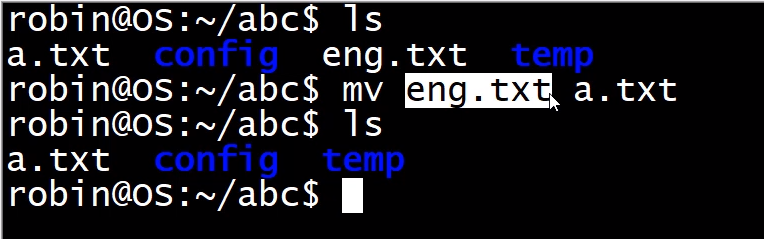
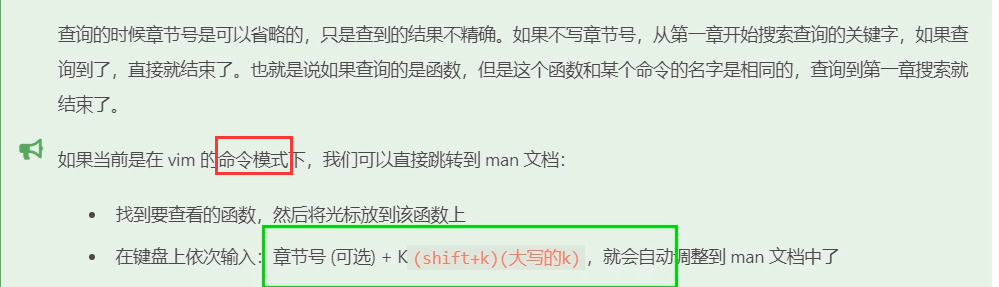
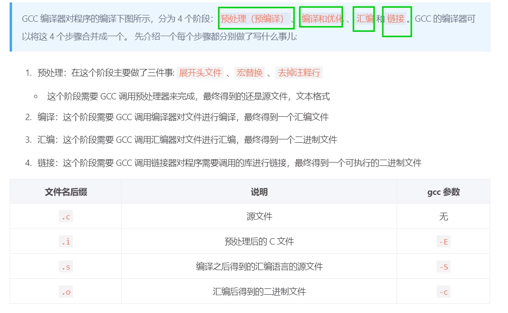
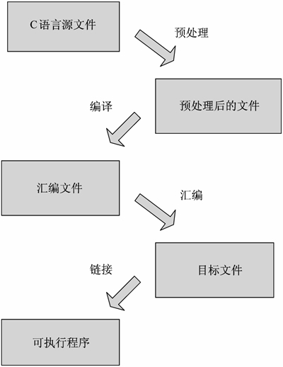
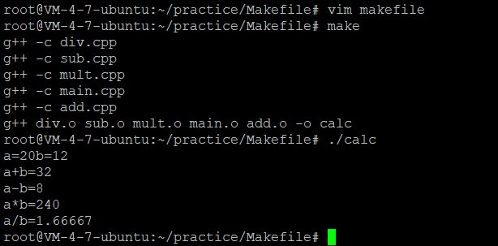
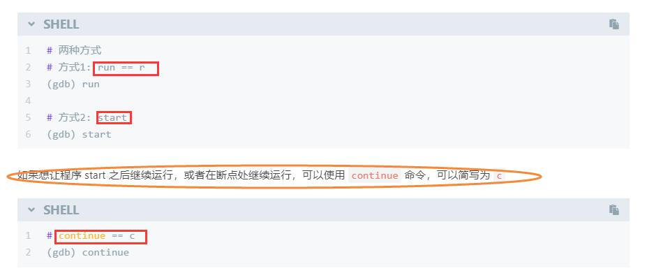

# Linux

## 第1章 Linux基础

### 1.Linux介绍

#### 1.2一些名词

GNU:号召软件自由

GPL:公共许可证

FSF:自由软件基本会，给GNU提供资金支持

POSIX:一套标准，度UI系统调用的服务接口进行标准化


#### 1.3Linux发行版

debian->Ubuntu 


redhat->CentOS


#### 1.4Linux内核

​	

```
Linux 系统从应用角度来看，分为内核空间和用户空间两个部分。内核空间是 Linux 操作系统的主要部分，但是仅有内核的操作系统是不能完成用户任务的。丰富并且功能强大的应用程序包是一个操作系统成功的必要件。这个和武林秘籍一样，不仅得有招式还得有内功心法。

Linux 的内核主要由 5 个子系统组成：进程调度、内存管理、虚拟文件系统、网络接口、进程间通信。下面将依次讲解这 5 个子系统。
```


### 2.Linux目录

#### 2.1 Linux目录结构


#### 2.2相对路径

./：代表目前所在的目录，也可以用.表示

../：代表当前目录的上一次目录，也可以使用..表示

### 3.命令解析器

#### 3.1工作原理


#### 3.2命令提示行


~：当前用户的家目录

$:当前用户的身份


root：当前用户，可以用whoami查看

VM-4-7-ubuntu：主机名

/home：当前路径

#：root用户


#### 3.3命令行快捷键


## 第2章 文件管理命令

### 1.cd命令

cd 使用相对路径/绝对目录

cd==cd ~   进入当前用户家目录

两个目录间的快速切换： cd -


### 2.ls命令


#### 2.1显示所有文件

ls -a：显示隐藏的文件

ls -l：显示文件的详细信息

ls -F：显示目录，如果是文件夹将会在后面加/

ls -h：在显示文件大小的时候以一种直观的方式


#### 2.2显示文件详细信息

##### 2.2.1文件类型


##### 2.2.2用户类型 

Linux有三大用户：文件所有者，文件所属用户组，其他人


##### 2.2.3文件权限

一共四种权限：

读权限：r表示 ->read

写权限：w表示->write

执行权限：x表示->excute

没有任何权限：用-表示


<font color=red>从第二个字母起，3个3个一组，共三组，分别表示 文件所有者，文件所属组用户，其他人的权限</font>

<font color=blue>只有对目录有执行权限，才能打开目录</font>


##### 2.2.4硬链接计数


**其实就是文件别名**


##### 2.2.5其他属性


robin：文件所属者

robin：文件所属组用户

4.0k：文件的大小，若文件是目录，4.0k仅代表目录所占空间，不包含目录内文件的内容

May 12 2020：文件的修改日期


### 3.创建删除目录  


创建单层目录 


创建多层级目录要加 -p


rmdir：只能删除单目录，内部不能包括子目录

 


rm:


### 4.cp命令

**拷贝文件**


**拷贝目录**


### 5.mv命令

**文件的移动**


**文件的改名**


**文件覆盖**


 




### 6.查看文件内容

**cat：**


**more：**


  

**less：**


**head：**


**tail：**


### 7.链接的创建


**软连接：**

语法：  ln -s 源文件路径<font color=red>(绝对路径)</font> 软连接文件的名字（可以带路径）


**硬链接：**

语法：  ln  源文件名称  硬连接文件的名字（可以带路径） <font color=green>**不允许给目录创建硬链接**</font>


### 8.文件属性

#### 8.1修改文件权限


**chmod：change mod**


**文字设定法：**

chmod who(=/+/-)rwx 文件名  

**who: u(user),g(group),o(other),a(all)**

```
比如 chmod a=rwx b.txt

比如 chmod o-wx a/

比如 chmod go-wx b.txt
```


**数字设定法：**


```
例如 chmod 777 b.txt

例如 chmod -200 b.txt
```


#### 8.2修改文件所有者 

**chown**


sudo：让普通用户使用管理员权限成功执行这条指令

普通用户拥有sudo权限需要授权：


#### 8.3修改文件所属组

**chgrp**


### 9.其他命令

#### 9.1tree命令


#### 9.2pwd命令

无参数  **pwd查看当前用户的工作目录**


#### 9.3touch命令


b文件已经存在，touch b，b的内容没有改变，修改时间变了


#### 9.4which命令


查看命令所在的目录


#### 9.5重定向命令


echo==printf

**abcd覆盖了hello world！**

**可以通过 >> 符号进行追加避免这种现象**


## 第3章 用户管理指令

 

### 1.切换用户


### 2.添加删除用户


#### 2.1添加新用户

**sudo useradd 用户名**

```
# 添加用户
# sudo -> 使用管理员权限执行这个命令
$ sudo adduser 用户名

# centos
$ sudo useradd 用户名

# ubuntu
$ sudo useradd -m -s /bin/bash  用户名

# 在使用 adduser 添加新用户的时候，有的Linux版本执行完命令就结束了，有的版本会提示设置密码等用户信息
robin@OS:~/Linux$ sudo adduser lisi
Adding user `lisi' ...
Adding new group `lisi' (1004) ...
Adding new user `lisi' (1004) with group `lisi' ...
Creating home directory `/home/lisi' ...
Copying files from `/etc/skel' ...
Enter new UNIX password: 
Retype new UNIX password: 
passwd: password updated successfully
Changing the user information for lisi
Enter the new value, or press ENTER for the default
        Full Name []: 
        Room Number []: 
        Work Phone []: 
        Home Phone []: 
        Other []: 
Is the information correct? [Y/n] y
```


#### 2.2删除用户

**sudo userdel 用户名 -r** 


### 3.添加删除用户组

**sudo groupadd 组名**


### 4.修改密码


## 第4章 压缩命令


### 1.tar


tar不能压缩，但可以打包文件(多合一)

gzip和bzip可以压缩文件，但不可以打包文件


#### 1.1压缩(.tar.gz/ .tgz  .tar.bz2 )


#### 1.2解压缩(.tar.gz/.tgz .tar.bz2 )


### 2.zip


#### 2.1压缩(.zip)


#### 2.2解压缩(.zip)


### 3.rar


#### 3.1压缩(.rar)


#### 3.2解压缩(.rar)


### 4.xz


#### 4.1压缩(.tar.xz)


**tar cvf xxx.tar 要压缩的文件**

**xz -z xxx.tar**


#### 4.2解压缩(.tar.xz)


**xz -d xxx.tar.xzz**

**tar xvf xxx.tar** 


### 第5章 查找命令


#### 1.find


##### 1.1文件名(-name)

<font color=red>**find  搜索路径 -name 要搜索的文件名**</font>


##### 1.2文件类型(type)


<font color=red>**find  搜索路径 -type 文件类型**</font>


##### 1.3文件大小(-size)


<font color=red>**find  搜索路径 -size 文件大小**</font>


##### 1.4目录层级


##### 1.5同时执行多个操作

###### 1.5.1exec


<font color=red>**find  搜索路径 参数 参数值 -exec shell命令2 {} \\；**</font>


###### 1.5.2ok

**交互命令**


<font color=red>**find  搜索路径 参数 参数值 -ok shell命令2 {} \\；**</font>


###### 1.5.3xargs


<font color=red>**find  搜索路径 参数 参数值 |xargs shell命令2 {} \\；**</font>


xargs  √ 

exec ×


#### 2.grep


<font color=red>**grep '搜索的内容' 搜索的路径/文件 参数 **</font>


 

####  3.locate

**不是直接检索文件**

**而是检索数据库的内容，数据库中含有本地所有文件信息**


<font color=red>**sudo updatedb **</font>


 


## 第6章 vim的使用

### 1.vim的安装


### 2.vim的模式


### 3.命令模式下的操作


#### 3.1保存退出


#### 3.2代码格式化


#### 3.3光标移动


```
home/0：行首

end/shift+4：行尾

gg：第一行行首

G：最后一行行首

nG：跳转到第n行行首 （n用键盘上方数组表示）

n+回车：光标位置向下移动n行的行首
```


#### 3.4删除命令


#### 3.5撤销和反撤销


#### 3.6复制和粘贴

 


#### 3.7可视模式

v：version


##### 3.7.1字符可视模式


##### 3.7.2行可视模式


##### 3.7.3块可视化模式


##### 3.7.4代码注释


 

#### 3.8替换

r:replace


#### 3.9查找 


 **记得/ 后加回车**

#号：光标指向单词  然后按#


#### 3.10查看man文档


例如：man 1 cp




#### 3.11切换到编辑模式


### 4.末行模式下的操作

#### 4.1命令模式到末行模式


#### 4.2保存退出


#### 4.3替换 


<font color=red>**:%s/被替换文字/新关键字/g**</font>


#### 4.4末行模式下的分屏操作


ctrl+w+w 选定窗口->  ：q/wq


#### 4.5行跳转


#### 4.5执行shell命令


### 5.vim配置文件


## 第7章 GCC

**GNU Compiler Collection**


### 1.安装GCC


 

### 2.gcc工作流程





源文件->预处理文件


预处理->汇编


汇编->二进制


 

二进制->可执行程序


**执行可执行程序 ：./+可执行程序名字**


**源文件->可执行程序**


未指定名字的情况下：


### 3.gcc常用参数


#### 3.1指定生成的文件名(-o)


#### 3.2搜索头文件


**同时编译多个文件用通配符 *.c**


 

 


#### 3.3指定一个宏(-D)


### 4.多文件编译

#### 4.1准备工作


#### 4.2编译运行


### 5.gcc与g++


## 第8章 静态库和动态库


### 1.静态库


#### 1.1生成静态链接库

具体步骤如下：

1.需要将源文件进行汇编，得到.o文件，需要使用参数-c


2.将得到的.o进行打包，得到静态库


3.发布头文件和静态库：head.h和libcalc.a


#### 1.2静态库的使用


### 2.动态库


#### 2.1生成动态链接库


 

1.

2.


3.


 

#### 2.2动态库的使用


#### 2.3解决动态库无法加载的问题

#####  2.3.1库的工作原理


##### 2.3.2动态链接器

<font color=red>**☆☆☆☆☆☆**</font>


#####  2.3.3解决方案

**查看环境变量**


**添加环境变量**(只对当前终端有效)


管理员权限


管理员权限


##### 2.3.4验证


**查看可执行程序需要的库文件**


### 3.优缺点

#### 3.1静态库


#### 3.2动态库


## 第9章 Makefile


### 1.规则


```
app：目标

a.c b.c c.c ：原材料(依赖)

		（Tab）+gcc a.c b.c d.c -o app：命令
```


### 2.工作原理

#### 2.1规则的执行


```
# makefile
# 规则之间的嵌套
# 规则1
app:a.o b.o c.o
	gcc a.o b.o c.o -o app
# 规则2
a.o:a.c
	gcc -c a.c
# 规则3
b.o:b.c
	gcc -c b.c  
# 规则4
c.o:c.c
	gcc -c c.c
```


#### 2.2文件的时间戳


#### 2.3自动推导

使用命令 make 编译扩展名为.c 的 C 语言文件的时候，源文件的编译规则不用明确给出。这是因为 make 进行编译的时候会使用一个默认的编译规则，按照默认规则完成对.c 文件的编译，生成对应的.o 文件。它使用命令 cc -c 来编译.c 源文件。在 Makefile 中只要给出需要构建的目标文件名（一个.o 文件），make 会自动为这个.o 文件寻找合适的依赖文件（对应的.c 文件），并且使用默认的命令来构建这个目标文件。


**.o文件不存在，自动推导.c文件生成.o文件**


### 3.变量


#### 3.1自定义变量


#### 3.2预定义变量


#### 3.3自动变量


**最常用 $@ $^ $<**


$^==add.o dov.o main.o mult.o sub.o

$@==calc


### 4.模式匹配


### 5.函数


#### 5.1wildcard


#### 5.2patsubst


#### 5.3函数练习




#### 5.4make clean


为了防止上面命令执行失败，后面命令终止执行，可以在指令前加 -

比如：


## 第10章 GDB调试


### 1.调试准备

**-g**


### 2.启动和退出gdb

#### 2.1启动gdb

**gdb 文件名**


#### 2.2命令行传参


#### 2.3gdb中启动程序

```
run：到断点处停，无断点直接跑完

start：阻塞在main函数第一行，等待其他gdb命令
```




#### 2.4退出gdb

```
q/quit
```


### 3.查看代码

#### 3.1当前文件

```
l/list

l 行号

l函数名
```


**如果进行了文件切换，切换到哪个文件，哪个文件就是当前文件**

 


#### 3.2 切换文件

```
l 文件名(a.cpp):行号/函数名
```


#### 3.3设置显示的行数

```
set list/listsize x
show list/listsize 
```


listsize==list


### 4.断点操作

#### 4.1设置断点

```
break/b 行号
break/b 函数名
break/b 文件名(a.cpp):行号
break/b 文件名(a.cpp):函数名
break/b 位置参数 if 变量==x(条件断点，多用于循环)
```


#### 4.2 查看断点

```
info break
i b
```


#### 4.3删除断点

```
delete/del/d 断点序号
delete/del/d 断点序号 断点序号 断点序号...
delete/del/d 断点序号-断点序号
```


#### 4.4设置断点状态

```
disable/dis 断点序号
disable/dis 断点序号 断点序号 断点序号...
disable/dis 断点序号-断点序号

enable/ena 断点序号
enable/ena 断点序号 断点序号 断点序号...
enable/ena 断点序号-断点序号
```


### 5.调试命令


#### 5.1继续运行gdb

```
continue/c
```


#### 5.2手动打印信息

```
p/print 变量名
```


####  5.3自动打印信息 

##### 5.3.1 设置变量名自动显示

```
display 变量名
```


##### 5.3.2查看自动显示列表

```
info/l display
```


##### 5.3.3取消自动显示

```
undisplay/delete 变量序号 
undisplay/delete 变量序号 变量序号 变量序号...
undisplay/delete 变量序号-变量序号
```


```
disable display  变量序号  
disable display  变量序号 变量序号 变量序号...
disable display  变量序号-变量序号

enable display  变量序号  
enable display  变量序号 变量序号 变量序号...
enable display  变量序号-变量序号
```


#### 5.4单步调试

##### 5.4.1 step

```
start后
step/s
```

**逐步调试，会进入函数体内部**


##### 5.4.2 finish

```
finish
```


##### 5.4.3 next

```
next/n
```

**不会进入函数体内部进行逐步调试**


##### 5.4.4until

```
#循环的开始/末尾 直接跳出循环
until
```

**不能有断点，循环体的开始行或结束行执行命令**


#### 5.5设置变量值

```
set var 变量名=x
```


