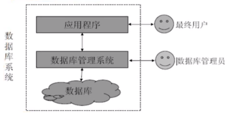
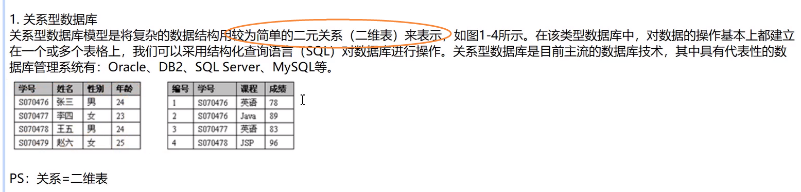
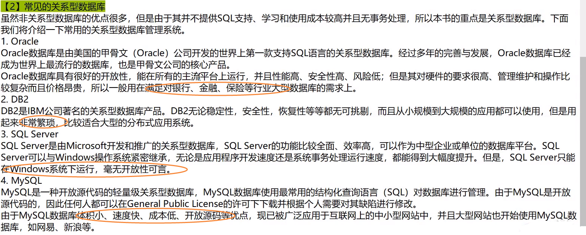
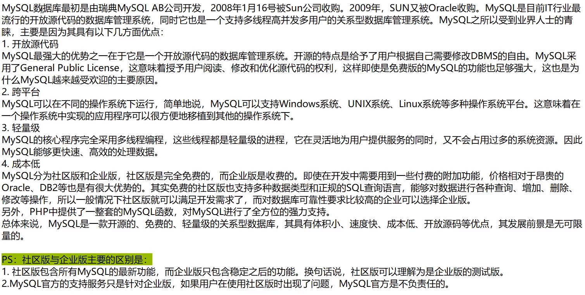

# MySQL数据库

## 1.数据库的基本概念

 (1)数据：字母、文字、文本、图形、音频、视频等

(2)数据库：指的是以一定格式存放、能够实现多个用户共享、与应用程序彼此独立的数据集合。

(3)数据库管理系统：Oracle、MySQL、SQL、Server、DB2等。

(4)数据库应用程序：面向用户的应用程序，比如学生管理系统、人事管理系统、图书管理系统。

(5)数据库管理员：对数据库管理系统进行操作的人员，主要负责数据库的运营和维护。

(6)最终用户：User，用数据库应用程序的人，不会直接与数据库打交道。

(7)数据库系统：

## 2.数据库类型和常见的关系型数据库

关系型数据库：存储在硬盘上的，需要读写

非关系型数据库：存在内存上，不能断电，效率较高

## 3.MySQL介绍

## 6.MySQL登录 访问 退出
