# MySQL数据库

# 第1章

## 1.数据库的基本概念

 (1)数据：字母、文字、文本、图形、音频、视频等

(2)数据库：指的是以一定格式存放、能够实现多个用户共享、与应用程序彼此独立的数据集合。

(3)数据库管理系统：Oracle、MySQL、SQL、Server、DB2等。

(4)数据库应用程序：面向用户的应用程序，比如学生管理系统、人事管理系统、图书管理系统。

(5)数据库管理员：对数据库管理系统进行操作的人员，主要负责数据库的运营和维护。

(6)最终用户：User，用数据库应用程序的人，不会直接与数据库打交道。

(7)数据库系统：


## 2.数据库类型和常见的关系型数据库


关系型数据库：存储在硬盘上的，需要读写

非关系型数据库：存在内存上，不能断电，效率较高


## 3.MySQL介绍


## 4.MySQL登录 访问 退出

登录数据库

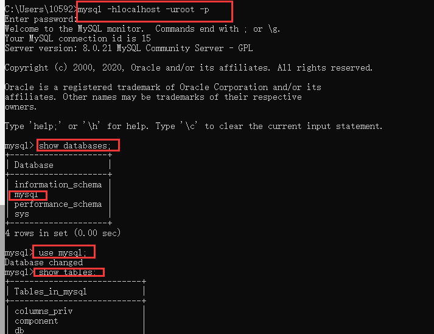


退出数据库

quit;或者exit;或者\q;


## 5.使用图形化客户端navicat12连接MySQL


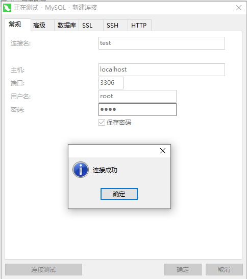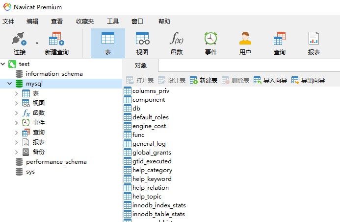


# 第2章

## 1.SQL语言入门

DQL：数据查询

DML：数据进行增加、修改、删除

DDL：操作数据库对象（数据库、表、索引、视图、触发器、存储过程、函数）

DCL：授予或者回收访问数据库的权限

TCL:数据库的事务管理

## 2.创建数据库表

数据库可以将复杂的数据结构用较为简单的二维表来表示

| 学号     | 姓名 | 性别 | 年龄 |
| -------- | ---- | ---- | ---- |
| 17071401 | 张三 | 男   | 20   |
|          |      |      |      |
|          |      |      |      |
|          |      |      |      |


（1）创建数据库：

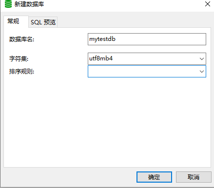

（2）新建查询：

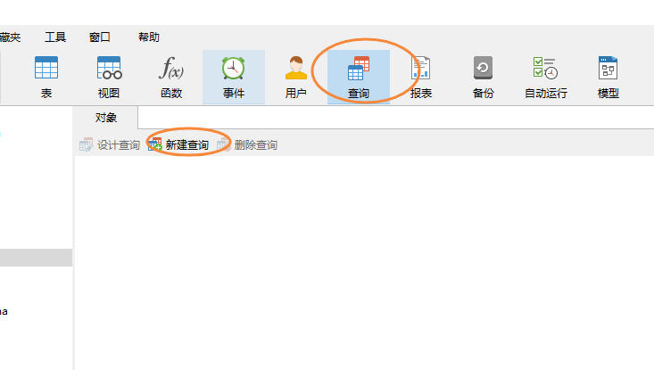

（3）创建数据库表：

```
##这是单行注释
/*
多行注释
多行注释
多行注释
*/

-- 创建数据库表
create table t_student(
sno int(6),-- 6显示长度  但真实值可以为2的31次方
sname varchar(5),-- 5个字符
sex char(1),
age int(3),
enterdate date,
classname varchar(10),
email varchar(15)
);

-- 查看表的结构：展示表的详细信息
desc t_student;

-- 查看表中数据：
select * from t_student;

-- 查看建表语句：
show create table t_student;
/*
CREATE TABLE `t_student` (
  `sno` int DEFAULT NULL,
  `sname` varchar(5) DEFAULT NULL,
  `sex` char(1) DEFAULT NULL,
  `age` int DEFAULT NULL,
  `enterdate` date DEFAULT NULL,
  `classname` varchar(10) DEFAULT NULL,
  `email` varchar(15) DEFAULT NULL
) ENGINE=InnoDB DEFAULT CHARSET=utf8mb4 COLLATE=utf8mb4_0900_ai_ci
*/
```


## 3.数据库表列类型

1.整数类型

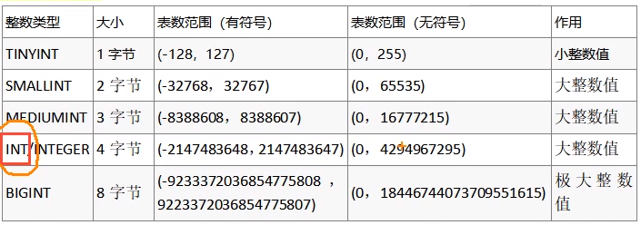

MySQL支持选择在该类型关键字后面的括号内指定整数值的显示宽度（比如：INT(4)）。**显示宽度并不限制可以在列内保存的值的范围**，也不限制超过列的指定宽度的值的显示。

主键自增：不使用序列，通过auto_increment，要求是整数类型


2.浮点数类型

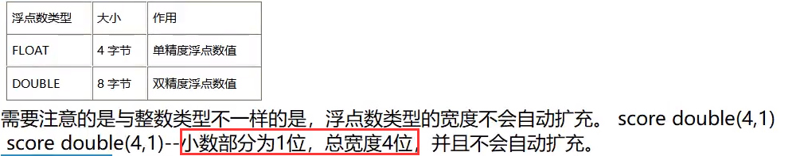


3.字符串类型

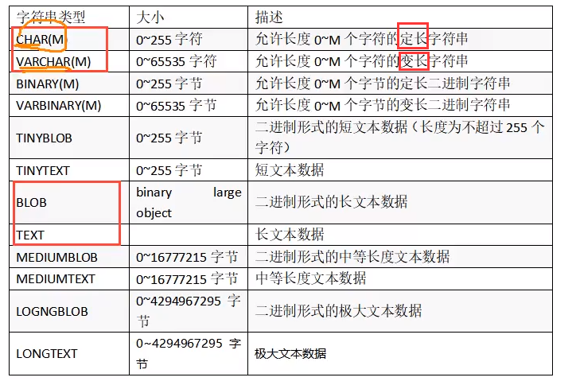

4.日期和时间

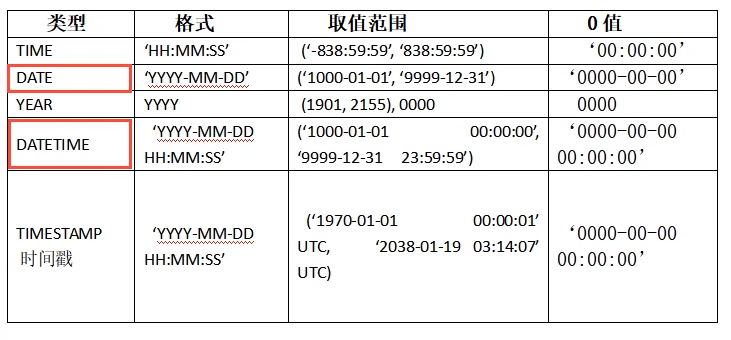

TIMESTEMP类型的数据指定方式与DATETIME基本相同，两者的不同之处在于以下几点：

①TIMESTEMP类型的取值范围更小

②如果没有对TIMESTEAMP类型明确赋值或者赋值为NULL，MySQL会自动将该字段赋值为系统当前的日期和时间

③TIMESTEMP类型可以使用CURRENT_TIMESTAMP来获取系统当前时间

④TIMESTEMP类型的特点是时间根据时区来显示的。比如在东八区插入的TIMESTEMP，在东九区显示的时候就会改变。


## 4.添加数据

注意事项：

①int 宽度是显示宽度，如果超过，可以自动增大宽度 int底层都是4个字节

②时间的方式多样 ‘1256-12-23’   “1256/12/23"    ”1256.12.23“

③字符串不区分单引号和双引号

④如何写入当前的时间 now() sysdate() CURRENT_DATE()

⑤char varchar 是字符的个数，不是字节的个数，可以使用binary，varbinary表示定长和不定长的字节个数

⑥如果不是全字段插入数据的话，需要加入字段的名字

```
-- 查看表记录；
select *from t_student;


-- 在t_student数据库表中插入数据:
insert into t_student values(1,'张三','男',18,'2022-5-8','软件1班','123@163.com');
insert into t_student values(100100100,'李四','女',18,'2022.5.8','软件1班','123@163.com');
insert into t_student values(110,"吴亦凡",'男',30,now(),'看守所1班','666@163.com');
insert into t_student (sno,sname,sex) values(123,"王五","男");
```

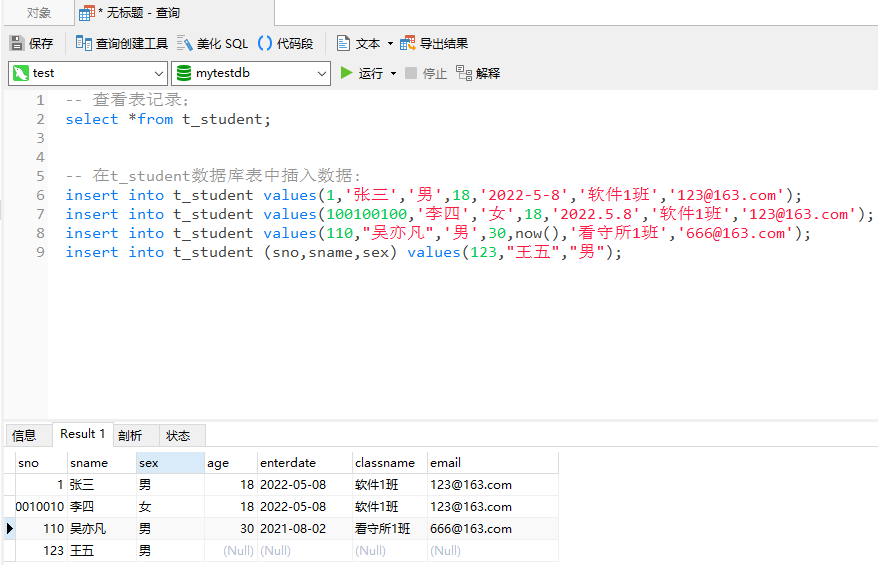


## 5.修改/删除数据

注意事项：

①关键字，表名，字段名不区分大小写

②默认情况下，内容不区分大小写

③删除操作from关键字不可缺少

④修改，删除数据别忘了加限制条件

```
-- 查看表记录；
select *from t_student;


-- 在t_student数据库表中插入数据:
insert into t_student values(1,'张三','男',18,'2022-5-8','软件1班','123@163.com');
insert into t_student values(100100100,'李四','女',18,'2022.5.8','软件1班','123@163.com');
insert into t_student values(110,"吴亦凡",'男',30,now(),'看守所1班','666@163.com');
insert into t_student (sno,sname,sex) values(123,"王五","男");

-- 修改表中数据
UPDATE t_student SET AGE=22 WHERE SNO=123;

-- 删除操作
DELETE FROM t_student WHERE SNAME="李四"
```

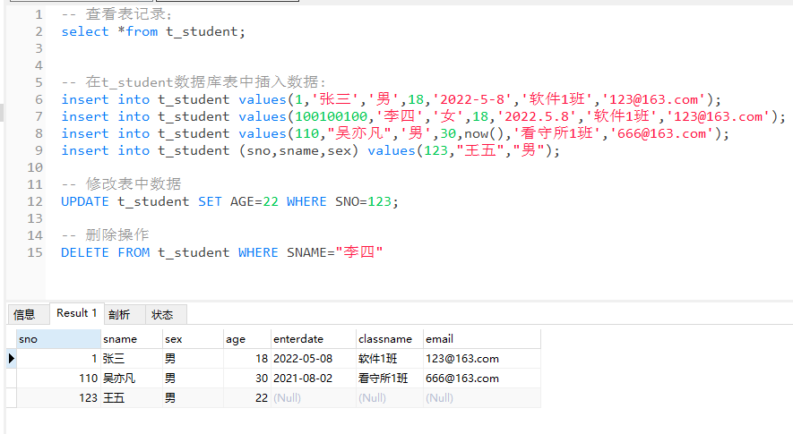


## 6.修改/删除数据表

```
-- 查看数据:
SELECT *FROM t_student

-- 修改表的结构：
-- 增加一列：
ALTER TABLE t_student add score DOUBLE(5,2);-- 5：总位数  2：小数位数
UPDATE t_student set score=123.5678 where sno=1;

-- 增加一列（放在最前面）
ALTER TABLE t_student add score DOUBLE(5,2) FIRST;

-- 增加一列（放在sex列的后面）
ALTER TABLE t_student add score DOUBLE(5,2) AFTER sex;

-- 删除一列：
ALTER TABLE t_student DROP score;


-- 修改一列：
ALTER TABLE t_student MODIFY score FLOAT(4,1); -- modify修改的是列的类型的定义，但不会改变列的名字
ALTER TABLE t_student CHANGE score socre1 DOUBLE(5,1)

-- 删除表
DROP TABLE t_student;
```

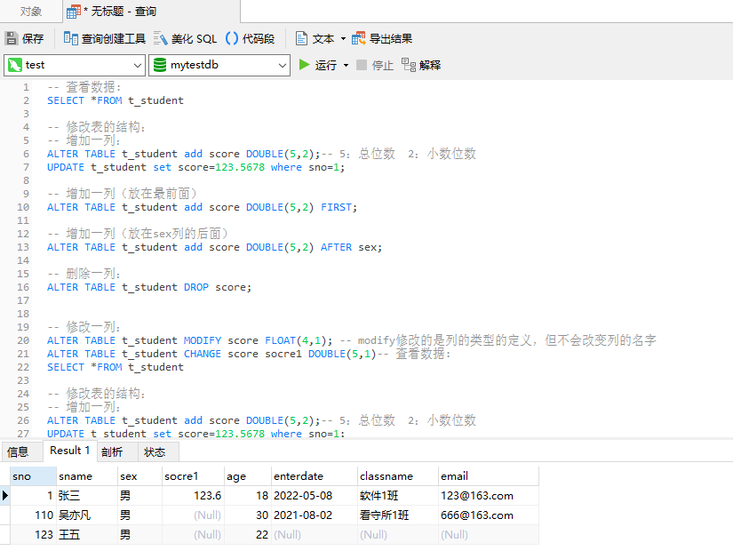

## 7.总结

**对表中的数据：**

**update tablename set 关键字=a where 关键字=b** <font color=green>//将tablename中的关键字等于=b的**所有数据替换**为关键字=a</font>

**delete from tablename where 关键字=a**  <font color=green>//将tablename中的关键字=a的**所有数据删除**</font>


**对于表本身的结构：**

**alter table tablename add 关键字 （FIRST/ AFTER 关键字2）;**  <font color=green>//将tablename中添加关键字 first为第一列</font>
**alter table tablename  关键字;** <font color=green>//将tablename中关键字 删除</font>

**alter table tablename modify 关键字 FLOAT(4,1);** <font color=green>//将tablename中关键字的属性修改</font>
**alter table tablename change 关键字 关键字1 DOUBLE(5,1); **<font color=green>//将tablename中关键字的属性修改，并把名字修改为关键字1</font>

# 第3章

表的完整性约束：

为了防止不符合规范的数据存入数据库，在用户对数据进行增删改查等操作时，MySQL提供了一种机制来检查数据库中的数据是否满足规定的条件，<font color=orange>以保证数据库中数据的准确性和一致性，这种机制就是完整性约束。</font>

## 1.非外键约束

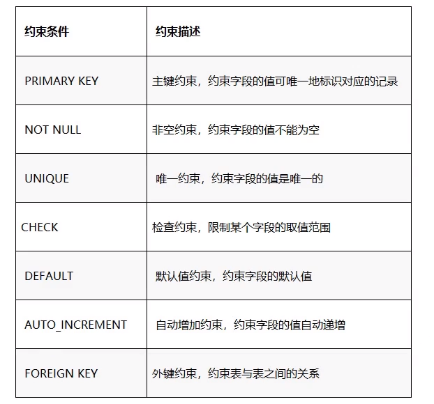

【1】**列级约束：**

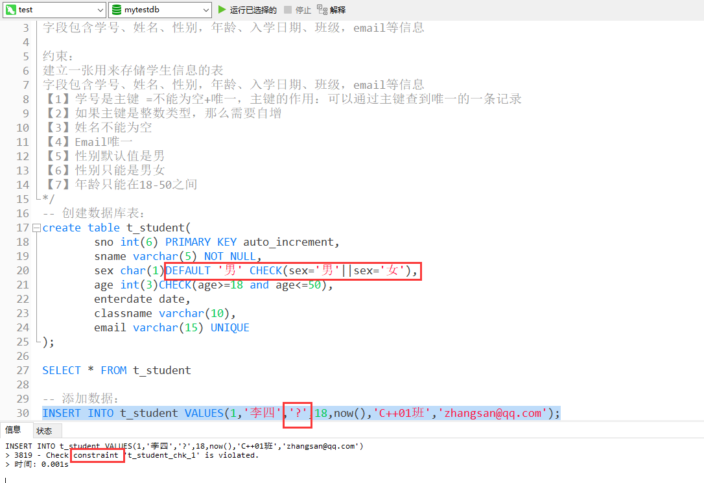

```
/*
建立一张用来存储学生信息的表
字段包含学号、姓名、性别，年龄、入学日期、班级，email等信息

约束：
建立一张用来存储学生信息的表
字段包含学号、姓名、性别，年龄、入学日期、班级，email等信息
【1】学号是主键 =不能为空+唯一，主键的作用：可以通过主键查到唯一的一条记录
【2】如果主键是整数类型，那么需要自增
【3】姓名不能为空
【4】Email唯一
【5】性别默认值是男
【6】性别只能是男女
【7】年龄只能在18-50之间
*/
-- 创建数据库表：
create table t_student(
				sno int(6) PRIMARY KEY auto_increment,
				sname varchar(5) NOT NULL,
				sex char(1)DEFAULT '男' CHECK(sex='男'||sex='女'),
				age int(3)CHECK(age>=18 and age<=50),
				enterdate date,
				classname varchar(10),
				email varchar(15) UNIQUE
);

SELECT * FROM t_student

-- 添加数据：
INSERT INTO t_student VALUES(1,'李四','男',18,now(),'C++01班','zhangsan@qq.com');
```


【2】**表级约束：**

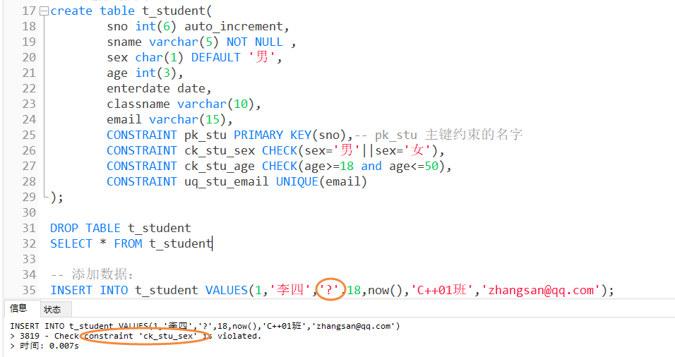

```
-- 创建数据库表：
create table t_student(
				sno int(6) auto_increment,
				sname varchar(5) NOT NULL ,
				sex char(1) DEFAULT '男',
				age int(3),
				enterdate date,
				classname varchar(10),
				email varchar(15),
				CONSTRAINT pk_stu PRIMARY KEY(sno),-- pk_stu 主键约束的名字
				CONSTRAINT ck_stu_sex CHECK(sex='男'||sex='女'),
				CONSTRAINT ck_stu_age CHECK(age>=18 and age<=50),
				CONSTRAINT uq_stu_email UNIQUE(email)
);

DROP TABLE t_student
SELECT * FROM t_student

-- 添加数据：
INSERT INTO t_student VALUES(1,'李四','?',18,now(),'C++01班','zhangsan@qq.com');
```

【3】在创建表以后添加约束：

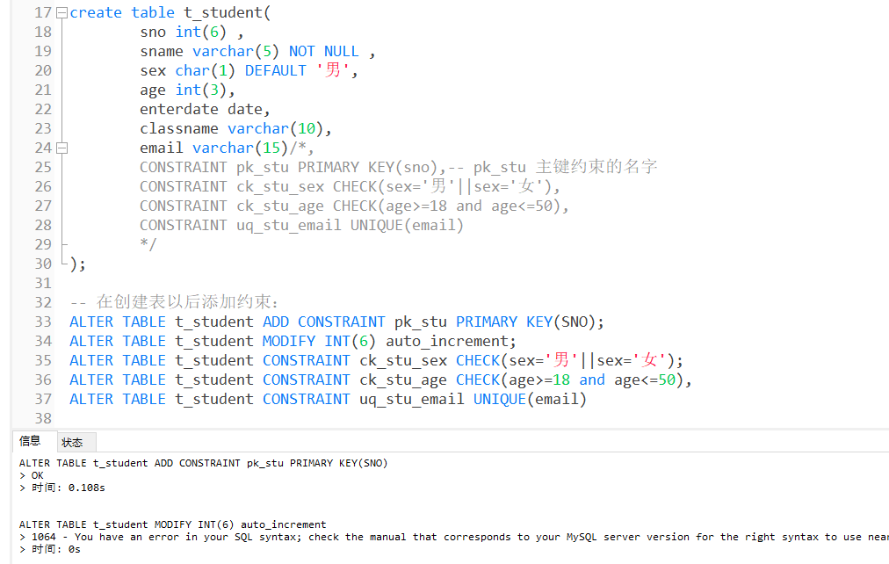

```
create table t_student(
				sno int(6) ,
				sname varchar(5) NOT NULL ,
				sex char(1) DEFAULT '男',
				age int(3),
				enterdate date,
				classname varchar(10),
				email varchar(15)/*,
				CONSTRAINT pk_stu PRIMARY KEY(sno),-- pk_stu 主键约束的名字
				CONSTRAINT ck_stu_sex CHECK(sex='男'||sex='女'),
				CONSTRAINT ck_stu_age CHECK(age>=18 and age<=50),
				CONSTRAINT uq_stu_email UNIQUE(email)
				*/
);

-- 在创建表以后添加约束：
ALTER TABLE t_student ADD CONSTRAINT pk_stu PRIMARY KEY(SNO);
ALTER TABLE t_student MODIFY INT(6) auto_increment;
ALTER TABLE t_student ADD CONSTRAINT ck_stu_sex CHECK(sex='男'||sex='女');
ALTER TABLE t_student ADD CONSTRAINT ck_stu_age CHECK(age>=18 and age<=50),
ALTER TABLE t_student ADD CONSTRAINT uq_stu_email UNIQUE(email)
```


## 2.外键约束

外键是指表中的某个字段的值会依赖于另一张表中某个字段的值，而被依赖的字段必须有主键约束或者唯一约束。


主表（父表）：班级表-班级编号-主键

从表（子表）：学生表-班级编号-外键

```
-- 先创建父表：班级表：
CREATE TABLE t_class(
	cno int(4) PRIMARY KEY auto_increment,
	cname varchar(10) NOT NULL,
	room char(4) NOT NULL
)

-- 添加班级数据：
INSERT INTO t_class VALUES(NULL,'java001','r803');
INSERT INTO t_class VALUES(NULL,'java002','r416');
INSERT INTO t_class VALUES(NULL,'c++001','r103');

-- 可以一次性添加多条记录：
INSERT INTO t_class VALUES(NULL,'java001','r803'), (NULL,'java002','r416'), (NULL,'c++001','r103');

-- 查询班级表：
SELECT * FROM t_class

-- 学生表删除：
DROP TABLE t_student

-- 创建子表
create table t_student(
				sno int(6) auto_increment,
				sname varchar(5) NOT NULL ,
				classno int(4), -- 取值参考t_class表中的cno字段，不要求字段名完全重复，但要求类型长度定义，尽量要求相同
				CONSTRAINT pk_stu PRIMARY KEY(sno)-- pk_stu 主键约束的名字
);

-- 添加学生信息：
INSERT INTO t_student VALUES (NULL,'张三',1),(NULL,'李四',1),(NULL,'王五',2);

INSERT INTO t_student VALUES (NULL,'丽丽',4);
-- 查看学生表：
SELECT * FROM t_student;

-- 添加外键约束：
-- 注意：外键约束只有表级约束，没有列级约束（只能添加到表后边）：
create table t_student(
				sno int(6) PRIMARY KEY auto_increment,
				sname varchar(5) NOT NULL ,
				classno int(4), -- 取值参考t_class表中的cno字段，不要求字段名完全重复，但要求类型长度定义，尽量要求相同
				CONSTRAINT fk_stu_classno FOREIGN KEY (classno) REFERENCES t_class(cno)
);

-- 在创建表以后添加外键约束：
ALTER TABLE t_student ADD CONSTRAINT fk_stu_classno FOREIGN KEY (classno) REFERENCES t_class(cno)

```

步骤：

①创建主表

②创建子表 并加外键约束的表级约束 **constrain 约束名 foreign key(子表某一列) reference父表名(父表某一列)**

效果：

①子表中不填添加父表中没有的元素

比如 父表中没有4班：insert into t_student values(NULL,'丽丽',4); 

②父表中不能删除子表中存在的元素

比如 删除父表的2班：delete from t_class where cno=2;

因为子表中有2班的学生，因此不能删除


## 3.外键策略

```
-- 删除班级2：如果直接删除的话肯定不行，因为有外键约束：

-- 加入外键策略：
-- 策略1：no action 不允许操作
-- 通过操作sql来完成：
-- 先把班级2的学生对应的班级 改为null
UPDATE t_student set classno=NULL WHERE classno=2;
-- 然后再删除班级2：
DELETE FROM t_class where cno=2;

-- 策略2：CASCADE 级联操作：操作主表的时候影响从表的外键信息：
-- 先删除之前的外键约束：
ALTER TABLE t_student DROP FOREIGN KEY fk_stu_classno;
-- 重新添加外键约束：
ALTER TABLE t_student ADD CONSTRAINT fk_stu_classno FOREIGN KEY (classno) REFERENCES t_class(cno) ON UPDATE CASCADE ON DELETE CASCADE;
-- 试试更新：
UPDATE t_class SET cno=5 WHERE cno=1;
-- 试试删除：
DELETE FROM t_class WHERE cno=5;

-- 策略3： set null 置空操作：
-- 先删除之前的外键约束：
ALTER TABLE t_student DROP FOREIGN KEY fk_stu_classno;
-- 重新添加外键约束：
ALTER TABLE t_student ADD CONSTRAINT fk_stu_classno FOREIGN KEY (classno) REFERENCES t_class(cno) ON UPDATE SET NULL ON DELETE SET NULL;
```

补充：

```
-- 添加一张表：快速添加  结构和数据跟t_student都是一致的
CREATE TABLE t_student2
as
SELECT * from t_student;


-- 快速添加  结构跟t_student都是一致的
CREATE TABLE t_student3
as
SELECT * from t_student WHERE 1=2;

-- 快速添加：只要部分列，部分数据：
CREATE TABLE t_student4
as
SELECT sno, sname ,age from t_student WHERE sno=2;


-- 删除数据操作
DELETE FROM t_student;逐条删除所有数据
TRUNCATE TABLE t_student;创建一个新表

```


## 4.总结


| 约束条件       | 约束描述     | 备注                                                |
| -------------- | ------------ | --------------------------------------------------- |
| primary key    | 主键约束     |                                                     |
| not null       | 非空约束     |                                                     |
| unique         | 唯一约束     |                                                     |
| check          | 检查约束     | check(关键字的逻辑表达式)                           |
| default        | 默认值约束   | default '男'                                        |
| auto_increment | 自动增加约束 | 主键的值为null/default的时候自增 只能放到列级约束内 |
| foreign key    | 外键约束     | 约束表与表之前的关系                                |


| 约束条件     | 约束表述                                         | 举例                                                        |
| ------------ | ------------------------------------------------ | ----------------------------------------------------------- |
| 列级约束     | 创建表的时候，在关键字的后面加约束               | sname varchar(5) NOT NULL                                   |
| 表级约束     | 创建表的时，在最后一个关键字后加所有关键字的约束 | constrain pk_stu primary key(sno),-- pk_stu 主键约束的名字  |
| 表外添加约束 | 在创建表后，在表外添加约束                       | alter tablet_student add constrain pk_stu primary key(sno); |


外键约束：不能放到列级约束内


```
包括主表和从表，从表依赖于主表

上图：主表为班级表，从表为学生表。

alter table 从表名 add constrain 约束命名_foreign key(从表关键字名) reference 主表名(主表关键字名)
```


外键策略：

```
级联操作：操作主表的时候影响从表的外键信息：
alter table 从表名 add constrain 约束命名_foreign key(从表关键字名) reference 主表名(主表关键字名) on update cascade on delete cascade

置空操作：操作主表的关键字，会使附表的被约束的关键字置空
alter table 从表名 add constrain 约束命名_foreign key(从表关键字名) reference 主表名(主表关键字名) on update set null on delete set null;
```


快速复制一个表：

```
完全复制：结构和数据
create table 表名
as
select * from t_student


仅复制结构
create table 表名
as
select * from t_student where 1=2(flase的逻辑表达式)

仅复制机构和数据的部分内容
create table 表名
as
select 关键字1，关键字2， from t_student where 关键字的逻辑表达式
```

