##  排序

```
void X_Sort(ElementType A[],int N)
```

大多数情况下，为简单起见，讨论<font color=red>从小到大的整数</font>排序


**稳定性:任意两个相等的数据，排序前后的相对位置不发生改变**

### 简单排序

#### 冒泡排序

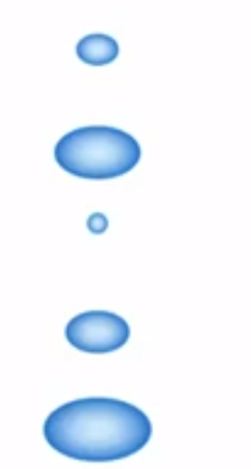

```
void X_Sort(ElementType A[],int N)
{
	ElementType temp;
	for(int P=N-1;P>=0;P--)
	{int flag=0;
		for(int i=0;i<P;i++)
		{
			if(A[i]>A[i+1])
			{
				Swap(A[i],A[i+1]);
				flag=1;
			}
		}
		if(flag==0)break;
	}
}
T=O(N平方)
```


#### 插入排序


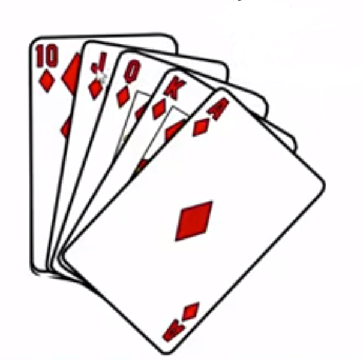

摸牌,如果目前排序大，比如是2，就放到该位置，如果是9，比A大，A往后挪一个，相应的KQJ10都往后挪

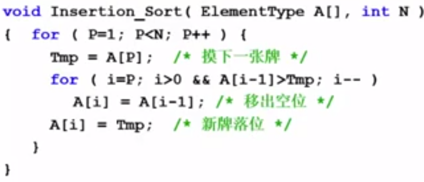

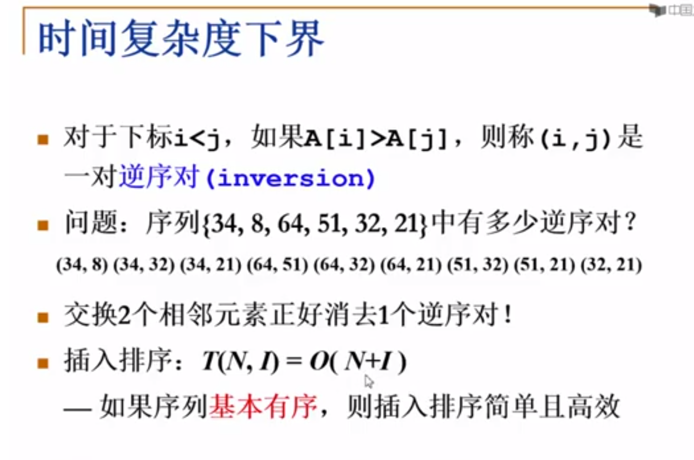


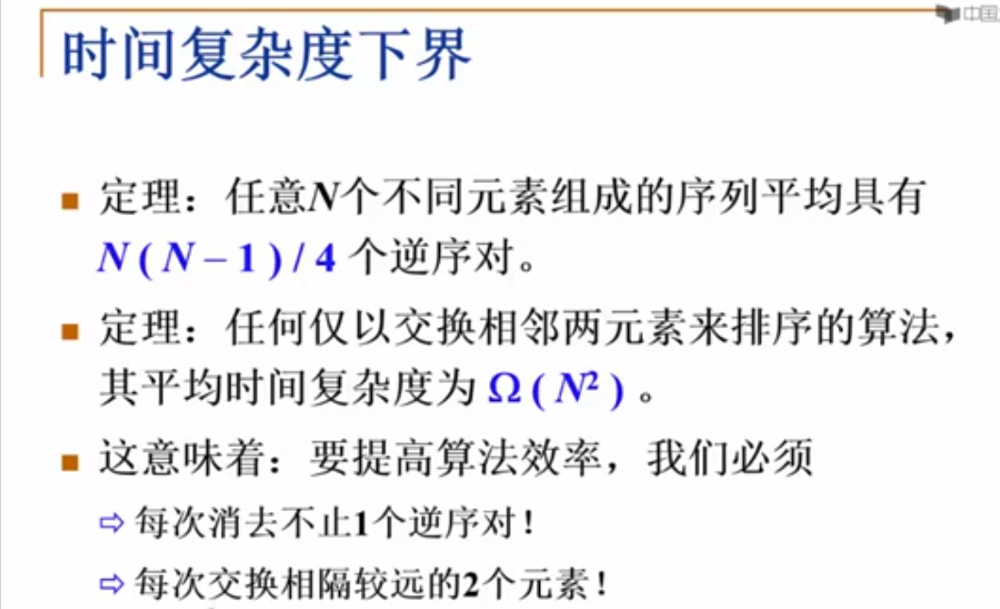


### 希尔排序(Shell Sort)

```
void ShellSort( ElementType A[], int N )
{ /* 希尔排序 - 用Sedgewick增量序列 */
     int Si, D, P, i;
     ElementType Tmp;
     /* 这里只列出一小部分增量 */
     int Sedgewick[] = {929, 505, 209, 109, 41, 19, 5, 1, 0};
     
     for ( Si=0; Sedgewick[Si]>=N; Si++ ) 
         ; /* 初始的增量Sedgewick[Si]不能超过待排序列长度 */

     for ( D=Sedgewick[Si]; D>0; D=Sedgewick[++Si] )
         for ( P=D; P<N; P++ ) { /* 插入排序*/
             Tmp = A[P];
             for ( i=P; i>=D && A[i-D]>Tmp; i-=D )
                 A[i] = A[i-D];
             A[i] = Tmp;
         }
}
```


### 堆排序

```
#include<iostream>

typedef struct Heap
{
	int* Elements;
	int Size;
	int Capacity;
} *MaxHeap;

MaxHeap Creat(int MaxSize)
{
	MaxHeap H = (MaxHeap)malloc(sizeof(Heap));
	H->Elements = (int*)malloc(sizeof(int) * MaxSize);
	H->Size = 0;
	H->Capacity = MaxSize;
	return H;
}


void BuildHeap(int A[], int length)
{
	int Children, Parent,Max;
	for (Parent = (length-1)/2; Parent >= 0; Parent--)
	{
		Children=2*Parent+1;
		int flag = 0;
		if ((Children+1) % 2 == 0 && A[Children + 1] > A[Children])
		{
			Max = A[Children + 1];
			flag = 1;
		}
		else
			Max = A[Children];
		if (Max > A[Parent])
		{
			int temp = 0;
			if (flag == 0)
				A[Children] = A[Parent];
			else
				A[Children + 1] = A[Parent];
			A[Parent] = Max;
		}
	}

}
```


### 归并排序


 


# 堆栈

## Stack

数据对象集：一个有0个或者多个元素的有穷线性表

### 操作集

**长度为MaxSize的堆栈S∈Stack，堆栈元素item∈ElementType**

**1、Stack CreateStack(int MaxSize)：生成空堆栈，其最大长度为Maxsize;**

**2、int IsFull(Stack S,int MaxSize)：判断堆栈是否已满;**

**3、void Push(Stack S,ElementType item)：将元素item压入堆栈;**

**4、int IsEmpty(Stack S)：判断堆栈S是否为空;**

**5、ElementType Pop(Stack S)：删除并返回栈顶元素；**

 

### 栈的顺序存储实现

**由一个一维数组和一个记录栈顶元素位置的变量组成**

```
#define MaxSize
typedef int ElementType; 
typedef SNode *Stack;
struct SNode
{
	ElementType Date[MaxSize];
	int Top;
};
```


#### 入栈

```
void Push(Stack PtrS,ElementType item)
{
	if(PtrS->Top==MaxSize-1)
	{
		cout<<"堆栈满"<<endl;
		return; 
	}
	else
	{
		 PtrS->Date[++(PtrS->Top)]=item;
		 return
	}
}
```


#### 出栈

```
ElementType Pop(Stack PtrS)
{
	if(PtrS->Top==-1)
	{
		cout<<"堆栈空"<<endl;
		throw;		
	}
	else
	{
		return(PtrS->Date[(PtrS->Top)--];
	}
}
```


### 栈的链式存储实现

**栈的链式存储结构实际上就是一个单链表，叫做链栈。插入和删除操作只能在链栈的栈顶进行。**


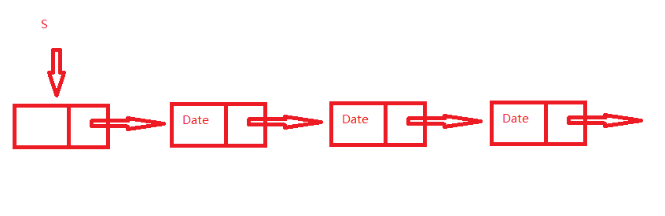

**<font color=red>栈顶指针Top应该指向链表的头结点，因为头结点插入和删除操作比较方便。</font>**

**如果Top指向链表尾部结点，进行插入操作可以，删除操作不能实现，如果删除尾结点，找不到前一个结点（只能通过遍历找到尾结点，无法找到倒数第二个结点）。**


```
typedef int ElementType; 
typedef SNode *Stack;
struct SNode
{
	ElementType Date;
	SNode *Next;
}
```


#### 入栈

```
void Push(Stack S,ElementType item)
{
	Stack newNode=new SNode();
	newNode->ElementType=item;
	newNode->next=S->next;
	S->next=newNode;
}
```


#### 出栈

```
ElementType Pop(Stack S)
{
	if(S->Next==NULL)
	{
		cout<<"堆栈为空"<<endl;
		throw;
	}
	Stack temp;
	ElementType Date;
	

	temp=S->Next;
	S->Next=temp->Next;
	Date=temp->Date;
	delete temp;
	return Date;
}
```


## Queue

**具有一定操作约束的线性表：只能在一端插入，而在另一端删除。**

数据对象集：一个有0个或多个元素的有穷线性表

### 操作集

**长度为MaxSize的队列Q∈Queue，队列元素item∈ElementType**

1、Queue CreatQueue(int MaxSize)：生成长度为MaxSize的空队列；

2、int IsFullQ(Queue Q,int MaxSize)：判断队列Q是否已满；

3、void AddQ(Queue Q,ElementType item)：将数据元素item插入队列Q中；

4、int IsEmptyQ(Queue Q)：判断队列Q是否为空；

5、ElementType DeleteQ(Queue Q)：将队头数据元素从队列中删除并返回。


## priority_queue

用堆实现

优先队列容器与队列一样，只能从队尾插入元素，从队首删除元素。<font color=red>**但是它有一个特性，就是队列中最大的元素总是位于队首，所以出队时，并非按照先进先出的原则进行，而是将当前队列中最大的元素出队。**</font>这点类似于给队列里的元素进行了由大到小的顺序排序。元素的比较规则默认按元素值由大到小排序，可以重载“<”操作符来重新定义比较规则。

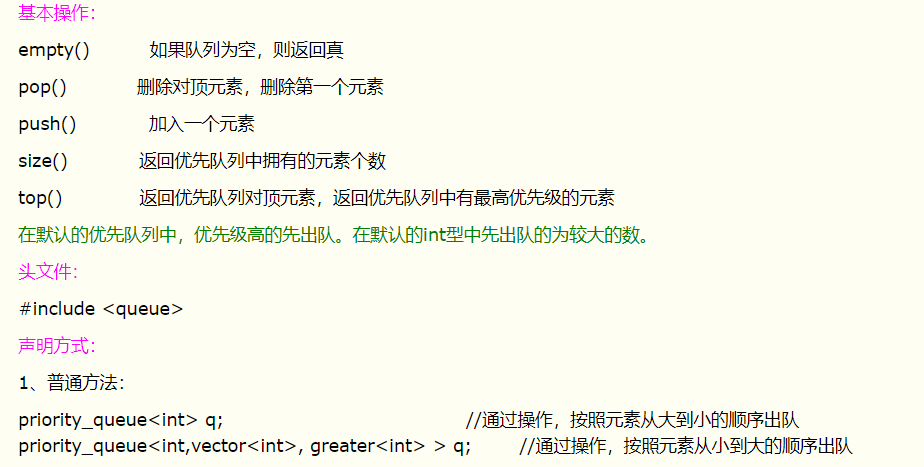

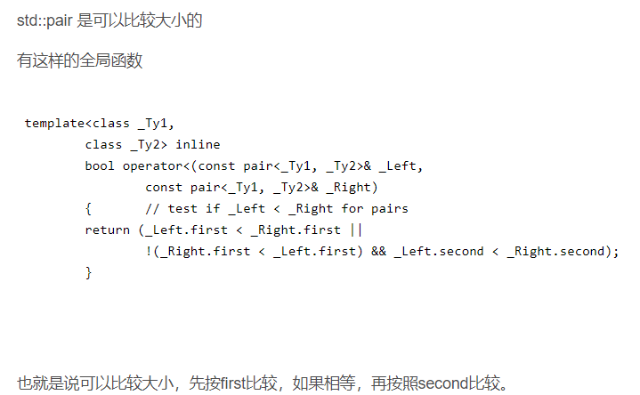


# **二叉树**

结点的度：结点的子树个数

树的度：树所有结点中最大的度数

叶节点：度为0的结点

父节点：有子树的结点是其子树的根节点的父节点

子节点：与父节点相反

兄弟节点：同一个父节点

结点的层次：规定根节点在1层，其它任意结点的层数是其父节点的层数加1

树的深度：树中所有结点中的最大层次

```
struct TreeNode {
  int val;
  TreeNode *left;
  TreeNode *right;
  TreeNode(int x) : val(x), left(NULL), right(NULL) {}
};
```


## 二叉树的遍历

二叉树主要有两种遍历方式：

1. 深度优先遍历：先往深走，遇到叶子节点再往回走。

2. 广度优先遍历：一层一层的去遍历。

   

   

那么从深度优先遍历和广度优先遍历进一步拓展，才有如下遍历方式：

- 深度优先遍历

- - 前序遍历（递归法，迭代法）
  - 中序遍历（递归法，迭代法）
  - 后序遍历（递归法，迭代法）

- 广度优先遍历

- - 层次遍历（迭代法）


在深度优先遍历中：有三个顺序，前中后序遍历

- 前序遍历：中左右
- 中序遍历：左中右
- 后序遍历：左右中

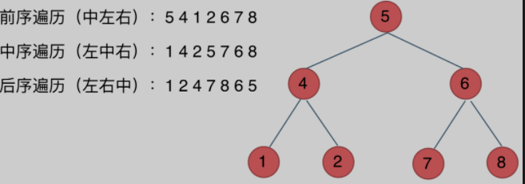


### 递归遍历

递归的要素：

**1.确定递归函数的参数和返回值：**确定哪些参数是递归的过程中需要处理的，那么就在递归函数上加上这个参数，并且还要明确每次递归的返回值是什么进而确定递归函数的返回类型。


**2.确定终止条件：**写完了递归算法，运行的时候，经常会遇到栈溢出的错误，就是没写终止条件或者终止条件没有写对，操作系统也是用一个栈的数据结构来保存每一层递归的信息，如果递归没有终止，操作系统的内存栈必然会溢出。


**3.确定单层递归的逻辑：**确定每一层递归需要处理的信息。在这里也就会重复调用来实现递归过程。


以前序遍历为例子：

1.确定递归函数的参数和返回值：参数为vector来放结点的数值，不需要返回值

```
void traversal（TreeNode* cur,vector<int>& vec)
```

2.确定终止条件：当前结点为空的时候结束递归

```
if(cur == NULL)return;
```

3.确定单层递归的逻辑：前序遍历是中左右的顺序

```
vec.push_back(cur->val);//中
traversal(cur->left,vec);//左
traversal(cur->right,vec);//右
```


### 非递归遍历

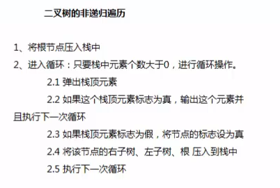


**对于前序遍历**

先讲根节点放入栈中，然后将右孩子入栈，再加入左孩子。(栈里面始终顶多一个元素)

```
vector<int> preorderTraversal(TreeNode* root){
	stack<TreeNode*> st;
	vector<int> result;
	st.push(root);
	while(!st.empty()){
		TreeNode* node=st.top();
		st.pop();
		result.push_back(node->val);
		if(node->right) st.push(node->right);
		if(node->left) st.push(node->left);
	}
	return result;
}
```


**对于中序遍历**

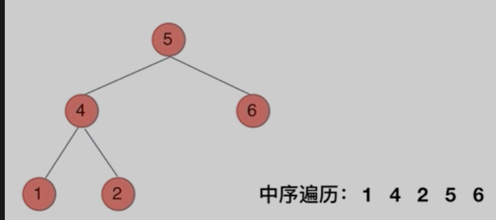

先从根节点入栈5，接着头结点的左儿子入栈4，接着1

直到1的左儿子为空，结束这一边的入栈操作。

因为1没有左儿子，中序遍历就直接读取cur.top()，同时1出栈。

再将1的右子树作为根节点，循环这个过程。

如果1没有右儿子，右儿子为空，那继续读取cur.top()，同时4出栈，再将4的右子树作为根节点，循环这个过程。

```
vector<int> inorderTraversal(TreeNode* root) {
    vector<int> ans;
    stack<TreeNode*> st;
    TreeNode* cur = root;
    while (cur != NULL || !st.empty()){
        if(cur!=NULL){
            st.push(cur);
            cur=cur->left;
        }
        else{
            cur=st.top();
            st.pop();
            ans.push_back(cur->val);
            cur=cur->right;
        }
    }
    return ans;
}
```


### 层序遍历

需要借用一个辅助数据结构即队列来实现，**「队列先进先出，符合一层一层遍历的逻辑，而是用栈先进后出适合模拟深度优先遍历也就是递归的逻辑。」**

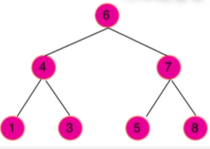

按照6,4,7,1,3,5,8的顺序遍历

1：先让root(6)进入队列

2：设置循环(队列非空)

3：将队列队首node保存，然后pop()，然后将保存的node->val保存

4：将左儿子(4)，右儿子(7)，push()进队列，然后进入3,4循环

```
vector<vector<int>> levelOrder(TreeNode* root) {
    queue<TreeNode*> que;
    vector<vector<int>> ans;
    if(root==nullptr)return ans;
    que.push(root);
    while(!que.empty()){
        int size=que.size();
        vector<int> v;
        for(int i=0;i<size;i++){
            TreeNode* node=que.front();
            que.pop();
            v.push_back(node->val);
            if(node->left)(que.push(node->left));
            if(node->right)(que.push(node->right));
        }
        ans.push_back(v);
    }
    return ans;
}
```


## 二叉搜索树

二叉搜索树：一棵二叉树可以是空；如果非空，满足：

1.非空左子树的所有键值小于其根节点的键值。

2.非空右子树的所有键值大于其根节点的键值。

3.左右子树都是二叉搜索树。


### 插入算法

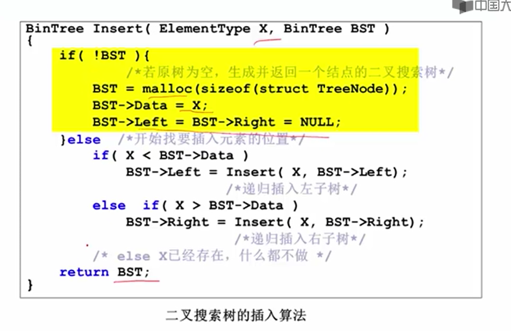


### 删除算法

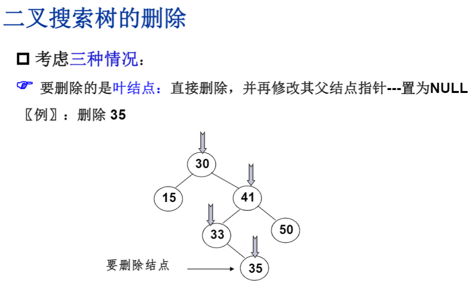

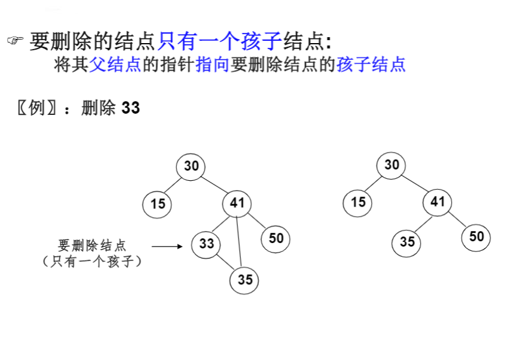

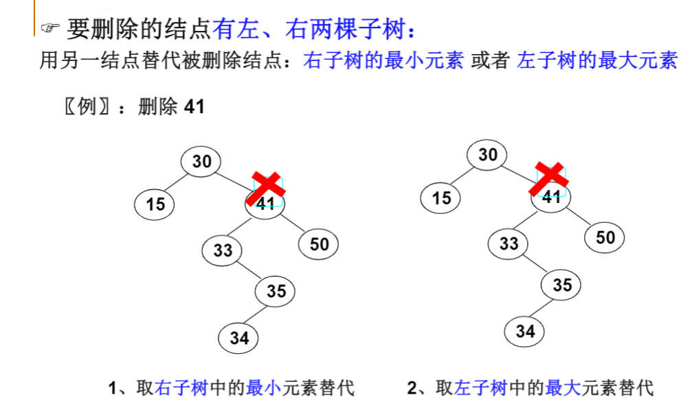

## 平衡二叉树

**C++中map、set、multimap，multiset的底层实现都是平衡二叉搜索树**，所以map、set的增删操作时间时间复杂度是logn。

注意我这里没有说unordered_map、unordered_set，unordered_map、unordered_map底层实现是哈希表。

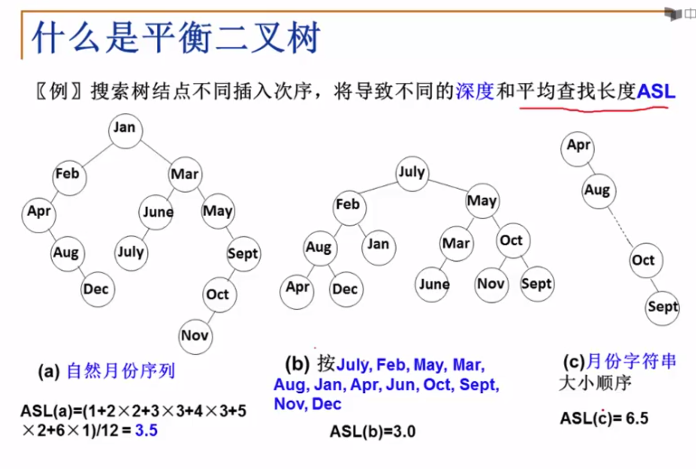

 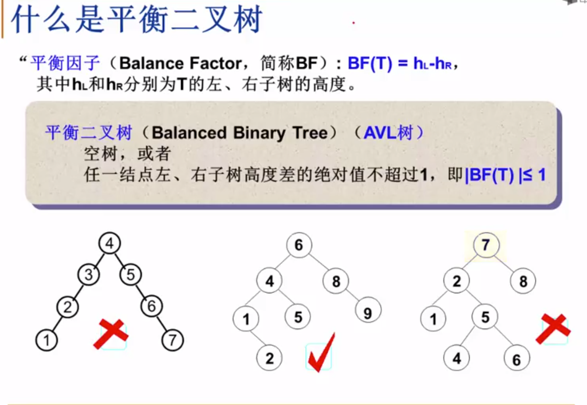

  

平衡因子(BF)：左子树的高度-右子树的高度

任意结点的平衡因子的绝对值小于等于1

平均查找长度与树的高度有关，平均查找长度越小，查找速度越快

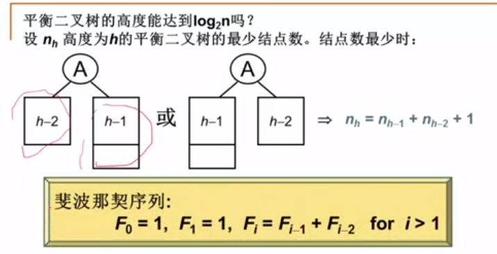


### 平衡二叉树的调整

##### RR插入

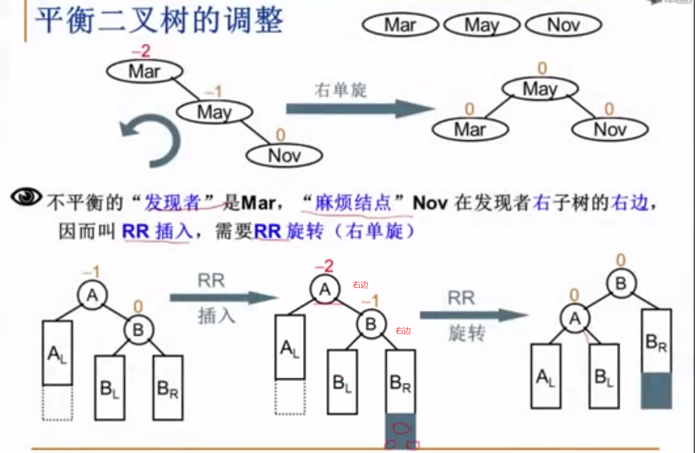


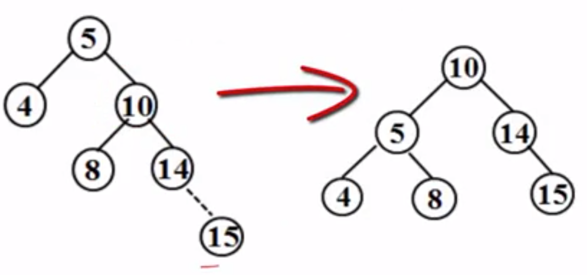


##### LL插入

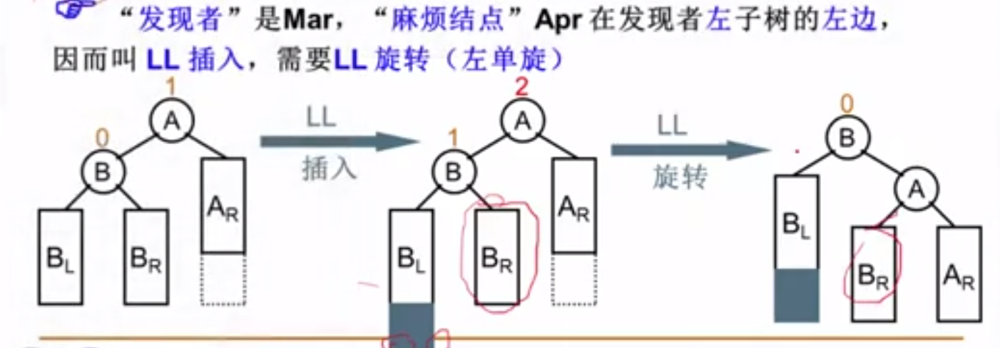


##### LR插入

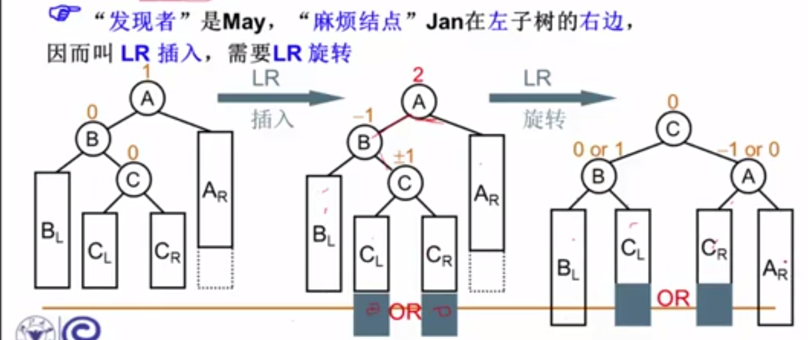


  

## 堆

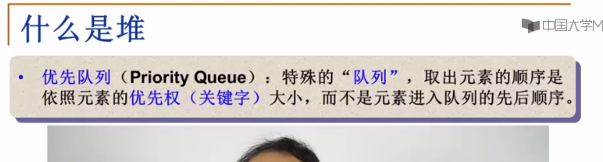

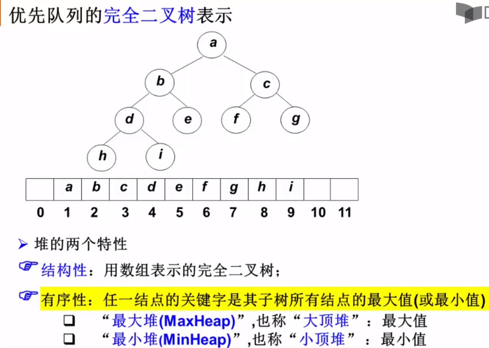

 

### 最大堆的操作

#### 最大堆的创建

数组形式

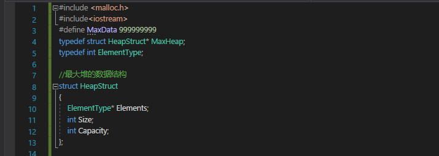


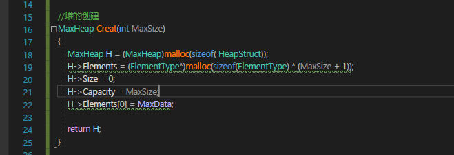

从下标为1的地方开始存放

#### 最大堆的插入

 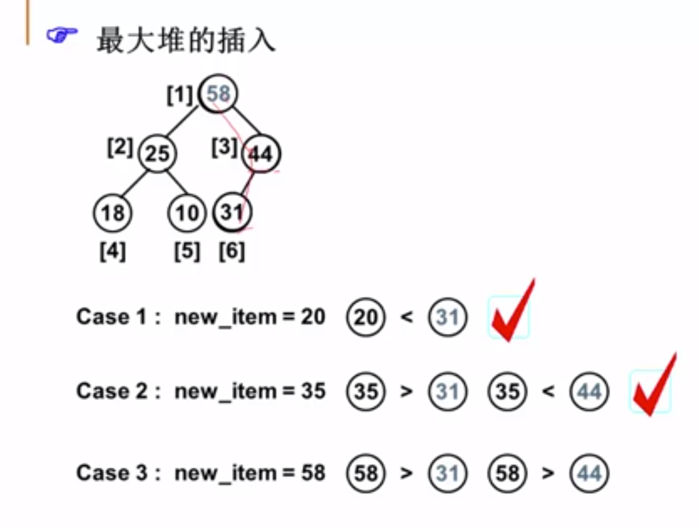


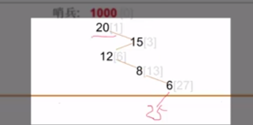


#### 最大堆的删除

```
typedef stuect HeapStruct *MaxHeap;
struct HeapStruct
{
	ElementType *Elements;//存储堆元素的数组
	int Szie;//堆的当前元素个数
	int Capacity;//堆的最大容量
}

ElementType DeleteMax（MaxHeap H)
{
	int Parent,Child;
	ElementType MaxItem,temp;
	if(IsEmpty(H))
	{
		printf("最大堆已为空");
		return;
	}
	Maxitem=H->Elements[1]；
	temp=H->Elements[H->Size--];
	for(Parent=1;Parent*2<=H->Szie;Parent=Child)    //Parent*2<=H->Szie判断有没有左儿子
	{
		Child=Parent*2;
		if((Child!=H->Szie)&&(H->Elements[Child]<H->Elements[Child+1]))    //判Child!=H->Szie断有没有右边儿子
			Child++;
		if(temp>=H->Elements[Child])
			break;
		else
			H->Elements[Parent]=H->Elements[Child];
	}
	H->Elements[Parent]=temp;
	return MaxItem;
	
}
```


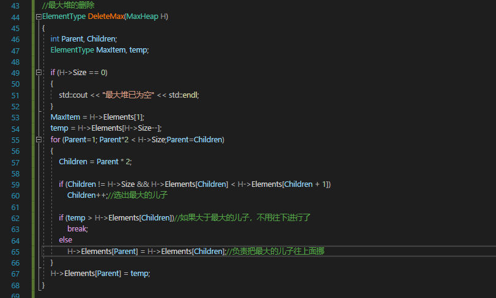

#### 最大堆的建立

建立最大堆：将已经存在的N个元素按最大堆的要求存放在一个一维数组中

方法1：通过插入操作不断的插入，时间复杂度O(NlogN)


方法2：在线性时间复杂度下建立最大堆

(1)将N个元素按输入顺序存入，先满足完全二叉树的结构特性

(2)调整各个结点的位置，以满足最大堆的有序特性

