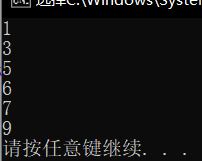
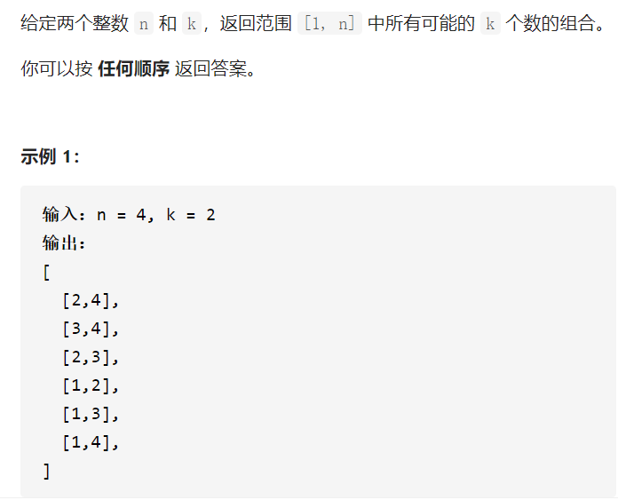
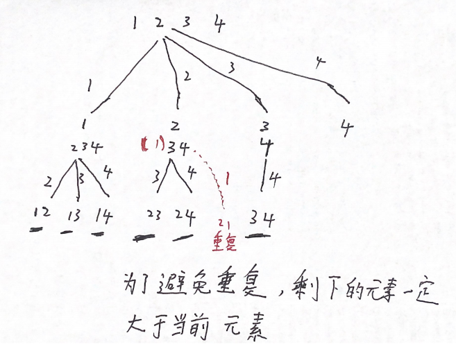
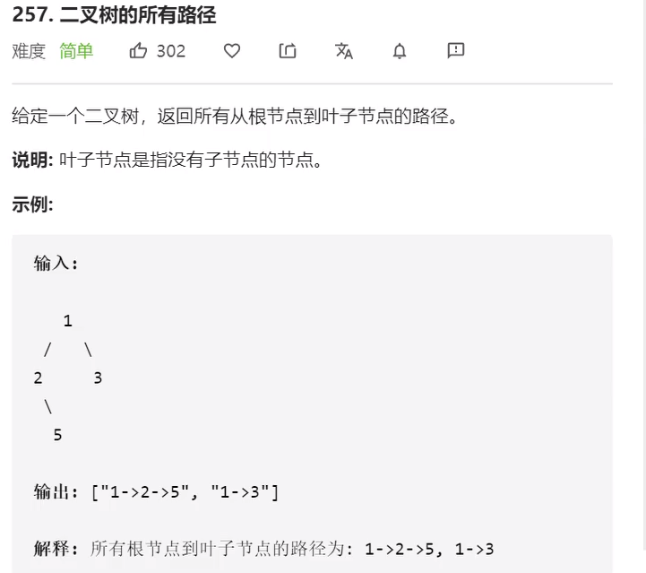
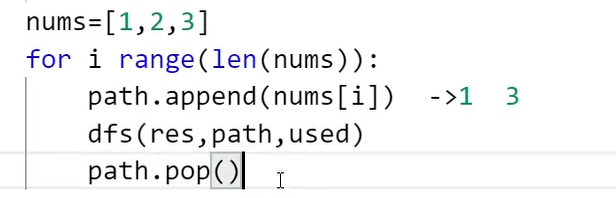
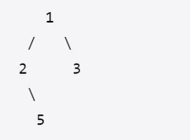

##  排序

```
void X_Sort(ElementType A[],int N)
```

大多数情况下，为简单起见，讨论<font color=red>从小到大的整数</font>排序


**稳定性:任意两个相等的数据，排序前后的相对位置不发生改变**

### 简单排序

### 冒泡排序


```
void X_Sort(ElementType A[],int N)
{
	ElementType temp;
	for(int P=N-1;P>=0;P--)
	{int flag=0;
		for(int i=0;i<P;i++)
		{
			if(A[i]>A[i+1])
			{
				Swap(A[i],A[i+1]);
				flag=1;
			}
		}
		if(flag==0)break;
	}
}
T=O(N平方)
```


### 插入排序


摸牌,如果目前排序大，比如是2，就放到该位置，如果是9，比A大，A往后挪一个，相应的KQJ10都往后挪


### 希尔排序(Shell Sort)

```
void ShellSort( ElementType A[], int N )
{ /* 希尔排序 - 用Sedgewick增量序列 */
     int Si, D, P, i;
     ElementType Tmp;
     /* 这里只列出一小部分增量 */
     int Sedgewick[] = {929, 505, 209, 109, 41, 19, 5, 1, 0};
     
     for ( Si=0; Sedgewick[Si]>=N; Si++ ) 
         ; /* 初始的增量Sedgewick[Si]不能超过待排序列长度 */

     for ( D=Sedgewick[Si]; D>0; D=Sedgewick[++Si] )
         for ( P=D; P<N; P++ ) { /* 插入排序*/
             Tmp = A[P];
             for ( i=P; i>=D && A[i-D]>Tmp; i-=D )
                 A[i] = A[i-D];
             A[i] = Tmp;
         }
}
```


### 堆排序

```
#include<iostream>

typedef struct Heap
{
	int* Elements;
	int Size;
	int Capacity;
} *MaxHeap;

MaxHeap Creat(int MaxSize)
{
	MaxHeap H = (MaxHeap)malloc(sizeof(Heap));
	H->Elements = (int*)malloc(sizeof(int) * MaxSize);
	H->Size = 0;
	H->Capacity = MaxSize;
	return H;
}


void BuildHeap(int A[], int length)
{
	int Children, Parent,Max;
	for (Parent = (length-1)/2; Parent >= 0; Parent--)
	{
		Children=2*Parent+1;
		int flag = 0;
		if ((Children+1) % 2 == 0 && A[Children + 1] > A[Children])
		{
			Max = A[Children + 1];
			flag = 1;
		}
		else
			Max = A[Children];
		if (Max > A[Parent])
		{
			int temp = 0;
			if (flag == 0)
				A[Children] = A[Parent];
			else
				A[Children + 1] = A[Parent];
			A[Parent] = Max;
		}
	}

}
```


### 归并排序

easy



 

```
#include<iostream>
#include<vector>

void Merge(std::vector<int>& arr,int low,int mid,int high){
	int i=low,j=mid+1,k=0; 
	std::vector<int> temp(high-low+1);
	while(i<=mid&&j<=high){
		if(arr[i]<=arr[j])temp[k++]=arr[i++];
		else temp[k++]=arr[j++];
	} 
	while(i<=mid)temp[k++]=arr[i++];
	while(j<=high)temp[k++]=arr[j++];
	for(i=low,k=0;i<=high;++i,++k)arr[i]=temp[k];
	}
	
void MergeSort(std::vector<int>& arr,int low,int high){
	if(low>=high)return;
	int mid=low+(high-low)/2;
	MergeSort(arr,low,mid);
	MergeSort(arr,mid+1,high);
	Merge(arr,low,mid,high);
}


			
int main(){
	std::vector<int> arr={3,7,5,6,9,1};
	MergeSort(arr,0,5);
	for(auto a:arr)std::cout<<a<<std::endl;
}
```


**复杂度分析**

们知道，归并排序的过程中，需要对当前区间进行对半划分，直到区间的长度为`1`。也就是说，每一层的子区间，长度都是上一层的`1/2`。**这也就意味着，当划分到第logn层的时候，子区间的长度就是1了**。而归并排序的`merge`操作，则是从最底层开始（子区间为`1`的层），对相邻的两个子区间进行合并，过程如下：

- 在第`logn`层（最底层），每个子区间的长度为`1`，共`n`个子区间，每相邻两个子区间进行合并，总共合并`n/2`次。`n`个数字都会被遍历一次，所有这一层的总时间复杂度为`O（n）`；

  ......

- 在第二层，每个子区间长度为`n/4`，总共有`4`个子区间，每相邻两个子区间进行合并，总共合并`2`次。`n`个数字都会被遍历一次，所以这一层的总时间复杂度为`O（n）`；
- 在第一层，每个子区间长度为`n/2`，总共有`2`个子区间，只需要合并一次。`n`个数字都会被遍历一次，所以这一层的总时间复杂度为`O（n）`；

  通过上面的过程我们可以发现，对于每一层来说，在合并所有子区间的过程中，`n`个元素都会被操作一次，所以每一层的时间复杂度都是`O（n）`。而之前我们说过，归并排序划分子区间，将子区间划分为只剩`1`个元素，需要划分`logn`次。**每一层的时间复杂度为O（n），共有logn层，所以归并排序的时间复杂度就是O（nlogn）**。


# 堆栈

## Stack

数据对象集：一个有0个或者多个元素的有穷线性表

### 操作集

**长度为MaxSize的堆栈S∈Stack，堆栈元素item∈ElementType**

**1、Stack CreateStack(int MaxSize)：生成空堆栈，其最大长度为Maxsize;**

**2、int IsFull(Stack S,int MaxSize)：判断堆栈是否已满;**

**3、void Push(Stack S,ElementType item)：将元素item压入堆栈;**

**4、int IsEmpty(Stack S)：判断堆栈S是否为空;**

**5、ElementType Pop(Stack S)：删除并返回栈顶元素；**

 

### 栈的顺序存储实现

**由一个一维数组和一个记录栈顶元素位置的变量组成**

```
#define MaxSize
typedef int ElementType; 
typedef SNode *Stack;
struct SNode
{
	ElementType Date[MaxSize];
	int Top;
};
```


#### 入栈

```
void Push(Stack PtrS,ElementType item)
{
	if(PtrS->Top==MaxSize-1)
	{
		cout<<"堆栈满"<<endl;
		return; 
	}
	else
	{
		 PtrS->Date[++(PtrS->Top)]=item;
		 return
	}
}
```


#### 出栈

```
ElementType Pop(Stack PtrS)
{
	if(PtrS->Top==-1)
	{
		cout<<"堆栈空"<<endl;
		throw;		
	}
	else
	{
		return(PtrS->Date[(PtrS->Top)--];
	}
}
```


### 栈的链式存储实现

**栈的链式存储结构实际上就是一个单链表，叫做链栈。插入和删除操作只能在链栈的栈顶进行。**


**<font color=red>栈顶指针Top应该指向链表的头结点，因为头结点插入和删除操作比较方便。</font>**

**如果Top指向链表尾部结点，进行插入操作可以，删除操作不能实现，如果删除尾结点，找不到前一个结点（只能通过遍历找到尾结点，无法找到倒数第二个结点）。**


```
typedef int ElementType; 
typedef SNode *Stack;
struct SNode
{
	ElementType Date;
	SNode *Next;
}
```


#### 入栈

```
void Push(Stack S,ElementType item)
{
	Stack newNode=new SNode();
	newNode->ElementType=item;
	newNode->next=S->next;
	S->next=newNode;
}
```


#### 出栈

```
ElementType Pop(Stack S)
{
	if(S->Next==NULL)
	{
		cout<<"堆栈为空"<<endl;
		throw;
	}
	Stack temp;
	ElementType Date;
	

	temp=S->Next;
	S->Next=temp->Next;
	Date=temp->Date;
	delete temp;
	return Date;
}
```


## Queue

**具有一定操作约束的线性表：只能在一端插入，而在另一端删除。**

数据对象集：一个有0个或多个元素的有穷线性表

### 操作集

**长度为MaxSize的队列Q∈Queue，队列元素item∈ElementType**

1、Queue CreatQueue(int MaxSize)：生成长度为MaxSize的空队列；

2、int IsFullQ(Queue Q,int MaxSize)：判断队列Q是否已满；

3、void AddQ(Queue Q,ElementType item)：将数据元素item插入队列Q中；

4、int IsEmptyQ(Queue Q)：判断队列Q是否为空；

5、ElementType DeleteQ(Queue Q)：将队头数据元素从队列中删除并返回。


## priority_queue

用堆实现

优先队列容器与队列一样，只能从队尾插入元素，从队首删除元素。<font color=red>**但是它有一个特性，就是队列中最大的元素总是位于队首，所以出队时，并非按照先进先出的原则进行，而是将当前队列中最大的元素出队。**</font>这点类似于给队列里的元素进行了由大到小的顺序排序。元素的比较规则默认按元素值由大到小排序，可以重载“<”操作符来重新定义比较规则。


# **二叉树**

结点的度：结点的子树个数

树的度：树所有结点中最大的度数

叶节点：度为0的结点

父节点：有子树的结点是其子树的根节点的父节点

子节点：与父节点相反

兄弟节点：同一个父节点

结点的层次：规定根节点在1层，其它任意结点的层数是其父节点的层数加1

树的深度：树中所有结点中的最大层次

```
struct TreeNode {
  int val;
  TreeNode *left;
  TreeNode *right;
  TreeNode(int x) : val(x), left(NULL), right(NULL) {}
};
```


## 二叉树的遍历

二叉树主要有两种遍历方式：

1. 深度优先遍历：先往深走，遇到叶子节点再往回走。

2. 广度优先遍历：一层一层的去遍历。

   

   

那么从深度优先遍历和广度优先遍历进一步拓展，才有如下遍历方式：

- 深度优先遍历

- - 前序遍历（递归法，迭代法）
  - 中序遍历（递归法，迭代法）
  - 后序遍历（递归法，迭代法）

- 广度优先遍历

- - 层次遍历（迭代法）


在深度优先遍历中：有三个顺序，前中后序遍历

- 前序遍历：中左右
- 中序遍历：左中右
- 后序遍历：左右中


### dfs递归遍历

递归的要素：

**1.确定递归函数的参数和返回值：**确定哪些参数是递归的过程中需要处理的，那么就在递归函数上加上这个参数，并且还要明确每次递归的返回值是什么进而确定递归函数的返回类型。


**2.确定终止条件：**写完了递归算法，运行的时候，经常会遇到栈溢出的错误，就是没写终止条件或者终止条件没有写对，操作系统也是用一个栈的数据结构来保存每一层递归的信息，如果递归没有终止，操作系统的内存栈必然会溢出。


**3.确定单层递归的逻辑：**确定每一层递归需要处理的信息。在这里也就会重复调用来实现递归过程。


以前序遍历为例子：

1.确定递归函数的参数和返回值：参数为vector来放结点的数值，不需要返回值

```
void traversal（TreeNode* cur,vector<int>& vec)
```

2.确定终止条件：当前结点为空的时候结束递归

```
if(cur == NULL)return;
```

3.确定单层递归的逻辑：前序遍历是中左右的顺序

```
vec.push_back(cur->val);//中
traversal(cur->left,vec);//左
traversal(cur->right,vec);//右
```


### 非递归遍历


**对于前序遍历**

先讲根节点放入栈中，然后将右孩子入栈，再加入左孩子。

```
vector<int> preorderTraversal(TreeNode* root){
	stack<TreeNode*> st;
	vector<int> result;
	st.push(root);
	while(!st.empty()){
		TreeNode* node=st.top();
		st.pop();
		result.push_back(node->val);
		if(node->right) st.push(node->right);
		if(node->left) st.push(node->left);
	}
	return result;
}
```


**对于后序遍历**

因为前序遍历是**根左右**

后续遍历是**左右根**

我们可以**根右左** **然后翻转reverse(根右左)=左右根**

```
vector<int> preorderTraversal(TreeNode* root){
	stack<TreeNode*> st;
	vector<int> result;
	st.push(root);
	while(!st.empty()){
		TreeNode* node=st.top();
		st.pop();
		result.push_back(node->val);
		if(node->right) st.push(node->left);
		if(node->left) st.push(node->right);
	}
	reverse(result.begin(), result.end());
	return result;
}
```


**对于中序遍历**


先从根节点入栈5，接着头结点的左儿子入栈4，接着1

直到1的左儿子为空，结束这一边的入栈操作。

因为1没有左儿子，中序遍历就直接读取cur.top()，同时1出栈。

再将1的右子树作为根节点，循环这个过程。

如果1没有右儿子，右儿子为空，那继续读取cur.top()，同时4出栈，再将4的右子树作为根节点，循环这个过程。

```
vector<int> inorderTraversal(TreeNode* root) {
    vector<int> ans;
    stack<TreeNode*> st;
    TreeNode* cur = root;
    while (cur != NULL || !st.empty()){
        if(cur!=NULL){
            st.push(cur);
            cur=cur->left;
        }
        else{
            cur=st.top();
            st.pop();
            ans.push_back(cur->val);
            cur=cur->right;
        }
    }
    return ans;
}
```


### 层序遍历bfs

需要借用一个辅助数据结构即队列来实现，**「队列先进先出，符合一层一层遍历的逻辑，而是用栈先进后出适合模拟深度优先遍历也就是递归的逻辑。」**


按照6,4,7,1,3,5,8的顺序遍历

1：先让root(6)进入队列

2：设置循环(队列非空)

3：将队列队首node保存，然后pop()，然后将保存的node->val保存

4：将左儿子(4)，右儿子(7)，push()进队列，然后进入3,4循环

```
vector<vector<int>> levelOrder(TreeNode* root) {
    queue<TreeNode*> que;
    vector<vector<int>> ans;
    if(root==nullptr)return ans;
    que.push(root);
    while(!que.empty()){
        int size=que.size();
        vector<int> v;
        for(int i=0;i<size;i++){
            TreeNode* node=que.front();
            que.pop();
            v.push_back(node->val);
            if(node->left)(que.push(node->left));
            if(node->right)(que.push(node->right));
        }
        ans.push_back(v);
    }
    return ans;
}
```


## 二叉搜索树

二叉搜索树：一棵二叉树可以是空；如果非空，满足：

1.非空左子树的所有键值小于其根节点的键值。

2.非空右子树的所有键值大于其根节点的键值。

3.左右子树都是二叉搜索树。


### 插入算法


### 删除算法


## 平衡二叉树

**C++中map、set、multimap，multiset的底层实现都是平衡二叉搜索树**，所以map、set的增删操作时间时间复杂度是logn。

注意我这里没有说unordered_map、unordered_set，unordered_map、unordered_map底层实现是哈希表。


 

  

平衡因子(BF)：左子树的高度-右子树的高度

任意结点的平衡因子的绝对值小于等于1

平均查找长度与树的高度有关，平均查找长度越小，查找速度越快


### 平衡二叉树的调整

##### RR插入


##### LL插入


##### LR插入


  

## 堆


 

### 最大堆的操作

#### 最大堆的创建

数组形式


从下标为1的地方开始存放

#### 最大堆的插入

 


#### 最大堆的删除

```
typedef stuect HeapStruct *MaxHeap;
struct HeapStruct
{
	ElementType *Elements;//存储堆元素的数组
	int Szie;//堆的当前元素个数
	int Capacity;//堆的最大容量
}

ElementType DeleteMax（MaxHeap H)
{
	int Parent,Child;
	ElementType MaxItem,temp;
	if(IsEmpty(H))
	{
		printf("最大堆已为空");
		return;
	}
	Maxitem=H->Elements[1]；
	temp=H->Elements[H->Size--];
	for(Parent=1;Parent*2<=H->Szie;Parent=Child)    //Parent*2<=H->Szie判断有没有左儿子
	{
		Child=Parent*2;
		if((Child!=H->Szie)&&(H->Elements[Child]<H->Elements[Child+1]))    //判Child!=H->Szie断有没有右边儿子
			Child++;
		if(temp>=H->Elements[Child])
			break;
		else
			H->Elements[Parent]=H->Elements[Child];
	}
	H->Elements[Parent]=temp;
	return MaxItem;
	
}
```


#### 最大堆的建立

建立最大堆：将已经存在的N个元素按最大堆的要求存放在一个一维数组中

方法1：通过插入操作不断的插入，时间复杂度O(NlogN)


方法2：在线性时间复杂度下建立最大堆

(1)将N个元素按输入顺序存入，先满足完全二叉树的结构特性

(2)调整各个结点的位置，以满足最大堆的有序特性


## 回溯算法

递归函数下面就是回溯过程

解决问题：

组合

切割

子集

排列

棋盘


所有的回溯算法都可以归结为一个树


模版：

```
void backtracking（参数）{
	if(终止条件){
		收集结果;
		return;
		}
	for(集合元素){
		处理结点;
		递归函数;
		回溯操作(撤销处理节点的情况)
		}
	return;
	}
```



如果用暴力的方法就是2层for循环


```
1234组合
for(int i=1;i<=4;++i){
	for(int j=i+1;j<=4++j){
		cout<<(i,j)<<endl;
    }
}
```

但如果n=100，k=50就需要50层for循环，况且k不定for循环没法写

回溯算法用递归来代替for循环，最外层有一个for循环，for循环内部有递归，递归就代表嵌套的for循环。



```
    vector<int> path;
    vector<vector<int>> res;
    vector<vector<int>> combine(int n, int k) {
        backtracking(n,k,1);
        return res;
    }
    void backtracking(int n,int k,int index){
        if(path.size()==k){
            res.push_back(path);
            return;
        }
        for(int i=index;i<=n;++i){
            path.push_back(i);
            backtracking(n,k,i+1);
            
            path.pop_back();//比如path已经是1，我们得到12，但是为了回溯到上一步，我们需要把2弹出，在加3变成13
            
        }
        return;
    }
```


###  剪枝操作

​	

比如n=5 k=3；

当前path里面有1 即path.size()个数字

还需要（3-1）=2即（k-path.size())个数字 

一共n个数字

当i=n-（k-path.size())+1的时候 剩余的数字个数恰好为n-i+1=（k-path.size())个

那么i至多等于 5-2+1=4即有且只有4，5可以选择

那么就是i至多从n-（k-path.size())+1 的位置开始一定可以搜到大小为k的组合的


### 二叉树的回溯算法



```
vector<string> binaryTreePaths(TreeNode* root) {
    vector<string> res;
    dfs(root,res,"");
    return res;
}
void dfs(TreeNode* root,vector<string>& res,string path){
    if(root==nullptr)return;
    if(root->left==nullptr&&root->right==nullptr){
        res.push_back(path+to_string(root->val));
    }
    else {
    path=path+to_string(root->val)+"->";
    dfs(root->left,res,path);
    dfs(root->right,res,path);
    }
    return;
}
```

相对于传统的回溯算法，是因为解空间是固定的，只有左子树和右子树。

之前的全组合问题需要pop()回溯是因为，解空间是改变的。

比如：

path里面是1，dfs后是1 2，接下来我要弹出2才能继续递归出13，此时的path是一个全局变量




在树的回溯里面，解空间只有两个左子树和右子树

此时的path是传值操作

    path=path+to_string(root->val)+"->";
    dfs(root->left,res,path);
    dfs(root->right,res,path);

两个dfs是同一层，用的path都是{1}这个相等的path

