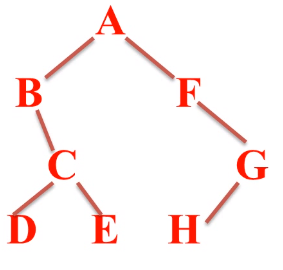
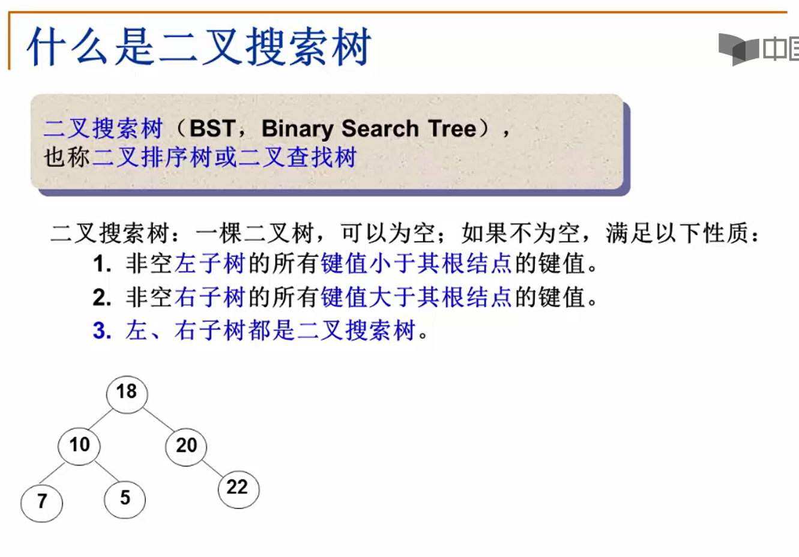
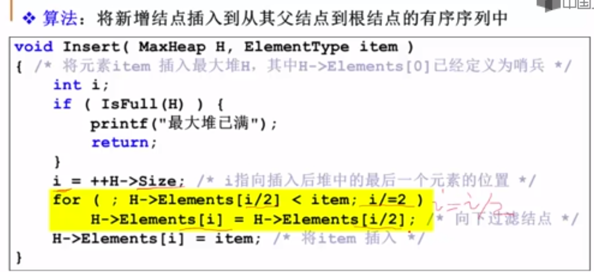

##  排序

```
void X_Sort(ElementType A[],int N)
```

大多数情况下，为简单起见，讨论<font color=red>从小到大的整数</font>排序


**稳定性:任意两个相等的数据，排序前后的相对位置不发生改变**

### 简单排序

#### 冒泡排序


```
void X_Sort(ElementType A[],int N)
{
	ElementType temp;
	for(int P=N-1;P>=0;P--)
	{int flag=0;
		for(int i=0;i<P;i++)
		{
			if(A[i]>A[i+1])
			{
				Swap(A[i],A[i+1]);
				flag=1;
			}
		}
		if(flag==0)break;
	}
}
T=O(N平方)
```


#### 插入排序


摸牌,如果目前排序大，比如是2，就放到该位置，如果是9，比A大，A往后挪一个，相应的KQJ10都往后挪


### 希尔排序(Shell Sort)

```
void ShellSort( ElementType A[], int N )
{ /* 希尔排序 - 用Sedgewick增量序列 */
     int Si, D, P, i;
     ElementType Tmp;
     /* 这里只列出一小部分增量 */
     int Sedgewick[] = {929, 505, 209, 109, 41, 19, 5, 1, 0};
     
     for ( Si=0; Sedgewick[Si]>=N; Si++ ) 
         ; /* 初始的增量Sedgewick[Si]不能超过待排序列长度 */

     for ( D=Sedgewick[Si]; D>0; D=Sedgewick[++Si] )
         for ( P=D; P<N; P++ ) { /* 插入排序*/
             Tmp = A[P];
             for ( i=P; i>=D && A[i-D]>Tmp; i-=D )
                 A[i] = A[i-D];
             A[i] = Tmp;
         }
}
```


### 堆排序

```
#include<iostream>

typedef struct Heap
{
	int* Elements;
	int Size;
	int Capacity;
} *MaxHeap;

MaxHeap Creat(int MaxSize)
{
	MaxHeap H = (MaxHeap)malloc(sizeof(Heap));
	H->Elements = (int*)malloc(sizeof(int) * MaxSize);
	H->Size = 0;
	H->Capacity = MaxSize;
	return H;
}


void BuildHeap(int A[], int length)
{
	int Children, Parent,Max;
	for (Parent = (length-1)/2; Parent >= 0; Parent--)
	{
		Children=2*Parent+1;
		int flag = 0;
		if ((Children+1) % 2 == 0 && A[Children + 1] > A[Children])
		{
			Max = A[Children + 1];
			flag = 1;
		}
		else
			Max = A[Children];
		if (Max > A[Parent])
		{
			int temp = 0;
			if (flag == 0)
				A[Children] = A[Parent];
			else
				A[Children + 1] = A[Parent];
			A[Parent] = Max;
		}
	}

}
```


### 归并排序


 


## 线性结构

### 堆栈

Stack

数据对象集：一个有0个或者多个元素的有穷线性表

#### 操作集

**长度为MaxSize的堆栈S∈Stack，堆栈元素item∈ElementType**

**1、Stack CreateStack(int MaxSize)：生成空堆栈，其最大长度为Maxsize;**

**2、int IsFull(Stack S,int MaxSize)：判断堆栈是否已满;**

**3、void Push(Stack S,ElementType item)：将元素item压入堆栈;**

**4、int IsEmpty(Stack S)：判断堆栈S是否为空;**

**5、ElementType Pop(Stack S)：删除并返回栈顶元素；**

 

#### 栈的顺序存储实现

**由一个一维数组和一个记录栈顶元素位置的变量组成**

```
#define MaxSize
typedef int ElementType; 
typedef SNode *Stack;
struct SNode
{
	ElementType Date[MaxSize];
	int Top;
};
```


##### 入栈

```
void Push(Stack PtrS,ElementType item)
{
	if(PtrS->Top==MaxSize-1)
	{
		cout<<"堆栈满"<<endl;
		return; 
	}
	else
	{
		 PtrS->Date[++(PtrS->Top)]=item;
		 return
	}
}
```


##### 出栈

```
ElementType Pop(Stack PtrS)
{
	if(PtrS->Top==-1)
	{
		cout<<"堆栈空"<<endl;
		throw;		
	}
	else
	{
		return(PtrS->Date[(PtrS->Top)--];
	}
}
```


#### 栈的链式存储实现

**栈的链式存储结构实际上就是一个单链表，叫做链栈。插入和删除操作只能在链栈的栈顶进行。**


**<font color=red>栈顶指针Top应该指向链表的头结点，因为头结点插入和删除操作比较方便。</font>**

**如果Top指向链表尾部结点，进行插入操作可以，删除操作不能实现，如果删除尾结点，找不到前一个结点（只能通过遍历找到尾结点，无法找到倒数第二个结点）。**


```
typedef int ElementType; 
typedef SNode *Stack;
struct SNode
{
	ElementType Date;
	SNode *Next;
}
```


##### 入栈

```
void Push(Stack S,ElementType item)
{
	Stack newNode=new SNode();
	newNode->ElementType=item;
	newNode->next=S->next;
	S->next=newNode;
}
```


##### 出栈

```
ElementType Pop(Stack S)
{
	if(S->Next==NULL)
	{
		cout<<"堆栈为空"<<endl;
		throw;
	}
	Stack temp;
	ElementType Date;
	

	temp=S->Next;
	S->Next=temp->Next;
	Date=temp->Date;
	delete temp;
	return Date;
}
```


### 队列

**具有一定操作约束的线性表：只能在一端插入，而在另一端删除。**

数据对象集：一个有0个或多个元素的有穷线性表

#### 操作集

**长度为MaxSize的队列Q∈Queue，队列元素item∈ElementType**

1、Queue CreatQueue(int MaxSize)：生成长度为MaxSize的空队列；

2、int IsFullQ(Queue Q,int MaxSize)：判断队列Q是否已满；

3、void AddQ(Queue Q,ElementType item)：将数据元素item插入队列Q中；

4、int IsEmptyQ(Queue Q)：判断队列Q是否为空；

5、ElementType DeleteQ(Queue Q)：将队头数据元素从队列中删除并返回。


# **二叉树**

结点的度：结点的子树个数

树的度：树所有结点中最大的度数

叶节点：度为0的结点

父节点：有子树的结点是其子树的根节点的父节点

子节点：与父节点相反

兄弟节点：同一个父节点

结点的层次：规定根节点在1层，其它任意结点的层数是其父节点的层数加1

树的深度：树中所有结点中的最大层次

## 特殊二叉树


## 抽象数据类型定义

## 二叉树的遍历




`struct BinaryNode`
`{`
	`char ch;`
	`struct BinaryNode *lChild;`
	`struct BinaryNode *rChild;`

`};`

`void recursion(BinaryNode *root)`
`{`
	`if(root==NULL)`
		`return;`
	`cout<<root->ch<<endl;`
	`recursion(root->lChild);`
	`recursion(root->rChild);`
`}`
`void test01()`
`{`

```
	BinaryNode nodeA={'A',NULL,NULL};
	BinaryNode nodeB={'B',NULL,NULL};
	BinaryNode nodeC={'C',NULL,NULL};
	BinaryNode nodeD={'D',NULL,NULL};
	BinaryNode nodeE={'E',NULL,NULL};
	BinaryNode nodeF={'F',NULL,NULL};
	BinaryNode nodeG={'G',NULL,NULL};
	BinaryNode nodeH={'H',NULL,NULL};
	
	nodeA.lChild=&nodeB;
	nodeA.rChild=&nodeF;

	nodeB.rChild=&nodeC;
	
	nodeC.lChild=&nodeD;
	nodeC.rChild=&nodeE;

	nodeF.rChild=&nodeG;
	
	nodeG.lChild=&nodeH; 
	
	recursion(&nodeA);
```

`}`

`int main()`
`{`
	`test01();`
`}`

## 二叉树的编程


### 求树中叶子的数量

```
void calculateLeafNum(BinaryNode *root,int *num)
{
	if(root==NULL)
		return;
	if(root->lChild==NULL&&root->rChild==NULL)
	{
		(*num)++;
	}
	calculateLeafNum(root->lChild,num);
	calculateLeafNum(root->rChild,num);
}
```


### 求树的高度/深度

```
int getTreeHeight(BinaryNode *root)
{
	if(root==NULL)
		return 0;
	int lHeight=getTreeHeigjt(root->lChild);
	int rHeight=getTreeHeight(root->rChild);
	
	return lHeight>rHeight?lHeight+1:rHeight+1;

}
```


## 二叉树的非递归遍历


```
typedef int ElementType; 
typedef SNode *Stack;
struct SNode
{
	ElementType Date;
	SNode *Next;
}
```


入栈

```
void Push(Stack S,ElementType item)
{
	Stack newNode=new SNode();
	newNode->ElementType=item;
	newNode->next=S->next;
	S->next=newNode;
}
```


出栈

```
ElementType Pop(Stack S)
{
	if(S->Next==NULL)
	{
		cout<<"堆栈为空"<<endl;
		throw;
	}
	Stack temp;
	ElementType Date;
	

	temp=S->Next;
	S->Next=temp->Next;
	Date=temp->Date;
	delete temp;
	return Date;
}
```

## 二叉搜索树



### 插入算法


### 删除算法


## 平衡二叉树


 

  

平衡因子(BF)：左子树的高度-右子树的高度

任意结点的平衡因子的绝对值小于等于1

平均查找长度与树的高度有关，平均查找长度越小，查找速度越快


### 平衡二叉树的调整

##### RR插入


##### LL插入


##### LR插入


  

## 堆


 

### 最大堆的操作

#### 最大堆的创建

数组形式


从下标为1的地方开始存放

#### 最大堆的插入

 




#### 最大堆的删除

```
typedef stuect HeapStruct *MaxHeap;
struct HeapStruct
{
	ElementType *Elements;//存储堆元素的数组
	int Szie;//堆的当前元素个数
	int Capacity;//堆的最大容量
}

ElementType DeleteMax（MaxHeap H)
{
	int Parent,Child;
	ElementType MaxItem,temp;
	if(IsEmpty(H))
	{
		printf("最大堆已为空");
		return;
	}
	Maxitem=H->Elements[1]；
	temp=H->Elements[H->Size--];
	for(Parent=1;Parent*2<=H->Szie;Parent=Child)    //Parent*2<=H->Szie判断有没有左儿子
	{
		Child=Parent*2;
		if((Child!=H->Szie)&&(H->Elements[Child]<H->Elements[Child+1]))    //判Child!=H->Szie断有没有右边儿子
			Child++;
		if(temp>=H->Elements[Child])
			break;
		else
			H->Elements[Parent]=H->Elements[Child];
	}
	H->Elements[Parent]=temp;
	return MaxItem;
	
}
```


#### 最大堆的建立

建立最大堆：将已经存在的N个元素按最大堆的要求存放在一个一维数组中

方法1：通过插入操作不断的插入，时间复杂度O(NlogN)


方法2：在线性时间复杂度下建立最大堆

(1)将N个元素按输入顺序存入，先满足完全二叉树的结构特性

(2)调整各个结点的位置，以满足最大堆的有序特性
