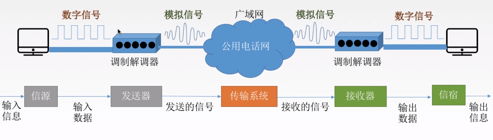
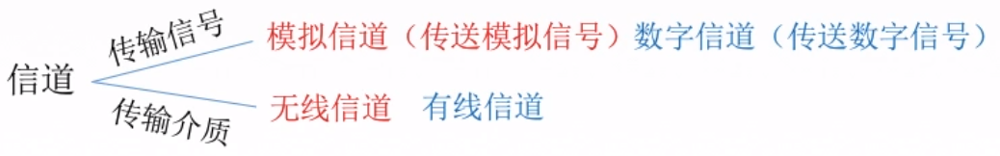
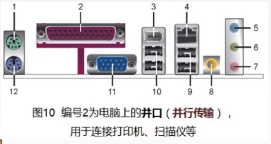
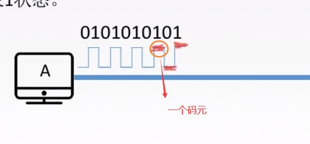
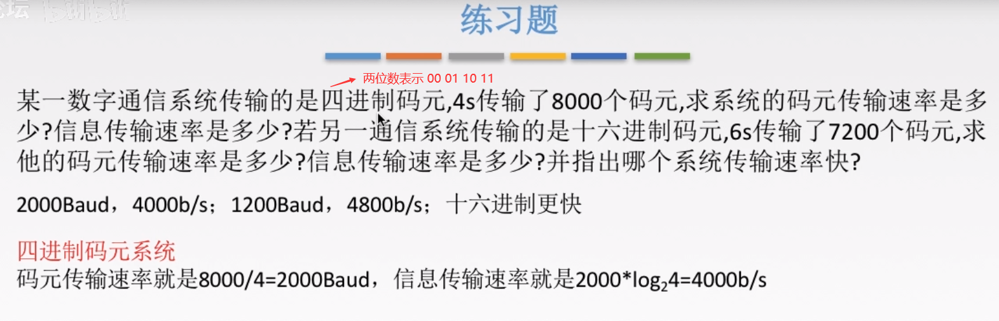
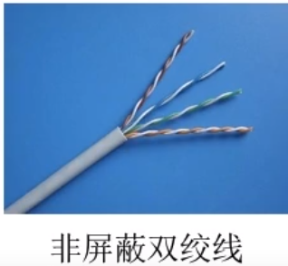
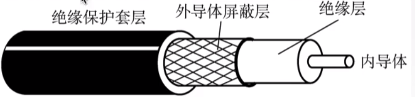
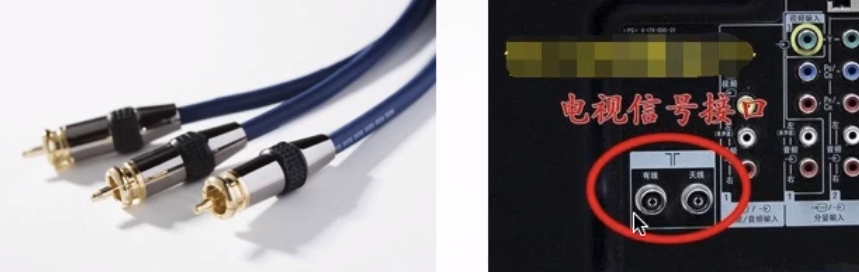
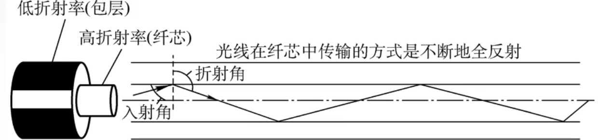
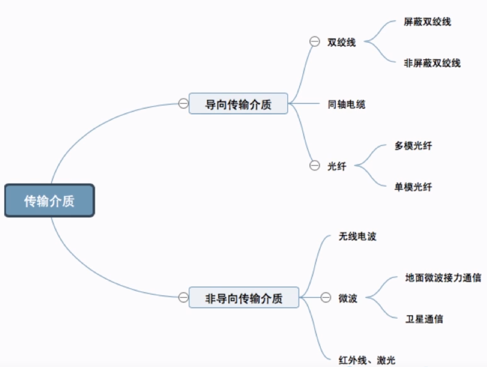

# 计算机网络

# 第1章 计算机网络体系结构

## 1.1计算机网络概述

### 计算机网络概念、组成、功能和分类

将分散的、具有独立功能的<font color=red>计算机系统</font>，通过通信设备与线路连接起来，由功能完善的软件实现资源共享和信息传递的系统。 

计算机网络是互联的、自治的计算机集合。

互联-互联互通 通信链路

自治-无主从关系


#### 计算机网络的功能

**1.数据通信**

**2.资源共享 （硬件资源 软件资源 数据资源）**

3.分布式处理 多台计算机各自承担统一工作任务的不同部分

4.提高可靠性 

5.负载均衡


#### 计算机网络的组成


#### 计算机网络的分类


#### 总结


###  标准化工作及相关组织

#### 标准化工作


**自己想制定标准供大家使用**


#### 总结


### 性能指标

#### 速率相关的性能指标

##### 速率 

**Mbps**

**速率用比特/秒，容量用字节**


##### 带宽

**带宽->路宽**

**传播速率->车速**


##### 吞吐量

**带宽->路宽**

**吞吐量->单位时间内路口过去多少车**(实际情况)


#### 时间相关的性能指标

##### 时延


##### **时延带宽积**

A-B的一条公路

A-B的距离/车速=传播时延

带宽：路宽，即车道个数


时延带宽积：A-B这条路可以容纳的所有车辆

```
时延带宽积(bit)=传播时延(s)×带宽(b/s)
```


##### 往返时延RTT


##### 利用率


#### 总结


## 1.2计算机网络体系结构与参考模型


### 分层结构、协议、接口、服务

#### 为什么要分层？

- 发送文件前要完成的工作

   ①发起通信的计算机必须将数据通信的通路进行激活（清理链路）

   ②要告诉网络如何识别目的主机

   ③发起通信的计算机要查明目的主机是否开机，并且与网络连接正常

   ④发起通信的计算机要弄清楚，对方计算机中文件管理程序是否已经做好准备工作。 

   ⑤确保差错和意外可以解决


#### 常用名词

- 实体：第n层中的活动元素称为n层实体。同一层的实体称为对等实体

- 协议：为进行网络中的对等实体数据交换而建立的规则、标准或约定。包含语法，语义，同步三个部分，水平方向 语法：规定传输数据的格式 语义：规定所要完成的功能 同步：规定各种操作的顺序

- 接口（访问服务点SAP）：上层使用下层服务的入口

- 服务：下层为相邻上层提供的功能调用，垂直方向

- SDU （Service Data Unit）服务数据单元：为完成用户所要求的功能而应传送的数据

- PCI （Protocol Control Information）协议控制信息：控制协议操作的信息

- PDU （Protocol Data Unit）协议数据单元：对等层次之间传送的数据单位 PDU = SDU + PCI 上一层PDU会成为下一层的SDU，与下一层的PCI组合成下一层的PDU，直到传递到物理层
- 

#### 分层基本原则

- 各层之间相互独立，每层只实现一种相对独立的功能

- 每层之间界面自然清晰，易于理解，相互交流尽可能少

- 结构上可分割开。每层都采用最合适的技术来实现，不受其他层影响

- 保持下层对上层的独立性，上层单向使用下层提供的服务

- 整个分层结构应该能促进标准化工作


#### 重要概念

- 网络体系结构是从功能上描述计算机网络结构的

- 计算机网络体系结构简称网络体系结构是分层结构

- 每层遵循网络协议以完成本层功能

- 计算机网络体系结构是计算机网络的各层及其协议的集合

- 第n层向第n+1提供服务时，此服务不仅包括第n层本身的功能，还包含由下层服务提供的功能

- 仅仅在相邻层间有接口，且所提供服务的具体实现细节对上一层完全屏蔽

- 体系结构是抽象的，通过一系列软件和硬件来实现

​	


### 7层OSI参考模型


#### 提出背景

- IBM提出了第一个网络体系结构SNA

- 美国国防部提出了TCP/IP

- 为了支持异构网络系统的互联互通，ISO于1984年提出开放系统互连（OSI）参考模型


#### 模型分层

模型分层每层以功能划分，即每层完成特定的功能

物理层，数据链路层，网络层，传输层，会话层，表示层，应用层

**顺口溜：物联网叔会使用**


#### 模型通信过程

- 主机A（完整七层）→中间系统（通信子网部分层）→主机B（完整七层）（物理层之间通过传输介质连接）

- 主机A自顶向下（打包） ①除物理层和数据链层外，其余各层只要在上一层数据基础上添加头部 ②数据链路层需要在上一层数据基础上添加头部和尾部 ③物理层将数据链路层的比特流转换成物理信号，并放到传输介质

- 物理信号经传输介质传送到中间系统上，从物理层开始自底向上对数据进行解析，同时确定数据下一发送目的地，再自顶向下将数据包裹传到物理层，转换成物理信号发送到传输介质上传输

- 主机B自底向上（拆包） ①物理层从传输介质上接收物理信号，转换成数据链路层数据格式 ②数据链路层根据协议去掉头和尾 ②其余各层根据协议去掉头部即可

- 特点总结：应用层、表示层、会话层、传输层，不需要中间系统，是端到端的通信。物理层、数据链路层、网络层需要中间系统，是点对点的通信


#### 每层的功能及协议

##### 应用层

所有能和用户交互产生网络流量的程序

应用层服务：文件传输FTP、电子邮件SMTP、万维网HTTP


##### 表示层

用于处理两个通信系统中交换信息的表示方式（语法和语义） 

- 功能

  ①数据格式变换（各主机信息编码不同，类似翻译官） 

  ②数据加密和解密 

  ③数据压缩及恢复

- 协议：JPEG、ASCII


##### 会话层

建立连接并在连接上有序的传输数据

- 功能：向表示层实体/用户进程提供建立连接并在连接上有序地传输数据的功能。这叫会话Session，也是建立同步（SYN）

  ①建立、管理、终止会话 

  ②使用校验点使会话在通信失效时，从校验点/同步点继续恢复通信，实现数据同步。

- 协议：ADSP、ASP

##### 传输层

负责主机中两个进程间的通信，端到端的通信

- 自下而上第一个端到端通信的层次，也是资源子网和通信子网的中间接口

- 传输单位是**报文段或用户数据报**

- 功能（顺口溜：“可差留用”）

  ①可靠传输（建立连接，确认机制，收到确认才发新数据）TCP、不可靠传输（不建立连接，不需要确认，发送即可）UDP

  ②差错控制（报文段数据纠错） 

  ③流量控制（控制发送方的速度）

  ④复用分用 复用：多个应用层进程可同时使用下面运输层的服务 分用：运输层把收到的信息交付给上面应用层中相应的进程 （多进程可同时发送数据，报文段有对应的**目标端口号**，传输层通过端口号查找目标进程转发）

- 协议：TCP、UDP

##### 网络层

定义IP编址与路由，把数据报分组从源端传到目的端，为分组交换网的不同主机服务

- 传输单位是数据报/数据报组。数据报过长，就可拆分成若干分组，再放到链路上传递。

- 功能

   ①路由选择（通过路由算法计算出最佳路径）

   ②流量控制（控制发送端速度）

   ③差错控制（检查并纠错）

   ④拥塞控制 若所有结点都来不及接收分组，而要丢弃大量分组，网络就处于拥塞状态。要采取一定措施，缓解拥塞

- 协议：IP、IPX、ICMP、IGMP、ARP、RARP、OSPF


##### 数据链路层

定义数据基本格式，把网络层传下来的数据报组装成帧

- 传输单位是帧

- 功能 

  ①成帧（定义帧的开始和结束）

  ②差错控制（帧错、位错） 

  ③流量控制（控制发送端的速度）

  ④访问（接入）控制（控制对信道的访问，例如在广播式网络，同时只有一台主机发送，其他主机监听）

- 协议：SDLC、HDLC、PPP、STP

##### 物理层

在物理媒体上实现比特流的透明传输（不管所传数据是什么样比特组合，都应当能在链路上传送）

- 传输单位是比特

- 功能 ①定义接口特性（引脚） ②定义传输模式（单工、半双工、双工） ③定义传输速率 ④比特同步 ⑤比特编码

- 协议：Rj45、802.3


### 4层TCP/IP模型

#### 与OSI参考模型的对比


相同点

①都分层

②都是基于独立的协议栈的概念

③可以实现异构网络互联(不同设备)


不同点

①OSI定义三点：服务、协议、接口

②OSI先出现，参考模型先与协议发明，不偏向特定协议

③TCP/IP设计之初就考虑到易购网**互联**的问题，将IP作为重要层次

④


面向连接：

①建立连接。发出一个建立连接的请求。

②只有连接建立成功后才能开始传输数据。

③当数据传输完毕，释放连接。 无连接：直接进行数据传输


### 5层参考模型

综合了OSI和TCP/IP的优点（功能划分清晰，且不重叠）

#### 各层功能及其协议

- 应用层

  支持各种网络应用（FTP、SMTP、HTTP）

- 传输层

  进程-进程的数据传输（TCP、UDP）

- 网络层

  源主机到目的主机的数据分组路由与转发（IP、ICMP、OSPF）

- 数据链路层

  把网络层传下来的数据报组装成帧（Ethernet、PPP）

- 物理层

  比特传输（Rj45、802.3）


#### 数据封装与解封装 


### 总结


# 第2章 物理层

## 2.1 通信基础

### 物理层基本概念

解决如何在各种计算机的传输媒体上传输数据比特流

定义标准：

①机械特性 包括接口形状、引线数目等

②电气特性 规定电压范围、距离限制等、

③功能特性 规定某条线上出现某一电平的意义

④规程特性 定义各个物理线路的工作规程和时序关系


------

### 通信基础知识

#### 典型的数据通信模型

调制解调器(猫)



#### 相关术语

通信的目的是传送消息。

数据：传送信息的实体，通常是有意义的符号序列。

信号：数据的电气表现，是数据的存在型式。

​		数字信号：离散的，0V,5V代表0101

​		模拟信号：连续的，波形

信源：发送数据源头

信宿：接收数据终点

信道：信号的传输媒介，包括发送信道和接收信道



#### 三种通信方式

1.单工通信 没有反方向交互，只需要一条信道（一直挨打）

2.半双工通信 双方可以接受或者发送，但一方不能同时接收和发送，需要两条信道（回合制）

3.全双工通信 通信双方可以同时发送和接受，也需要两条信道（即时制）

#### 两种数据传输方式

串行传输：速度慢，费用低，适合远距离

并行传输：速度快，费用高，适合近距离




------


### 码元、速率、波特、带宽

#### 码元

用一个固定时长的信号波形（数字脉冲），（0,1的长度为码元宽度，0,1两种高低不同称为二进制码元），是数字通信中数字信号的计量单位

#### 速率、波特、带宽



速率：数据的传输速率，表示单位时间内传输的数据量

①码元传输速率：单位时间内传播的码元个数（ 脉冲个数）， 单位是波特（码元/秒），与进制数无关

②信息传输速率 比特/秒  

带宽：最高传输速率 b/s



------


### 奈氏准则和香农定理

失真：数字信号->模拟信号 由于信道带宽首先、有噪声、干扰导致信号波形变形

影响失真的因素：

①码元传输速率+

②信号传输距离+

③噪声干扰+

④传输媒体质量- 


信道带宽：可以通过的最高频率和最低频率之差

#### 奈式准则（奈奎斯特定理）

<font color=red>**信号太密集会产生码间串扰**</font>

在理想低通条件下，极限码元传输速率为2W 波特，W是信道带宽，单位Hz

①任何信道中，码元传输的速率是有上限的。

②信道的频带越宽，就可应用越高的速率进行码元传输。

③奈氏准则给出了码元传速速率的限制，但没有对信息传速速率给出限制。

④想提高数据传输的速率，需要采用多元制的调制方法，比如4进制，8进制，16进制码元


#### 香农定理

<font color=red>**噪声会限制信息的发送速率**</font>

在带宽受限且有噪声的信道中，为了不产生误差，信息传输速率的上限值。

信噪比形容噪声对信号的影响

dB=10log(S/N)平均功率/噪声的平均功率

信道的极限数据传输速率=Wlog2（1+S/N)（b/s）

------


### 编码与调制

#### 基带信号与带宽信号

信道：信号的传输媒介。

包括数字信道和模拟信道。


基带信号（**来自信源**的信号）：将数字信号1和0直接用两种不同的电压表示，再送到**数字信道**上去传输(基带传输)。

基带信号就是发出的**直接表达了要传输的信息的信号**。

宽带信号：将基带信号进行调制后形成的频分复用模拟信号，再传送到**模拟信道**上去传输(宽带传输)。

将基带信号经过载波调制后，把信号的频率范围搬移到较高的频段以便在信道中传输。


区别：

传输距离较近，计算机网络采用基带传输方式。

传输距离较远，计算机网络采用宽带传输方式。


#### 编码（数据→数字信号）

```
数字数据——>（数字发送器）数字信号
```


模拟数据——>（PCM编码器）数字信号

#### 调制（数据→模拟信号） 

数字数据——>（调制器）模拟信号

模拟数据——>（放大调制器）模拟信号

------


## 2.2传输介质

传输介质也叫做传输媒体(介)，它就是数据传输系统中在发送设备和接收设备之间的物理通路。

**传输媒体并不是物理层。**在传输信号的过程中，传输媒体并不知道传输的信号代表什么意思，只管传，但物理层规定了电气特性，因此能够识别传输的比特流。

### 导向性传输介质

电磁波被导向沿着固体媒介(铜线/光纤)传播。

介质：


①双绞线：绞合可以减小对相邻导线的电磁干扰。

②同轴电缆：（电视线）

③光纤：（全反射）

### 费导向性传输介质

自由空间，介质可以是空气、真空、海水等。

①无线电波：所有方向，较强穿透能力

②微波：固定方向，地面微波接力通信，卫星通信

③红外线、激光：固定方向，把传输的信号分别转换为各自的信号格式。

### 知识总结



------


## 2.3物理层设备

### 放大器

### 中继器

### 集线器

------


## 知识总结
