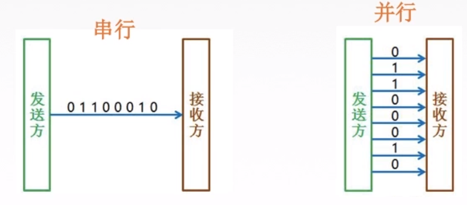

# 计算机网络

# 第1章 计算机网络体系结构

## 1.1计算机网络概述

### 计算机网络概念、组成、功能和分类

将分散的、具有独立功能的<font color=red>计算机系统</font>，通过通信设备与线路连接起来，由功能完善的软件实现资源共享和信息传递的系统。 

计算机网络是互联的、自治的计算机集合。

互联-互联互通 通信链路

自治-无主从关系


#### 计算机网络的功能

**1.数据通信**

**2.资源共享 （硬件资源 软件资源 数据资源）**

3.分布式处理 多台计算机各自承担统一工作任务的不同部分

4.提高可靠性 

5.负载均衡


#### 计算机网络的组成


#### 计算机网络的分类


#### 总结


###  标准化工作及相关组织

#### 标准化工作


**自己想制定标准供大家使用**


#### 总结


### 性能指标

#### 速率相关的性能指标

##### 速率 

**Mbps**

**速率用比特/秒，容量用字节**


##### 带宽

**带宽->路宽**

**传播速率->车速**


##### 吞吐量

**带宽->路宽**

**吞吐量->单位时间内路口过去多少车**(实际情况)


#### 时间相关的性能指标

##### 时延


##### **时延带宽积**

A-B的一条公路

A-B的距离/车速=传播时延

带宽：路宽，即车道个数


时延带宽积：A-B这条路可以容纳的所有车辆

```
时延带宽积(bit)=传播时延(s)×带宽(b/s)
```


##### 往返时延RTT


##### 利用率


#### 总结


## 1.2计算机网络体系结构与参考模型


### 分层结构、协议、接口、服务

#### 为什么要分层？

- 发送文件前要完成的工作

   ①发起通信的计算机必须将数据通信的通路进行激活（清理链路）

   ②要告诉网络如何识别目的主机

   ③发起通信的计算机要查明目的主机是否开机，并且与网络连接正常

   ④发起通信的计算机要弄清楚，对方计算机中文件管理程序是否已经做好准备工作。 

   ⑤确保差错和意外可以解决


#### 常用名词

- 实体：第n层中的活动元素称为n层实体。同一层的实体称为对等实体

- 协议：为进行网络中的对等实体数据交换而建立的规则、标准或约定。包含语法，语义，同步三个部分，水平方向 语法：规定传输数据的格式 语义：规定所要完成的功能 同步：规定各种操作的顺序

- 接口（访问服务点SAP）：上层使用下层服务的入口

- 服务：下层为相邻上层提供的功能调用，垂直方向

- SDU （Service Data Unit）服务数据单元：为完成用户所要求的功能而应传送的数据

- PCI （Protocol Control Information）协议控制信息：控制协议操作的信息

- PDU （Protocol Data Unit）协议数据单元：对等层次之间传送的数据单位 PDU = SDU + PCI 上一层PDU会成为下一层的SDU，与下一层的PCI组合成下一层的PDU，直到传递到物理层
- 

#### 分层基本原则

- 各层之间相互独立，每层只实现一种相对独立的功能

- 每层之间界面自然清晰，易于理解，相互交流尽可能少

- 结构上可分割开。每层都采用最合适的技术来实现，不受其他层影响

- 保持下层对上层的独立性，上层单向使用下层提供的服务

- 整个分层结构应该能促进标准化工作


#### 重要概念

- 网络体系结构是从功能上描述计算机网络结构的

- 计算机网络体系结构简称网络体系结构是分层结构

- 每层遵循网络协议以完成本层功能

- 计算机网络体系结构是计算机网络的各层及其协议的集合

- 第n层向第n+1提供服务时，此服务不仅包括第n层本身的功能，还包含由下层服务提供的功能

- 仅仅在相邻层间有接口，且所提供服务的具体实现细节对上一层完全屏蔽

- 体系结构是抽象的，通过一系列软件和硬件来实现

​	


### 7层OSI参考模型


#### 提出背景

- IBM提出了第一个网络体系结构SNA

- 美国国防部提出了TCP/IP

- 为了支持异构网络系统的互联互通，ISO于1984年提出开放系统互连（OSI）参考模型


#### 模型分层

模型分层每层以功能划分，即每层完成特定的功能

物理层，数据链路层，网络层，传输层，会话层，表示层，应用层

**顺口溜：物联网叔会使用**


#### 模型通信过程

- 主机A（完整七层）→中间系统（通信子网部分层）→主机B（完整七层）（物理层之间通过传输介质连接）

- 主机A自顶向下（打包） ①除物理层和数据链层外，其余各层只要在上一层数据基础上添加头部 ②数据链路层需要在上一层数据基础上添加头部和尾部 ③物理层将数据链路层的比特流转换成物理信号，并放到传输介质

- 物理信号经传输介质传送到中间系统上，从物理层开始自底向上对数据进行解析，同时确定数据下一发送目的地，再自顶向下将数据包裹传到物理层，转换成物理信号发送到传输介质上传输

- 主机B自底向上（拆包） ①物理层从传输介质上接收物理信号，转换成数据链路层数据格式 ②数据链路层根据协议去掉头和尾 ②其余各层根据协议去掉头部即可

- 特点总结：应用层、表示层、会话层、传输层，不需要中间系统，是端到端的通信。物理层、数据链路层、网络层需要中间系统，是点对点的通信


#### 每层的功能及协议

##### 应用层

所有能和用户交互产生网络流量的程序

应用层服务：文件传输FTP、电子邮件SMTP、万维网HTTP


##### 表示层

用于处理两个通信系统中交换信息的表示方式（语法和语义） 

- 功能

  ①数据格式变换（各主机信息编码不同，类似翻译官） 

  ②数据加密和解密 

  ③数据压缩及恢复

- 协议：JPEG、ASCII


##### 会话层

建立连接并在连接上有序的传输数据

- 功能：向表示层实体/用户进程提供建立连接并在连接上有序地传输数据的功能。这叫会话Session，也是建立同步（SYN）

  ①建立、管理、终止会话 

  ②使用校验点使会话在通信失效时，从校验点/同步点继续恢复通信，实现数据同步。

- 协议：ADSP、ASP

##### 传输层

负责主机中两个进程间的通信，端到端的通信

- 自下而上第一个端到端通信的层次，也是资源子网和通信子网的中间接口

- 传输单位是**报文段或用户数据报**

- 功能（顺口溜：“可差留用”）

  ①可靠传输（建立连接，确认机制，收到确认才发新数据）TCP、不可靠传输（不建立连接，不需要确认，发送即可）UDP

  ②差错控制（报文段数据纠错） 

  ③流量控制（控制发送方的速度）

  ④复用分用 复用：多个应用层进程可同时使用下面运输层的服务 分用：运输层把收到的信息交付给上面应用层中相应的进程 （多进程可同时发送数据，报文段有对应的**目标端口号**，传输层通过端口号查找目标进程转发）

- 协议：TCP、UDP

##### 网络层

定义IP编址与路由，把数据报分组从源端传到目的端，为分组交换网的不同主机服务

- 传输单位是数据报/数据报组。数据报过长，就可拆分成若干分组，再放到链路上传递。

- 功能

   ①路由选择（通过路由算法计算出最佳路径）

   ②流量控制（控制发送端速度）

   ③差错控制（检查并纠错）

   ④拥塞控制 若所有结点都来不及接收分组，而要丢弃大量分组，网络就处于拥塞状态。要采取一定措施，缓解拥塞

- 协议：IP、IPX、ICMP、IGMP、ARP、RARP、OSPF


##### 数据链路层

定义数据基本格式，把网络层传下来的数据报组装成帧

- 传输单位是帧

- 功能 

  ①成帧（定义帧的开始和结束）

  ②差错控制（帧错、位错） 

  ③流量控制（控制发送端的速度）

  ④访问（接入）控制（控制对信道的访问，例如在广播式网络，同时只有一台主机发送，其他主机监听）

- 协议：SDLC、HDLC、PPP、STP

##### 物理层

在物理媒体上实现比特流的透明传输（不管所传数据是什么样比特组合，都应当能在链路上传送）

- 传输单位是比特

- 功能 ①定义接口特性（引脚） ②定义传输模式（单工、半双工、双工） ③定义传输速率 ④比特同步 ⑤比特编码

- 协议：Rj45、802.3


### 4层TCP/IP模型

#### 与OSI参考模型的对比


相同点

①都分层

②都是基于独立的协议栈的概念

③可以实现异构网络互联(不同设备)


不同点

①OSI定义三点：服务、协议、接口

②OSI先出现，参考模型先与协议发明，不偏向特定协议

③TCP/IP设计之初就考虑到易购网**互联**的问题，将IP作为重要层次

④


面向连接：

①建立连接。发出一个建立连接的请求。

②只有连接建立成功后才能开始传输数据。

③当数据传输完毕，释放连接。 无连接：直接进行数据传输


### 5层参考模型

综合了OSI和TCP/IP的优点（功能划分清晰，且不重叠）

#### 各层功能及其协议

- 应用层

  支持各种网络应用（FTP、SMTP、HTTP）

- 传输层

  进程-进程的数据传输（TCP、UDP）

- 网络层

  源主机到目的主机的数据分组路由与转发（IP、ICMP、OSPF）

- 数据链路层

  把网络层传下来的数据报组装成帧（Ethernet、PPP）

- 物理层

  比特传输（Rj45、802.3）


#### 数据封装与解封装 


### 总结


# 第2章 物理层

## 2.1 通信基础

### 物理层基本概念

解决如何在各种计算机的传输媒体上传输数据比特流

定义标准：

①机械特性 包括接口形状、引线数目等

②电气特性 规定电压范围、距离限制等、

③功能特性 规定某条线上出现某一电平的意义

④规程特性 定义各个物理线路的工作规程和时序关系


------

### 通信基础知识

#### 典型的数据通信模型

调制解调器(猫)


#### 相关术语

通信的目的是传送消息。

数据：传送信息的实体，通常是有意义的符号序列。

信号：数据的电气表现，是数据的存在型式。

​		数字信号：离散的，0V,5V代表0101

​		模拟信号：连续的，波形

信源：发送数据源头

信宿：接收数据终点

信道：信号的传输媒介，包括发送信道和接收信道


#### 三种通信方式

1.单工通信 没有反方向交互，只需要一条信道（一直挨打）

2.半双工通信 双方可以接受或者发送，但一方不能同时接收和发送，需要两条信道（回合制）

3.全双工通信 通信双方可以同时发送和接受，也需要两条信道（即时制）

#### 两种数据传输方式

串行传输：速度慢，费用低，适合远距离

并行传输：速度快，费用高，适合近距离




------


### 码元、速率、波特、带宽

#### 码元

用一个固定时长的信号波形（数字脉冲），（0,1的长度为码元宽度，0,1两种高低不同称为二进制码元），是数字通信中数字信号的计量单位

#### 速率、波特、带宽


速率：数据的传输速率，表示单位时间内传输的数据量

①码元传输速率：单位时间内传播的码元个数（ 脉冲个数）， 单位是波特（码元/秒），与进制数无关

②信息传输速率 比特/秒  

带宽：最高传输速率 b/s


------


### 奈氏准则和香农定理

失真：数字信号->模拟信号 由于信道带宽首先、有噪声、干扰导致信号波形变形

影响失真的因素：

①码元传输速率+

②信号传输距离+

③噪声干扰+

④传输媒体质量- 


信道带宽：可以通过的最高频率和最低频率之差

#### 奈式准则（奈奎斯特定理）

<font color=red>**信号太密集会产生码间串扰**</font>

在理想低通条件下，极限码元传输速率为2W 波特，W是信道带宽，单位Hz

①任何信道中，码元传输的速率是有上限的。

②信道的频带越宽，就可应用越高的速率进行码元传输。

③奈氏准则给出了码元传速速率的限制，但没有对信息传速速率给出限制。

④想提高数据传输的速率，需要采用多元制的调制方法，比如4进制，8进制，16进制码元


#### 香农定理

<font color=red>**噪声会限制信息的发送速率**</font>

在带宽受限且有噪声的信道中，为了不产生误差，信息传输速率的上限值。

信噪比形容噪声对信号的影响

dB=10log(S/N)平均功率/噪声的平均功率

信道的极限数据传输速率=Wlog2（1+S/N)（b/s）

------


### 编码与调制

#### 基带信号与带宽信号

信道：信号的传输媒介。

包括数字信道和模拟信道。


基带信号（**来自信源**的信号）：将数字信号1和0直接用两种不同的电压表示，再送到**数字信道**上去传输(基带传输)。

基带信号就是发出的**直接表达了要传输的信息的信号**。

宽带信号：将基带信号进行调制后形成的频分复用模拟信号，再传送到**模拟信道**上去传输(宽带传输)。

将基带信号经过载波调制后，把信号的频率范围搬移到较高的频段以便在信道中传输。


区别：

传输距离较近，计算机网络采用基带传输方式。

传输距离较远，计算机网络采用宽带传输方式。


#### 编码（数据→数字信号）

数字数据——>（数字发送器）数字信号

模拟数据——>（PCM编码器）数字信号

#### 调制（数据→模拟信号） 

数字数据——>（调制器）模拟信号

模拟数据——>（放大调制器）模拟信号

------


## 2.2传输介质

传输介质也叫做传输媒体(介)，它就是数据传输系统中在发送设备和接收设备之间的物理通路。

**传输媒体并不是物理层。**在传输信号的过程中，传输媒体并不知道传输的信号代表什么意思，只管传，但物理层规定了电气特性，因此能够识别传输的比特流。

### 导向性传输介质

电磁波被导向沿着固体媒介(铜线/光纤)传播。

介质：


①双绞线：绞合可以减小对相邻导线的电磁干扰。

②同轴电缆：（电视线）

③光纤：（全反射）

### 非导向性传输介质

自由空间，介质可以是空气、真空、海水等。

①无线电波：所有方向，较强穿透能力

②微波：固定方向，地面微波接力通信，卫星通信

③红外线、激光：固定方向，把传输的信号分别转换为各自的信号格式。

### 知识总结


------


## 2.3物理层设备

### 放大器

对模拟信号放大的设备

### 中继器


对信号进行**再生和还原**，对衰减的信号进行放大，保持与原数据相同，以增加信号传输的距离，延长网络的长度。

中继器的两端：

①两端的网络部分是网段，不是子网，适用于完全相同的两类网络的互联，且两个网段速率要相同。 

②中继器只将任何电缆段上的数据发送到另一段电缆上，仅作用于信号的电气部分，不管是否有错误或者不适于网段的数据（傻瓜层）。

③两端可连接相同媒体（传输介质），也可连接不同媒体。

④中继器两端的网段一定要是同一个协议。


5-4-3规则：网络标准中 都对信号的延迟范围作了具体的规定，因而中继器只能在规定的范围内进行，否则会网络故障。

**以太网络标准中就约定了一个以太网上只允许出现5个网段, 最多使用4个中继器, 而且其中只有3个网段可以挂接计算机终端。**

5：5个网段

4:4个物理层的网络设备（中继器/集线器）

3：只有三个段可以连接计算机。

### 集线器


多口中继器

对信号进行**再生放大转发**，对衰减的信号进行放大，接着转发到其他所有(除输入端口外)处于工作状态的端口上，以增加信号传输的距离，延长网络的长度。不具备信号的定向传送能力，是一个共享式设备。

集线器是星型拓扑结构，广播通信方式

集线器不能分割冲突域，连在集线器上的工作主机平分带宽 集线器在一个时钟周期内，只能传递一组信息，多台主机要同时通信会发生碰撞，每台主机的带宽变小，通信速率降低


### **中继器和集线器的区别**

1.在于连接设备的线缆的数量。一个中继器通常只有两个端口，而一个集线器通常有4至20个或更多的端口。

2.中继器只起到连接的作用，而集线器则还有分配网络资源的作用，所以说集线器的功能上要比中继器的强。

3.中继器主要功能是通过对数据信号的重新发送或者转发，来扩大网络传输的距离;集线器的主要功能是对接收到的信号进行再生整形放大，以扩大网络的传输距离，同时把所有节点集中在以它为中心的节点上。

------


## 知识总结


# 第3章 数据链路层

## 3.1数据链路层的功能

当专门研究数据链路层的问题的时候，只关注水平方向的


### 基本概念

结点：主机、路由器

链路：网络中两个结点之间的物理通道，链路的传输介质主要有双绞线、光纤和微波。分为有线链路、无线链路。 

数据链路：网络中两个节点之间的逻辑通道，把实现控制数据协议的硬件和软件嫁到链路上就构成数据链路。

帧：链路层的协议数据单元，封装网络层数据报。

数据链路层负责 通过一条链路从一个结点向另一个物理链路直接相连的相邻结点传送数据报。

### 功能概述

功能一：为网络层提供服务。无确认无连接服务，有确认无连接服务，有确认面向连接服务。确认：确认信号，有连接一定有确认！

功能二：链路管理 ，即连接的建立、维持、释放（用于面向连接的服务）。

功能三：组帧。

功能四：流量控制。限制放送方。

功能五：差错控制（帧错/位错）。

  

------

## 3.2组帧


封装成帧：就是在一段数据的前后部分添加首部和尾部，这样就构成了一个帧。接收端再收到物理层上交的比特流后，就能根据首部和尾部的标记，从收到的比特流中识别帧的开始和结束。

首部和尾部包含许多的控制信息，他们的一个重要作用：**帧定界**

**帧同步：**接收方应当能从接收到的二级制比特流中区分出帧的起始和终止。

### 透明传输

不管数据是什么样的比特组合，都应当能在链路上传送。因此链路层就“看不见”有什么妨碍数据传输的东西。

当传送的数据恰好和某个控制信息完全一样时，就需要采取措施，保证数据不被误认。这才能保证传输透明。  

### 四种组帧方法

组帧的四种方法：

(1)字符计数法

帧首部使用一个计数字段（第一个字节 八位）来标明帧内字符数。


痛点：鸡蛋装在一个篮子里，如果第1帧的第1个字符5写成4，后面的每一帧就全错了。


(2)字符填充法

SHO和ETO都用特定字符表示

**如果传输的数据中出现这两个特定字符，要在其前面加上字节填充进行转义**


(3)零比特填充法


操作：

①在发送端，扫描整个信息字段，只要连续5个1，就立即填入1个0.

②在接收端收到一个帧时，先找到标志字段确定边界，再用硬件对比特流进行扫描。发现连续5个1时，就把后面的0删除。


(4)违规编码法  


曼彻斯特编码不会出现“高-高”，“低-低”的情况，用这两种违规编码来表示每一帧的起始和终止。

可以用“高-高”，“低-低”来定界帧的起始和终止。


目前普遍使用的帧同步法是**比特填充和违规编码法。**

------

## 3.3差错控制(错位)

差错都是由于噪声引起的。

全局性：

①由于线路本身电气特性所产生的随机噪声（热噪声），是信道固有的，随机存在的。

解决办法：提高信噪比来减少或避免干扰。（对传感器下手）

局部性：

②外界特定的短暂原因所造成的冲击噪声，是产生差错的主要原因。

解决办法：通常利用编码技术来解决。

### 差错由来

位错：比特位出错，1变成0/0变成1

帧错：1-2-3

①丢失1-3

②重复1-2-2-3

③失序1-3-2


### 确认和重传机制

无确认无连接服务（通信质量好，有线传输链路）

有确认无连接服务（通信质量差的无线传输服务）有确认面向连接服务。

### 检错编码（位错/比特位出错）

奇偶校验码：

1位校验元+n-1位信息元

奇校验码：“1”的个数为奇数

偶校验码：“1”的个数为偶数

```
例子：一个字符S的ASCII编码从低到高依次是1100101，采用奇校验

为了n中1的个数为奇数，应该在前加上校验元1,11100101
```

奇偶校验码的特点：

**只能检查出奇数个比特错误，检错能力为50%，**

**出现0变1可以检查出错误，出现两个0变1就检查不出错误**


循环冗余码CRC：

```
例子：
发送端：
要传的数据（5）÷生成多项式（2）=2......FCS帧检验序列/冗余码（1）
最终发送的数据：5+1=6

接收端：
接收到的数据（6）÷生成多项式（2）=3......0
余数为0，判定无措，就接受。
```


**接收端： 将最终发送的数据11010110111110除生成多项式，余数为0接受，否则丢弃**


### 纠错编码(发现并确定错误位置)

海明码：发现双比特错，纠正单比特错

工作原理：动一发而牵全身

工作流程：

①确定校验码位数r

海明不等式
$$
2的r次方>=k+r+1
$$
r为冗余信息位，k为信息位

```
要发送的数据：D=101101
数据的位数k=6
满足不等式的最小r为4
也就是D=101101的海明码应该有6+4=10位，
其中原数据6位，校验码4位。
```

②确定校验码和数据的位置

D=101101
假设这4位校验码分别为P1、P2、P3、P4；数据从左到右为D1、D2、...、D6。


③求出校验码的值


④检错并纠错


### 知识总结


------

## 3.4流量控制与可靠传输机制


### 流量控制方法

### 可靠传输、流量控制、滑动窗口关系

### 停止等待协议

### 后退N帧协议（GBN，Go Back N）

### 选择重传协议（SR,Selective Repeat）

------

## 3.5介质访问控制

### 传输数据使用的两种链路

### 介质访问控制基本概念

### 信道划分介质访问控制（静态划分信道）

### 动态媒体接入控制/多点接入（动态分配信道）

### 知识总结

------

## 3.6局域网与以太网

### 局域网

### 以太网

### 无线局域网

------

## 3.7广域网


### 与局域网对比

### PPP协议（面向字节）

### HDLC协议（面向比特）

### 协议对比

### 知识总结

------

## 3.8数据链路层设备

### 物理层扩展以太网

### 链路层扩展以太网

### 冲突域和广播域

### 知识总结

------

## 知识总结
