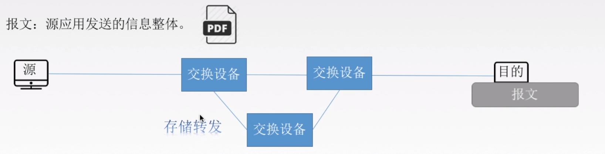

#  计算机网络

# 第1章 计算机网络体系结构

## 1.1计算机网络概述

### 计算机网络概念、组成、功能和分类

将分散的、具有独立功能的<font color=red>计算机系统</font>，通过通信设备与线路连接起来，由功能完善的软件实现资源共享和信息传递的系统。 

计算机网络是互联的、自治的计算机集合。

互联-互联互通 通信链路

自治-无主从关系


#### 计算机网络的功能

**1.数据通信**

**2.资源共享 （硬件资源 软件资源 数据资源）**

3.分布式处理 多台计算机各自承担统一工作任务的不同部分

4.提高可靠性 

5.负载均衡


#### 计算机网络的组成


#### 计算机网络的分类


#### 总结


###  标准化工作及相关组织

#### 标准化工作


**自己想制定标准供大家使用**


#### 总结


### 性能指标

#### 速率相关的性能指标

##### 速率 

**Mbps**

**速率用比特/秒，容量用字节**


##### 带宽

**带宽->路宽**

**传播速率->车速**


##### 吞吐量

**带宽->路宽**

**吞吐量->单位时间内路口过去多少车**(实际情况)


#### 时间相关的性能指标

##### 时延


##### **时延带宽积**

A-B的一条公路

A-B的距离/车速=传播时延

带宽：路宽，即车道个数


时延带宽积：A-B这条路可以容纳的所有车辆

```
时延带宽积(bit)=传播时延(s)×带宽(b/s)
```


##### 往返时延RTT


##### 利用率


#### 总结


## 1.2计算机网络体系结构与参考模型


### 分层结构、协议、接口、服务

#### 为什么要分层？

- 发送文件前要完成的工作

   ①发起通信的计算机必须将数据通信的通路进行激活（清理链路）

   ②要告诉网络如何识别目的主机

   ③发起通信的计算机要查明目的主机是否开机，并且与网络连接正常

   ④发起通信的计算机要弄清楚，对方计算机中文件管理程序是否已经做好准备工作。 

   ⑤确保差错和意外可以解决


#### 常用名词

- 实体：第n层中的活动元素称为n层实体。同一层的实体称为对等实体

- 协议：为进行网络中的对等实体数据交换而建立的规则、标准或约定。包含语法，语义，同步三个部分，水平方向 语法：规定传输数据的格式 语义：规定所要完成的功能 同步：规定各种操作的顺序

- 接口（访问服务点SAP）：上层使用下层服务的入口

- 服务：下层为相邻上层提供的功能调用，垂直方向

- SDU （Service Data Unit）服务数据单元：为完成用户所要求的功能而应传送的数据

- PCI （Protocol Control Information）协议控制信息：控制协议操作的信息

- PDU （Protocol Data Unit）协议数据单元：对等层次之间传送的数据单位 PDU = SDU + PCI 上一层PDU会成为下一层的SDU，与下一层的PCI组合成下一层的PDU，直到传递到物理层
- 

#### 分层基本原则

- 各层之间相互独立，每层只实现一种相对独立的功能

- 每层之间界面自然清晰，易于理解，相互交流尽可能少

- 结构上可分割开。每层都采用最合适的技术来实现，不受其他层影响

- 保持下层对上层的独立性，上层单向使用下层提供的服务

- 整个分层结构应该能促进标准化工作


#### 重要概念

- 网络体系结构是从功能上描述计算机网络结构的

- 计算机网络体系结构简称网络体系结构是分层结构

- 每层遵循网络协议以完成本层功能

- 计算机网络体系结构是计算机网络的各层及其协议的集合

- 第n层向第n+1提供服务时，此服务不仅包括第n层本身的功能，还包含由下层服务提供的功能

- 仅仅在相邻层间有接口，且所提供服务的具体实现细节对上一层完全屏蔽

- 体系结构是抽象的，通过一系列软件和硬件来实现

​	


### 7层OSI参考模型


#### 提出背景

- IBM提出了第一个网络体系结构SNA

- 美国国防部提出了TCP/IP

- 为了支持异构网络系统的互联互通，ISO于1984年提出开放系统互连（OSI）参考模型


#### 模型分层

模型分层每层以功能划分，即每层完成特定的功能

物理层，数据链路层，网络层，传输层，会话层，表示层，应用层

**顺口溜：物联网叔会使用**


#### 模型通信过程

- 主机A（完整七层）→中间系统（通信子网部分层）→主机B（完整七层）（物理层之间通过传输介质连接）

- 主机A自顶向下（打包） ①除物理层和数据链层外，其余各层只要在上一层数据基础上添加头部 ②数据链路层需要在上一层数据基础上添加头部和尾部 ③物理层将数据链路层的比特流转换成物理信号，并放到传输介质

- 物理信号经传输介质传送到中间系统上，从物理层开始自底向上对数据进行解析，同时确定数据下一发送目的地，再自顶向下将数据包裹传到物理层，转换成物理信号发送到传输介质上传输

- 主机B自底向上（拆包） ①物理层从传输介质上接收物理信号，转换成数据链路层数据格式 ②数据链路层根据协议去掉头和尾 ②其余各层根据协议去掉头部即可

- 特点总结：应用层、表示层、会话层、传输层，不需要中间系统，是端到端的通信。物理层、数据链路层、网络层需要中间系统，是点对点的通信


#### 每层的功能及协议

##### 应用层

所有能和用户交互产生网络流量的程序

应用层服务：文件传输FTP、电子邮件SMTP、万维网HTTP


##### 表示层

用于处理两个通信系统中交换信息的表示方式（语法和语义） 

- 功能

  ①数据格式变换（各主机信息编码不同，类似翻译官） 

  ②数据加密和解密 

  ③数据压缩及恢复

- 协议：JPEG、ASCII


##### 会话层

建立连接并在连接上有序的传输数据

- 功能：向表示层实体/用户进程提供建立连接并在连接上有序地传输数据的功能。这叫会话Session，也是建立同步（SYN）

  ①建立、管理、终止会话 

  ②使用校验点使会话在通信失效时，从校验点/同步点继续恢复通信，实现数据同步。

- 协议：ADSP、ASP

##### 传输层

负责主机中两个进程间的通信，端到端的通信

- 自下而上第一个端到端通信的层次，也是资源子网和通信子网的中间接口

- 传输单位是**报文段或用户数据报**

- 功能（顺口溜：“可差留用”）

  ①可靠传输（建立连接，确认机制，收到确认才发新数据）TCP、不可靠传输（不建立连接，不需要确认，发送即可）UDP

  ②差错控制（报文段数据纠错） 

  ③流量控制（控制发送方的速度）

  ④复用分用 复用：多个应用层进程可同时使用下面运输层的服务 分用：运输层把收到的信息交付给上面应用层中相应的进程 （多进程可同时发送数据，报文段有对应的**目标端口号**，传输层通过端口号查找目标进程转发）

- 协议：TCP、UDP

##### 网络层

定义IP编址与路由，把数据报分组从源端传到目的端，为分组交换网的不同主机服务

- 传输单位是数据报/数据报组。数据报过长，就可拆分成若干分组，再放到链路上传递。

- 功能

   ①路由选择（通过路由算法计算出最佳路径）

   ②流量控制（控制发送端速度）

   ③差错控制（检查并纠错）

   ④拥塞控制 若所有结点都来不及接收分组，而要丢弃大量分组，网络就处于拥塞状态。要采取一定措施，缓解拥塞

- 协议：IP、IPX、ICMP、IGMP、ARP、RARP、OSPF


##### 数据链路层

定义数据基本格式，把网络层传下来的数据报组装成帧

- 传输单位是帧

- 功能 

  ①成帧（定义帧的开始和结束）

  ②差错控制（帧错、位错） 

  ③流量控制（控制发送端的速度）

  ④访问（接入）控制（控制对信道的访问，例如在广播式网络，同时只有一台主机发送，其他主机监听）

- 协议：SDLC、HDLC、PPP、STP

##### 物理层

在物理媒体上实现比特流的透明传输（不管所传数据是什么样比特组合，都应当能在链路上传送）

- 传输单位是比特

- 功能 ①定义接口特性（引脚） ②定义传输模式（单工、半双工、双工） ③定义传输速率 ④比特同步 ⑤比特编码

- 协议：Rj45、802.3


### 4层TCP/IP模型

#### 与OSI参考模型的对比


相同点

①都分层

②都是基于独立的协议栈的概念

③可以实现异构网络互联(不同设备)


不同点

①OSI定义三点：服务、协议、接口

②OSI先出现，参考模型先与协议发明，不偏向特定协议

③TCP/IP设计之初就考虑到易购网**互联**的问题，将IP作为重要层次

④


面向连接：

①建立连接。发出一个建立连接的请求。

②只有连接建立成功后才能开始传输数据。

③当数据传输完毕，释放连接。 无连接：直接进行数据传输


### 5层参考模型

综合了OSI和TCP/IP的优点（功能划分清晰，且不重叠）

#### 各层功能及其协议

- 应用层

  支持各种网络应用（FTP、SMTP、HTTP）

- 传输层

  进程-进程的数据传输（TCP、UDP）

- 网络层

  源主机到目的主机的数据分组路由与转发（IP、ICMP、OSPF）

- 数据链路层

  把网络层传下来的数据报组装成帧（Ethernet、PPP）

- 物理层

  比特传输（Rj45、802.3）


#### 数据封装与解封装 


### 总结


# 第2章 物理层

## 2.1 通信基础

### 物理层基本概念

解决如何在各种计算机的传输媒体上传输数据比特流

定义标准：

①机械特性 包括接口形状、引线数目等

②电气特性 规定电压范围、距离限制等、

③功能特性 规定某条线上出现某一电平的意义

④规程特性 定义各个物理线路的工作规程和时序关系


------

### 通信基础知识

#### 典型的数据通信模型

调制解调器(猫)


#### 相关术语

通信的目的是传送消息。

数据：传送信息的实体，通常是有意义的符号序列。

信号：数据的电气表现，是数据的存在型式。

​		数字信号：离散的，0V,5V代表0101

​		模拟信号：连续的，波形

信源：发送数据源头

信宿：接收数据终点

信道：信号的传输媒介，包括发送信道和接收信道


#### 三种通信方式

1.单工通信 没有反方向交互，只需要一条信道（一直挨打）

2.半双工通信 双方可以接受或者发送，但一方不能同时接收和发送，需要两条信道（回合制）

3.全双工通信 通信双方可以同时发送和接受，也需要两条信道（即时制）

#### 两种数据传输方式

串行传输：速度慢，费用低，适合远距离

并行传输：速度快，费用高，适合近距离


------


### 码元、速率、波特、带宽

#### 码元

用一个固定时长的信号波形（数字脉冲），（0,1的长度为码元宽度，0,1两种高低不同称为二进制码元），是数字通信中数字信号的计量单位

#### 速率、波特、带宽


速率：数据的传输速率，表示单位时间内传输的数据量

①码元传输速率：单位时间内传播的码元个数（ 脉冲个数）， 单位是波特（码元/秒），与进制数无关

②信息传输速率 比特/秒  

带宽：最高传输速率 b/s


------


### 奈氏准则和香农定理

失真：数字信号->模拟信号 由于信道带宽首先、有噪声、干扰导致信号波形变形

影响失真的因素：

①码元传输速率+

②信号传输距离+

③噪声干扰+

④传输媒体质量- 


信道带宽：可以通过的最高频率和最低频率之差

#### 奈式准则（奈奎斯特定理）

<font color=red>**信号太密集会产生码间串扰**</font>

在理想低通条件下，极限码元传输速率为2W 波特，W是信道带宽，单位Hz

①任何信道中，码元传输的速率是有上限的。

②信道的频带越宽，就可应用越高的速率进行码元传输。

③奈氏准则给出了码元传速速率的限制，但没有对信息传速速率给出限制。

④想提高数据传输的速率，需要采用多元制的调制方法，比如4进制，8进制，16进制码元


#### 香农定理

<font color=red>**噪声会限制信息的发送速率**</font>

在带宽受限且有噪声的信道中，为了不产生误差，信息传输速率的上限值。

信噪比形容噪声对信号的影响

dB=10log(S/N)平均功率/噪声的平均功率

信道的极限数据传输速率=Wlog2（1+S/N)（b/s）

------


### 编码与调制

#### 基带信号与带宽信号

信道：信号的传输媒介。

包括数字信道和模拟信道。


基带信号（**来自信源**的信号）：将数字信号1和0直接用两种不同的电压表示，再送到**数字信道**上去传输(基带传输)。

基带信号就是发出的**直接表达了要传输的信息的信号**。

宽带信号：将基带信号进行调制后形成的频分复用模拟信号，再传送到**模拟信道**上去传输(宽带传输)。

将基带信号经过载波调制后，把信号的频率范围搬移到较高的频段以便在信道中传输。


区别：

传输距离较近，计算机网络采用基带传输方式。

传输距离较远，计算机网络采用宽带传输方式。


#### 编码（数据→数字信号）

数字数据——>（数字发送器）数字信号

模拟数据——>（PCM编码器）数字信号

#### 调制（数据→模拟信号） 

数字数据——>（调制器）模拟信号

模拟数据——>（放大调制器）模拟信号

------


## 2.2传输介质

传输介质也叫做传输媒体(介)，它就是数据传输系统中在发送设备和接收设备之间的物理通路。

**传输媒体并不是物理层。**在传输信号的过程中，传输媒体并不知道传输的信号代表什么意思，只管传，但物理层规定了电气特性，因此能够识别传输的比特流。

### 导向性传输介质

电磁波被导向沿着固体媒介(铜线/光纤)传播。

介质：


①双绞线：绞合可以减小对相邻导线的电磁干扰。

②同轴电缆：（电视线）

③光纤：（全反射）

### 非导向性传输介质

自由空间，介质可以是空气、真空、海水等。

①无线电波：所有方向，较强穿透能力

②微波：固定方向，地面微波接力通信，卫星通信

③红外线、激光：固定方向，把传输的信号分别转换为各自的信号格式。

### 知识总结


------


## 2.3物理层设备

### 放大器

对模拟信号放大的设备

### 中继器


对信号进行**再生和还原**，对衰减的信号进行放大，保持与原数据相同，以增加信号传输的距离，延长网络的长度。

中继器的两端：

①两端的网络部分是网段，不是子网，适用于完全相同的两类网络的互联，且两个网段速率要相同。 

②中继器只将任何电缆段上的数据发送到另一段电缆上，仅作用于信号的电气部分，不管是否有错误或者不适于网段的数据（傻瓜层）。

③两端可连接相同媒体（传输介质），也可连接不同媒体。

④中继器两端的网段一定要是同一个协议。


5-4-3规则：网络标准中 都对信号的延迟范围作了具体的规定，因而中继器只能在规定的范围内进行，否则会网络故障。

**以太网络标准中就约定了一个以太网上只允许出现5个网段, 最多使用4个中继器, 而且其中只有3个网段可以挂接计算机终端。**

5：5个网段

4:4个物理层的网络设备（中继器/集线器）

3：只有三个段可以连接计算机。

### 集线器


多口中继器

对信号进行**再生放大转发**，对衰减的信号进行放大，接着转发到其他所有(除输入端口外)处于工作状态的端口上，以增加信号传输的距离，延长网络的长度。不具备信号的定向传送能力，是一个共享式设备。

集线器是星型拓扑结构，广播通信方式

集线器不能分割冲突域，连在集线器上的工作主机平分带宽 集线器在一个时钟周期内，只能传递一组信息，多台主机要同时通信会发生碰撞，每台主机的带宽变小，通信速率降低


### **中继器和集线器的区别**

1.在于连接设备的线缆的数量。一个中继器通常只有两个端口，而一个集线器通常有4至20个或更多的端口。

2.中继器只起到连接的作用，而集线器则还有分配网络资源的作用，所以说集线器的功能上要比中继器的强。

3.中继器主要功能是通过对数据信号的重新发送或者转发，来扩大网络传输的距离;集线器的主要功能是对接收到的信号进行再生整形放大，以扩大网络的传输距离，同时把所有节点集中在以它为中心的节点上。

------


## 知识总结


# 第3章 数据链路层

## 3.1数据链路层的功能

当专门研究数据链路层的问题的时候，只关注水平方向的


### 基本概念

结点：主机、路由器

链路：网络中两个结点之间的物理通道，链路的传输介质主要有双绞线、光纤和微波。分为有线链路、无线链路。 

数据链路：网络中两个节点之间的逻辑通道，把实现控制数据协议的硬件和软件嫁到链路上就构成数据链路。

帧：链路层的协议数据单元，封装网络层数据报。

数据链路层负责 通过一条链路从一个结点向另一个物理链路直接相连的相邻结点传送数据报。

### 功能概述

功能一：为网络层提供服务。无确认无连接服务，有确认无连接服务，有确认面向连接服务。确认：确认信号，有连接一定有确认！

功能二：链路管理 ，即连接的建立、维持、释放（用于面向连接的服务）。

功能三：组帧。

功能四：流量控制。限制放送方。

功能五：差错控制（帧错/位错）。

  

------

## 3.2组帧


封装成帧：就是在一段数据的前后部分添加首部和尾部，这样就构成了一个帧。接收端再收到物理层上交的比特流后，就能根据首部和尾部的标记，从收到的比特流中识别帧的开始和结束。

首部和尾部包含许多的控制信息，他们的一个重要作用：**帧定界**

**帧同步：**接收方应当能从接收到的二级制比特流中区分出帧的起始和终止。

### 透明传输

不管数据是什么样的比特组合，都应当能在链路上传送。因此链路层就“看不见”有什么妨碍数据传输的东西。

当传送的数据恰好和某个控制信息完全一样时，就需要采取措施，保证数据不被误认。这才能保证传输透明。  

### 四种组帧方法

组帧的四种方法：

(1)字符计数法

帧首部使用一个计数字段（第一个字节 八位）来标明帧内字符数。


痛点：鸡蛋装在一个篮子里，如果第1帧的第1个字符5写成4，后面的每一帧就全错了。


(2)字符填充法

SHO和ETO都用特定字符表示

**如果传输的数据中出现这两个特定字符，要在其前面加上字节填充进行转义**


(3)零比特填充法


操作：

①在发送端，扫描整个信息字段，只要连续5个1，就立即填入1个0.

②在接收端收到一个帧时，先找到标志字段确定边界，再用硬件对比特流进行扫描。发现连续5个1时，就把后面的0删除。


(4)违规编码法  


曼彻斯特编码不会出现“高-高”，“低-低”的情况，用这两种违规编码来表示每一帧的起始和终止。

可以用“高-高”，“低-低”来定界帧的起始和终止。


目前普遍使用的帧同步法是**比特填充和违规编码法。**

------

## 3.3差错控制(错位)

差错都是由于噪声引起的。

全局性：

①由于线路本身电气特性所产生的随机噪声（热噪声），是信道固有的，随机存在的。

解决办法：提高信噪比来减少或避免干扰。（对传感器下手）

局部性：

②外界特定的短暂原因所造成的冲击噪声，是产生差错的主要原因。

解决办法：通常利用编码技术来解决。

### 差错由来

位错：比特位出错，1变成0/0变成1

帧错：1-2-3

①丢失1-3

②重复1-2-2-3

③失序1-3-2


### 确认和重传机制

无确认无连接服务（通信质量好，有线传输链路）

有确认无连接服务（通信质量差的无线传输服务）有确认面向连接服务。

### 检错编码（位错/比特位出错）

奇偶校验码：

1位校验元+n-1位信息元

奇校验码：“1”的个数为奇数

偶校验码：“1”的个数为偶数

```
例子：一个字符S的ASCII编码从低到高依次是1100101，采用奇校验

为了n中1的个数为奇数，应该在前加上校验元1,11100101
```

奇偶校验码的特点：

**只能检查出奇数个比特错误，检错能力为50%，**

**出现0变1可以检查出错误，出现两个0变1就检查不出错误**


循环冗余码CRC：

```
例子：
发送端：
要传的数据（5）÷生成多项式（2）=2......FCS帧检验序列/冗余码（1）
最终发送的数据：5+1=6

接收端：
接收到的数据（6）÷生成多项式（2）=3......0
余数为0，判定无措，就接受。
```


**接收端： 将最终发送的数据11010110111110除生成多项式，余数为0接受，否则丢弃**


### 纠错编码(发现并确定错误位置)

海明码：发现双比特错，纠正单比特错

工作原理：动一发而牵全身

工作流程：

①确定校验码位数r

海明不等式
$$
2的r次方>=k+r+1
$$
r为冗余信息位，k为信息位

```
要发送的数据：D=101101
数据的位数k=6
满足不等式的最小r为4
也就是D=101101的海明码应该有6+4=10位，
其中原数据6位，校验码4位。
```

②确定校验码和数据的位置

D=101101
假设这4位校验码分别为P1、P2、P3、P4；数据从左到右为D1、D2、...、D6。


③求出校验码的值


④检错并纠错


### 知识总结


------

## 3.4流量控制与可靠传输机制

较高的发送速度和较低的接受能力的不匹配，会造成传输出错，因此流量控制也是数据链路层的一项重要工作。

数据链路层的流量控制是点对点的，而传输层的流量控制是端到端的。

数据链路层流量控制手段：接收方收不下就不回复确认。

传输层流量控制手段：接收端给发送端一个窗口公告。

### 流量控制方法

停止-等待协议：


每发送完一个帧就停止发送，等待对方的确认，在收到确认后再发送下一个帧。


滑动窗口协议：


收到一个确认发送窗口前进一格

①后退N帧协议(GBN)

②选择重传协议(SR)

| 流量控制协议       | 发送窗口大小 | 接收窗口大小 |
| ------------------ | ------------ | ------------ |
| 停止等待协议       | =1           | =1           |
| 后退N帧协议（GBN） | >1           | =1           |
| 选择重传协议（SR） | >1           | >1           |


### 可靠传输、流量控制、滑动窗口关系

可靠传输：发送端发啥，接收端接受啥。

流量控制：控制发送速率，使得接收方有足够的缓冲空间来接收每一帧。

滑动窗口解决：

①流量控制（收不下就不给确认，想发也不能发）

②可靠传输（发送方自动重传）

### 停止等待协议

停等的由来：

 除了比特出差错，底层信道还会出现丢包问题 。

为了实现流量控制。


研究停等协议的前提：

①仅考虑一方发送另一方接受。

②不考虑数据是在哪一个层次上传送的。


停止等待协议应用的情况：

1）无差错情况

2）有差错情况

①数据帧丢失或者检测到帧出错

正常情况下发送一帧，确认一帧，然后发送下一帧

有一个超时计时器：每次发送一帧就会启动一个计时器，超时计时器的设置的重传时间应当比帧传输的平均RTT更长一些。

超时就会重传1帧

注意：

· 发完一个帧，必须保留它的副本

· 数据帧和确认帧必须编号（解决帧的丢失和重复）


②ACK丢失（确认帧丢失)

超时重传，确认方丢弃重复的1帧，重传确认1帧


③ACK迟到


和ACK丢失大体相同，只不过迟到后发送方收下就丢弃。

### 后退N帧协议（GBN，Go Back N）

- 发送方连续发送多帧（流水线技术） 

  ①要增加序号范围

  ②发送方需要缓存多个分组

- 滑动窗口类别

  - 发送窗口：发送方维持一组连续的允许发送的帧的序号

  - 接收窗口：接收方维持一组连续的允许接收帧的序号

  无差错情况

  - 发送窗口连续发送帧，接收到确认帧后右移一位
  - 接收窗口接收到一帧后，也右移一位
  - 注意：帧必须按顺序接收和确认


GBN发送方必须响应的三件事：

①上层的调用

上层要发送数据的时候，会先检查发送窗口是否已满，如果未满则产生一个帧并将其发送；

如果已经满了，发送发只需将数据返回给上层让上层等一会再发送。

②收到了一个ACK

GBN协议中，对n号帧的确认采用累计确认的方式，标志接收方已经收到n号帧以及之前的全部帧率。

③超时事件

如果出现超时，发送发会重传所有已发送但未被确认的帧。  


GBN接收方要做的事情：

如果正确收到n号帧，并且按序，那么接收方为n帧发送一个ACK，并将该帧中的数据部分交付给上层。

其余情况都丢弃帧，并为最近按序接受的帧重新发送ACK （3号帧没来，收到4,5号 但还是要丢掉4,5号帧）


滑动窗口长度：

采用n个比特対帧编号，那么发送窗口的尺寸WT应该满足1<=WT<=2的n次方-1。

n个比特対帧编号 比如n=2  可以表示0123 0123 0123，前面每个数字代表1帧，如果滑动窗口超过3，那就使得接收方无法区别新帧和旧帧

### 选择重传协议（SR,Selective Repeat）

  对于发送完的被确认的先放到缓存中，等到前面的帧收到后，经过整理再交付给网络层


SR发送方必须响应的三件事：

①上层的调用

从上层收到数据后，SR发送方检查下一个可用于该帧的序号，如果序号位于发送窗口内，则发送数据帧；否则，要么缓存数据，要么返回给上层之后再传输

②收到了一个ACK

收到ACK后移动到没有被确认的帧，并发送有序号的未发送帧


SR接收方要做的事：

接收方将确认一个正确接收的帧而不管其是否按顺序。对于失序的帧将被缓存，并发送ACK，直到所有帧（序号更小的帧）都被收到为止，然后将一批帧按序交付给上层。  


发送窗口最好等于接收窗口。WTmax=WRmax=2的n-1次方 


总结：

①对数据帧逐一确认，收一个确认一个

②只重传出错帧

③接收方有缓存

## 3.5介质访问控制

### 传输数据使用的两种链路

点对点链路：

两个相邻结点通过一个链路相连，没有第三者。

应用：PPP协议，常用于广域网。


广播式链路：

所有主机共享通信介质。

应用：早期的总线以太网、无线局域网，常用于局域网。

典型拓扑结构：总线型、星型（逻辑总线型）

### 介质访问控制基本概念

采取一定的措施，使得两对节点之间的通信不会发生相互干扰的情况。

### 信道划分介质访问控制（静态划分信道）

信道划分介质访问控制：

将使用介质的每个设备与来自同一信道的其他设备的通信隔离开，把时域和频域资源合理地分配给网络上的设备。

多路复用技术：


①频分多路复用FDM frequency ---并行

每个用户占用一个频段。


②时分多路复用TDM time ---并发

将时间划分为一段段等长的时分复用帧，所有用户轮流占用信道。

TDM帧是在物理层传送的比特流所划分的帧，标志一个周期。

改进的时分复用：统计时分复用STDM

有一个集中器，先到先发。


③波分多路复用WDM wave

由于波长不同，所以各路光信号互不干扰最后再用波长分解复用器将各路波长分解出来。


④码分多路复用CDM code 


### 动态媒体接入控制/多点接入（动态分配信道）

#### 随机访问协议

可能发生冲突

①ALOHA协议（不听就说！）

纯ALOHA协议（想发就发）

协议思想：不监听信道，不按时间槽发送，随机重发

如果发生冲突，接收方就会检测出差错，然后不予确认，发送方在一定时间内收不到就判断发生冲突。


时隙ALOHA协议（控制想发就发的随意性）

协议思想：把时间分成若干个相同的时间片（时间槽），所有用户在时间片开始时刻同步接入网络信道，若发生冲突，**必须等到下一个时间片开始时刻再发送。**


②CSMA协议（先听再说）

carrier sense multiple access

CS：载波侦听/监听，每一个站在发送数据之前要检测一下总线上是否有其他计算机在发送数据。

MA：多点接入，表示许多计算机以多点接入的方式连接在以一根总线上。

协议思想：发送帧之前，**监听**信道。

监听结果：

· 信道空闲：发送完整帧

· 信道忙：推迟发送

```
1-坚持CSMA
坚持指的是对于监听信道忙之后的坚持。
思想：如果一个主机要发送消息，那么它先监听信道，空闲直接传输，不必等待。
	忙则一直监听，直到空闲马上传输。
	如果有冲突（一段时间内未收到肯定回复），则等待一个随机长的时间再监听，重复上述过程。
优点：只要媒体空闲，站点马上发送，避免了媒体利用率的损失。
缺点：假如有两个或者以上的站点要发送数据，冲突不可避免。

非坚持CSMA
非坚持指的是对于监听信道忙之后就不继续监听。
思想：忙则等待一个随机的时间之后再进行监听。
优点：可以减少冲突发送的可能性。
缺点：大家都在等待的时候，使得媒体处于空闲状态，媒体使用率降低。

p-坚持CSMA
p-坚持指的是对于监听信道空闲的处理。
思想：空闲则以p概率直接传输，不必等待；概率1-p等待到下一个时间槽再传输
	忙则等待一个随机的时间之后再进行监听
优点：集合了前两种。
```


③**CSMA/CD协议**（先听再说，边听边说）

载波监听多点接入/碰撞检测CSMA/CD

CS：载波侦听/监听，每一个站在<font color=red>发送数据之前以及发送数据时</font>都要检测一下总线上是否有其他计算机在发送数据。

MA：多点接入，总线型网络

CD：碰撞检测，“边发送边监听” （半双工网络）

```
先监听，发现没有其他计算机发送数据后再发送，为什么还会产生冲突？

因为电磁波在总线上总是以有限的速率传播的。
```

传播时延对载波监听的影响：


```
A->B需要的时间为τ

B在A发送后△t时刻发送，A信号会和B信号发生碰撞，在t=2τ-△t的时候检测到数据错误，发生了碰撞
当△t->0的时候t有最大值为2τ，如果2τ时间内还没检测到碰撞，就能确定一定不会发生碰撞。
```

最小帧长的问题：A站发了一个很短的帧，但是发生了碰撞，不过帧在发送完毕后才检测到发生碰撞，没法停止发送，因为发完了。

帧的传播时延至少要两倍于信号在总线中的传播时延：
$$
帧长（bit）/数据传输速率>=2τ
$$
以太网规定最短帧长为64B，凡是长度小于64B的都要进行填充。

④**CSMA/CA协议**

载波监听多点接入/碰撞避免CSMA/CA  

为什么要有CSMA/CA?

在无线局域网当中，无法做到360°全面检测碰撞，另外就是隐蔽站的问题（A给C发送数据不知道B也给C发送数据导致冲突）

工作原理：

①发送数据前，先检测信道是否空闲。

②空闲则发出RTS（request to send），RTS包括发射端的地址、接收端的地址、下一份数据将持续发送的时间等信息；信道忙则等待。 

③接收端收到RTS后，将响应CTS。

④发送端收到CTS后，开始发送数据帧（同时预约信道：发送方告知其他站点自己要传多久数据）

⑤接收端收到数据帧后，将用CRC来检验数据是否正确，正确则响应ACK帧。

⑥发送方收到ACK就可以进行下一个数据帧的发送，若没有则一直重传至规定重发次数为止（采用二进制指数退避算法来确定随机的推迟时间）

预约信道 ACK帧 RTS/CTS帧（可选）


CSMA/CD与CSMA/CA

相同点：先听再说，当发现信道空闲后，才能进行接入。

不同点：

①传输介质不同：分别是以太网和无线局域网

②载波检测方式不同：因为传输介质不同

③CSMA/CD检测冲突，CSMA/CA避免冲突，二者出现冲突后都会进行有上限的重传。

#### 轮流协议

轮训协议：

主节点轮流“邀请”从属节点发送数据。

问题：轮询开销，等待延迟，单点故障


**令牌传递协议**：应用于令牌环网（物理上为星型结构，逻辑上为环状拓扑结构）

令牌：一个特殊格式的MAC控制帧，不含任何信息。

​		控制信道的使用，确保同一时刻只有一个结点独占信道。  

发送数据的主机持有令牌并且改令牌标志位，标志令牌正在使用，令牌后面跟数据。

当A主机发送数据过长，还是会将令牌传递出去让其他主机发送数据。

每结点都可以在一定时间内获得发送数据的权利，并不是无限制地持有令牌。

问题：令牌开销，等待延迟，单点故障


### 知识总结


------

## 3.6局域网与以太网

### 局域网

简称LAN，是指在某一区域内由多台计算机互联成的计算机组，使用广播信道。

特点：

①覆盖的地理范围较小

②数据传输速率较高（10Mb/s~10Gb/s）

③通信延迟时间短，误码率低，可靠性较高。

④各站点平等，共享传输信道

⑤多采用分布式控制和广播式通信，能进行广播和组播。

**决定局域网的主要要素为：网络拓扑，传输介质与介质访问控制方法。**


局域网的拓扑结构


局域网的传输介质

有线局域网：双绞线、同轴电缆、光纤

无线局域网：电磁波


局域网介质访问控制方法：

1.CSMA/CD：常用于总线型局域网，也用于树形网络

2.令牌总线：常用于总线型局域网，也用于树形网络

3.令牌环：用于环形局域网，如令牌环网


局域网的分类：

①以太网：逻辑总线，物理星型

②令牌环网：物理星型，逻辑环形 

③FDDI：物理双环，逻辑环形

④ATM网

⑤无线局域网WLAN：IEEE 802.11标准


MAC子层和LLC子层

IEEE 802标准将数据链路层划分为逻辑链路层LLC子层和介质访问控制MAC子层。

LLC：负责识别网络层协议，为网络层提供服务。

MAC：数据帧的封装/卸装，帧的寻址和识别，帧的接收和发送，链路的管理，帧的差错控制等。


### 以太网

是当今现有局域网采用的最通用的通信协议标准。以太网络使用CSMA/CD技术。

优点：

①造价低廉

②是应用最广泛的局域网技术

③比令牌环网、ATM网便宜，简单；

④满足网络速率要求：10Mb/s~10Gb/s    


以太网提供无连接、不可靠的服务

无连接：发送方和接收方之前无“握手过程”

不可靠：不需要对发送方的数据帧编号，接收方不向发送方进行确认，差错帧直接丢弃，差错纠正由高层负责。


**适配器和MAC地址**

计算机与外界有局域网的连接是通过通信适配器（网卡）的。

**在局域网中，硬件地址又称为物理地址，或者MAC地址。实际上就是一个标识符。** 

**MAC地址：每个适配器有一个全球位移的48位二进制地址，前24位代表厂家（由IEEE规定），后24位厂家自己指定。常用6个十六进制数表示，如02-60-8c-e4-b1-21。**


以太网MAC帧


### 无线局域网

802.11 MAC帧头格式：

设备A和设备B通信，A先传送到A附近的基站AP1，然后再发送到B附近的基站AP2，最后发送给B。


无线局域网的分类

1.有固定基础设施无线局域网


**一个WiFi名也叫服务集标识符。代表一个基站。**

2.无固定基础设施无线局域网的自组织网络


------

## 3.7广域网

通常跨接很大的物理范围，所覆盖的范围从十几公里到几千公里。

广域网的通信子网主要使用**分组交换**技术。它将分布在不同地区的局域网或计算机系统互联起来，达到资源共享的目的。因特网是世界范围内最大的局域网。


### 与局域网对比

- 覆盖的网络层次更多：局域网只覆盖链路层和物理层，广域网还覆盖网络层

- 局域网普遍采用总线型的多点接入技术，而广域网通常采用点对点的全双共或半双工通信模式

- 广域网强调资源共享（速度快，延迟高），局域网强调数据传输（延迟更小，速度较慢）

### PPP协议（面向字节）

点对点协议，是目前使用最广泛的数据链路层协议，只支持全双工链路。


PPP协议应满足的要求：

简单：对于链路层的帧，无需纠错，无需流量控制

封装成帧：帧定界符

透明传输：与帧定界符一样比特组合的数据应该如何处理：异步线路用字节填充，同步线路用比特填充。

多种网络层协议：封装的IP数据表可以采用多种协议。

多种类型链路：串行/并行，同步/异步，电/光...

差错检测：错就丢弃

检测连接状态：链路是否正常工作。

最大传送单元：数据部分最大长度MTU（默认不超过1500B）。

网络层地址协商：知道通信双方的网络层地址。

数据压缩协商


PPP协议无需满足的要求

纠错，流量控制，序号，不支持多点线路


PPP协议需要实现的三个功能：

①将IP数据报封装到串行链路的方法。

②链路控制协议LCP：建立并维护数据链路连接。 身份验证

③网络控制协议NCP：PPP支持多种网络层协议，不同的网络层协议要有响应的NCP配置，为网络层协议建立和配置逻辑连接。


PPP协议的帧格式：


### HDLC协议（面向比特）

高级数据链路控制，是一个在同步网上传输数据、面向比特的数据链路层协议。

数据报文可透明传输，用于实现透明传输的“0比特插入法”易于硬件实现，采用全双工通信

所有帧采用CRC检验，对信息帧进行顺序编号，可防止漏收或重份，传输可靠性高。


HDLC的站

①主站：起控制作用的站

②从站：被控制作用的站

③复合站：两种站的结合

三种数据操作方式：

①正常响应方式

②异步平衡方式

③异步响应方式


HDLC的帧格式


### 协议对比

相同点：

①都只支持全双工链路

②都可以实现透明传输

③都可以实现差错检测，但不纠正差错。

不同点：

| PPP协议  | 面向字节 | 2B协议字段 | 无序号和确认机制 | 不可靠 |
| -------- | -------- | ---------- | ---------------- | ------ |
| HDLC协议 | 面向比特 | 没有       | 有编号和去人机制 | 可靠   |

------

## 3.8数据链路层设备

### 物理层扩展以太网

- 用光纤

- 用主干集线器将集线器相连

- 物理层扩展容易冲突


### 链路层扩展以太网

网桥&交换机

网桥根据MAC帧的目的地址对帧进行转发和过滤。

当网桥收到一个帧时，并不向所有接口转发此帧，而是先检查此帧的目的MAC地址，然后再确定将该帧转发到哪一个接口，或者把它丢弃。


网桥分类

透明网桥：”透明“指以太网上的站点并不知道所发送的帧将经过哪几个网桥，是一种即插即用设备。

源路由网桥：在发送帧时，把详细的最佳路由信息（路由最少/时间最短）放在帧的首部中。

方法：源站以广播方式向欲通信的目的站发送一个发现帧。


多接口网桥--以太网交换机

 


以太网交换机的两种交换方式：

直通式交换机：查完目的地址（6B）就立刻转发。

存储转发是交换机（常用）：将帧放入高速缓存，并检查是否正确，正确则转发，错误则丢弃。


### 冲突域和广播域 

冲突域：同一时间内只能有一台设备发送信息的范围。

广播域：如果站点发出一个广播信号，所有能接收到这个信号的设备范围称为一个广播域。


------

## 知识总结


# 第4章 网络层

## 4.1网络层的功能

### 功能概述

主要任务是把**分组**从源端传到目的端，为分组交换网上的不同主机提供通信服务。

网络层传输单位是**数据报**。

**数据报是分组的片段。**

功能一：路由选择与分组转发  最佳路径

功能二：易购网络互联（不同设备通过路由器连接在一起）

功能三：拥塞控制

如果所有结点都来不及接受分组，而要丢弃大量分组的话，网络就处于拥塞状态。因此要采取一定措施缓解这种拥塞。 

way1：开环控制 静态

way2：闭环控制 动态

### 三种数据交换方式

路由器实现网络的互联

#### 电路交换

电话网络


电路交换的阶段：建立连接->通信->释放连接

优点：

①通信时延小

②有序传输

③没有冲突

④实时性强

缺点：

①建立连接时间长

②线路独占，使用效率低

③灵活性差

④无差错控制能力 


#### 报文交换

报文：源应用发送的信息整体。比如PDF整体



优点：

①无需建立连接

②存储转发，动态分配线路

③线路可靠性较高

④线路利用率较高

⑤多目标服务


缺点：

①有存储转发时延

②报文大小不定，需要网络结点有较大缓存空间


#### 分组交换

分组：把大的数据分割成小的数据块。


优点：

①无需建立连接

②存储转发，动态分配线路

③线路可靠性较高

④线路利用率较高

⑤相对于报文交换，存储管理更容易。

缺点：

①有存储转发时延

②需要传输额外的信息量（因为切成片，每一片都需要原地址目的地址等信息）

③乱序到目的主机时，要对分组排序重组。


#### 数据报方式&虚电路方式

**数据报方式**为网络层提供**无连接服务**。

无连接服务：不实现为分组的传输确定传输路径，每个分组独立确定传输路径，不同分组传输路径可能不同。

**虚电路方式**为网络层提供**连接服务**。

连接服务：首先为分组的传输确定传输路径（建立连接），然后沿该路径（连接）传输系列分组，系列分组传输路径相同，传输结束后拆除连接。


##### 数据报 

**每个分组携带源和目的地址**

**路由器根据分组的目的地址转发分组：**基于路由协议/算法构建转发表；检索转发表；每个分组独立选路。


##### 虚电路

将数据报方式和电路交换方式结合，发挥两者优点。

一条源主机到目的主机类似于电路的路径（逻辑连接），路径上所有结点都要维持这条虚电路的建立，都维持一张虚电路表，每一项记录了一个打开的虚电路的信息。


数据报服务和虚电路的异同


#### 几种传输单元名词辨析


报文交换：串行

分组交换：并行，当第一组数据发送出去后，第二组数据也同时发出，各个交换设备以及链路中都有分组。

​				计算时间只需看最后一个分组是什么时候发出的，然后最后一个分组到目的端需要多长时间。

​				因此分组交换是现实生活中最常用的数据交换方式。 


#### 三种数据交换方式比较总结


## 4.2 IP数据报

### TCP/IP协议栈


### IP数据报格式

IP数据报=首部+数据部分（TCP、UDP段）

首部=固定部分+可变部分


协议:


### IP数据报分片

#### 最大传送单元MTU 

链路层数据帧可封装数据的上线。

以太网的MTU是1500字节。


长度：数据报>分组>分片


#### 标识、标志、片偏移

标识：同一数据报告的分片使用同一标识

标志：一共三位，只有2位有意义

​		中间位DF（Don't Fragment）DF=1，禁止分片，DF=0，允许分片

​		最低位MF（More Fragment）MF=1，后面还有分片，MF=0，代表最后一片/没分片

片偏移：指出较长分组分片后，某片在原分组中的相对位置，以8B为单位。**相对于起始位置**

​			**除了最后一个分片，每个分片长度一定是8B的整数倍。**


#### IP数据报分片问题

如果数据部分大于MTU就需要分片

例题：

首部（20B）+数据部分（3800B） 要求：分片长度不超过1420B的数据报片

分的数据报片应该尽可能的接近1420，但又小于1420且是8的整数倍，那就是1400

那将分成三部分：


|                             | 标识  | MF   | DF   | 片偏移量   |
| --------------------------- | ----- | ---- | ---- | ---------- |
| 首部1（20B）+数据1400       | 12345 | 1    | 0    | 0          |
| 首部2（20B）++数据1400      | 12345 | 1    | 0    | 1400/8=175 |
| 首部3（20B）++数据100012345 | 12345 | 0    | 0    | 350        |

#### 一些单位

总长度单位：1B

片偏移单位：8B

首部长度单位：4B

顺口溜：1总8片首4  一种八片手势


## 4.3 IPV4

### IP编址的历史阶段

- 分类的IP地址

- 子网划分

- 构成超网（无分类编址方法）


### 互联网中的IP地址

IP地址：全世界唯一的32位/4字节标识符，标识路由器主机的接口。

IP地址::={<网络号>,<主机号>}


$$
2^{32}=4294967296
$$


同一个局域网 前面的网络号的一样的，比如：222.1.3

### 分类的IP地址

#### 概述


#### 特殊IP地址


#### 私有IP地址

用于公司，单位，学校等


**路由器对目的地址是私有IP地址的数据报一律不进行转发**


#### 网络地址转换NAT

在**专用网**连接到**因特网**的路由器上安装NAT软件，安装了NAT软件的路由器叫**NAT路由器**，它至少有一个有效的**外部全球IP地址**。

WAN端：广域网端

LAN端：局域网端


例子：A要给B发送数据

**A发送数据，在传输层：LAN源IP地址+目的IP+端口号**

**到NAT路由器：替换源IP地址WAN和端口号**


#### 最大可用网络数目


### 子网划分和子网掩码

#### 设置背景

如果一个公司买一个网段，如果网络号的位数较短，但没有那么多设备，容易造成浪费，子网划分就是为了解决这个问题的，把IP地址分为三段，一段是网络号，一段是设备号，一段是主机号。

子网掩码：将子网掩码的地址转为二进制数之后，前面1的个数即为网络号+主机号的位数。


```
比如：子网掩码为255.255.255.240  IP地址为172.20.10.8

转为二进制就是11111111 11111111 11111111 11110000

一共32位，28位为1。

然后将IP地址转换为二进制：

10101100 00010100 00001010 00001000

前28位为：10101100 00010100 00001010 0000xxxx

如果另一个IP的前28位数也是如此，那么就是同网段

那么网段二进制是从10101100 00010100 00001010 00000000到10101100 00010100 00001010 00001111

对应十进制的IP范围为：172.20.10.0-172.20.10.15
```


子网掩码的作用：将某个IP地址划分成[网络地址](https://baike.baidu.com/item/网络地址/9765459)和[主机地址](https://baike.baidu.com/item/主机地址/9765500)两部分

分类的IP地址的弱点：

①IP地址空间的利用率有时很低

②两级IP地址不够灵活


 

#### 子网划分


145.13为网络号

#### 子网掩码

目的就是找到主机号的位数


**对于三级IP地址：网络号+子网号+主机号**

**把主机号对应的位数全转换为0，把对应的网络号和子网号的位数全部转换为1，即为子网掩码**

**将三级IP地址与子网掩码的二进制数的对应位置作与运算，即可算出子网的网络地址。**


习题


```
首先广播分组的主机号为255，

其次子网掩码为255.255.252.0

252对应是11111100（6个连续的1），说明前8+8+6=22位为网络号+子网号

那么目的地址为：网络号+子网号+主机号（0）

IP地址180.80.77.55的前16位为180.80,77对应的二进制数为01001101，前6位为010011->76，因此子网掩码为

180对应的二进制数+80对应二进制数+010011+11 11111111（主机号的长度）

即180.80.79.255
```


### 无分类编址CIDR（Classless Inter-Domain Routing，无分类域间路由）

### ARP协议（Address Resolution Protocol，地址解析协议）

### DHCP协议（Dynamic Host Configuration Protocol，动态主机配置协议）

### ICMP协议（Internet Control Message Protocol，网际控制报文协议）


